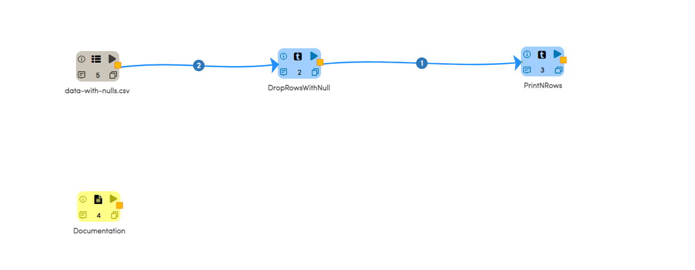
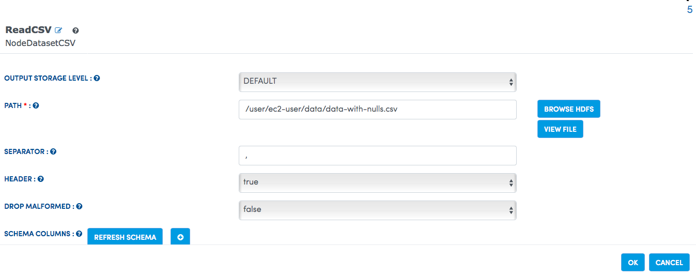
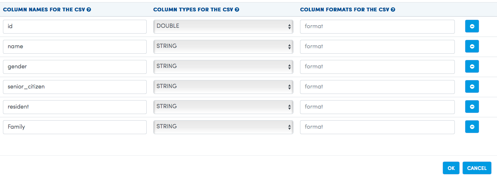
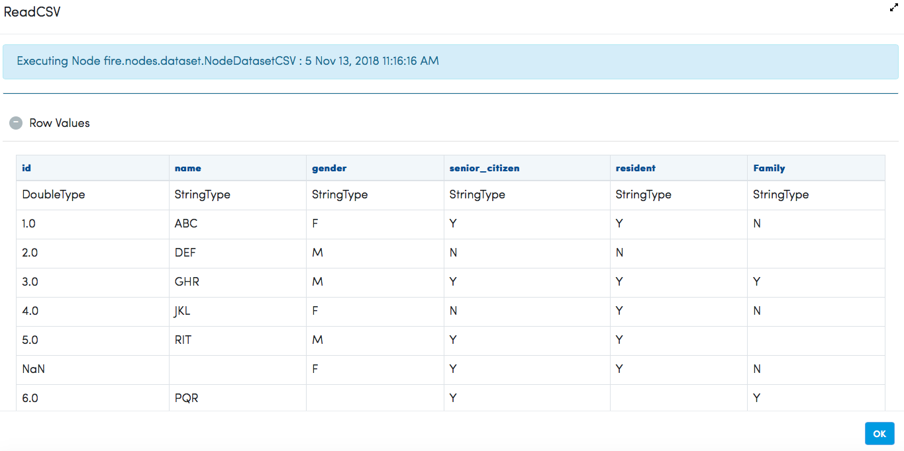
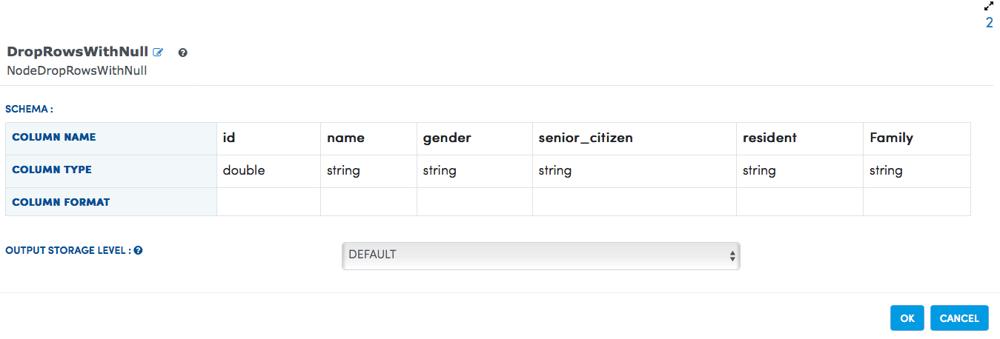
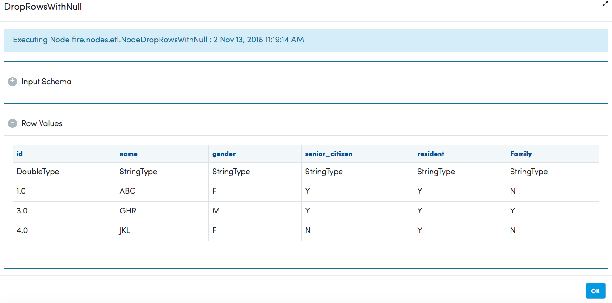

Drop Rows With Null
===================

This example drops/filters the rows contains any null values from the input dataset.

Workflow
--------

Below is the workflow. It does the following:

* Reads data from a CSV file.
* Drops rows having any null values in any of the columns.

   
Reading from CSV File
---------------------

It reads data from a CSV file. 

Processor Configuration
^^^^^^^^^^^^^^^^^^

   

   
Processor Output
^^^^^^

   
Droping rows with null
----------------------

It drops the rows which contains any null value.

Processor Configuration
^^^^^^^^^^^^^^^^^^

   
Processor Output
^^^^^^

   
   
