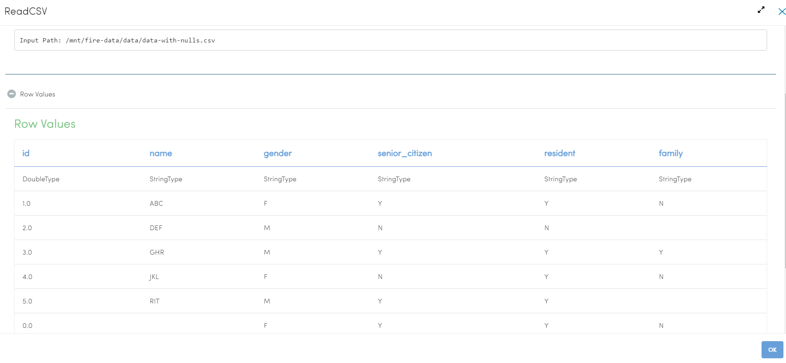
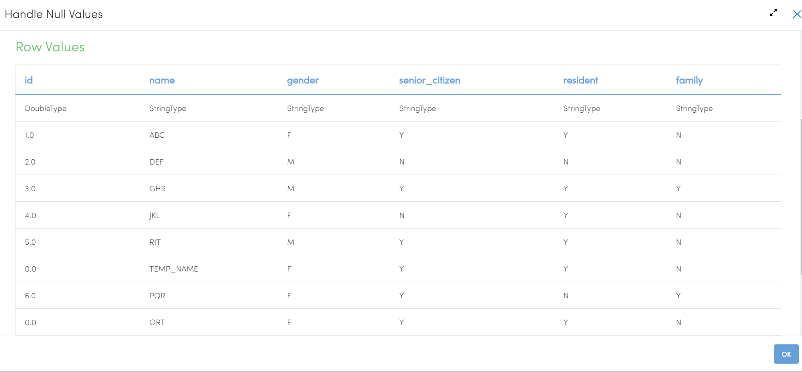
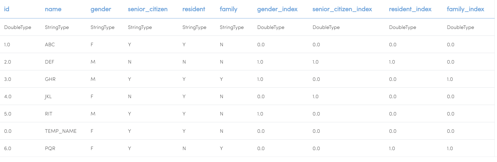
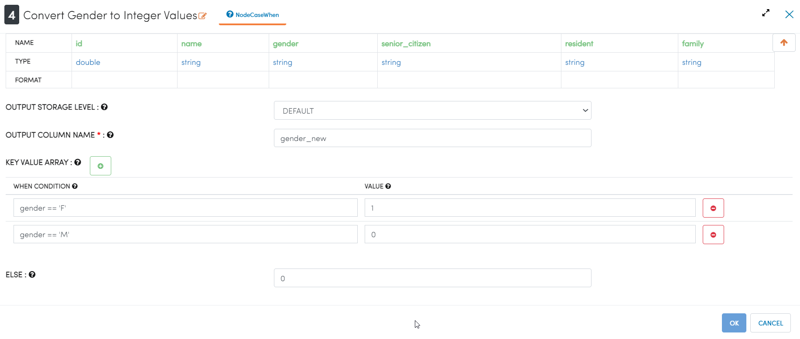
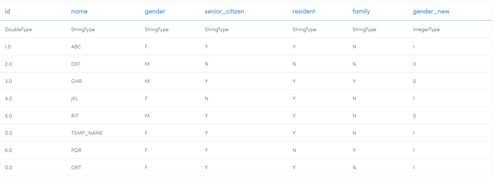
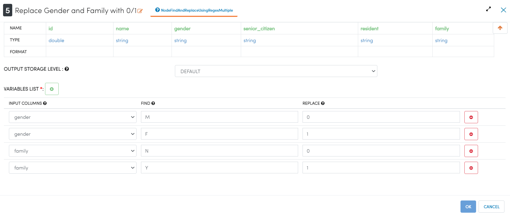
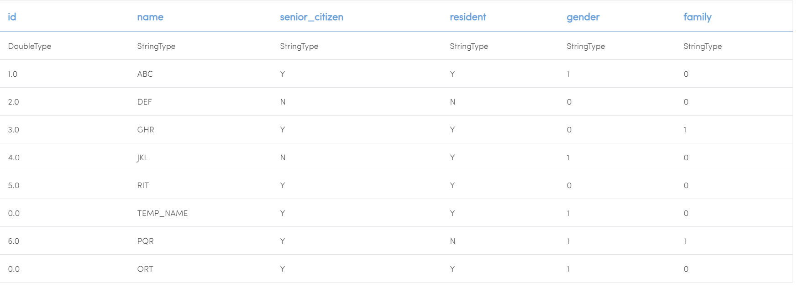

Handling Null Values
====================

This example removes null values from the input dataset.

Workflow
--------

Below is the workflow. It does the following:

* Reads data from a CSV file.
* Replaces null values in certain columns with Constant Values.
* Converts certain columns to 0/1 based on their value. It does it in 3 different ways.

  * Using StringIndexer Processor
  * Using CaseWhen Processor
  * Using FindAndReplaceUsingRegex Processor

.. figure:: ../../_assets/tutorials/data-cleaning/handling-null-values/1.png
   :alt: Handling Null Values
   :align: center
   :width: 60%
   
Reading from CSV File
---------------------

It reads in the CSV file data-with-nulls.csv.

Processor Configuration
^^^^^^^^^^^^^^^^^^

.. figure:: ../../_assets/tutorials/data-cleaning/handling-null-values/2.png
   :alt: Handling Null Values
   :align: center
   :width: 60%
   
Processor Output
^^^^^^

   
Replacing null values
---------------------

It replaces null values in certain columns with user defined constant values.

Processor Configuration
^^^^^^^^^^^^^^^^^^

.. figure:: ../../_assets/tutorials/data-cleaning/handling-null-values/3.png
   :alt: Handling Null Values
   :align: center
   :width: 60%

Processor Output
^^^^^^

   
Converting to 0/1 using StringIndexer
---------------------

It converts strings like Y/N to 0/1 for the specified columns using the StringIndexer Processor.

Processor Configuration
^^^^^^^^^^^^^^^^^^

.. figure:: ../../_assets/tutorials/data-cleaning/handling-null-values/4.png
   :alt: Handling Null Values
   :align: center
   :width: 60%

Processor Output
^^^^^^

   

Converting to 0/1 using CaseWhen
---------------------

It converts strings like Y/N to 0/1 for the specified columns using the CaseWhen Processor.

Processor Configuration
^^^^^^^^^^^^^^^^^^

Processor Output
^^^^^^

   

Converting to 0/1 using FindAndReplaceUsingRegex
---------------------

It converts strings like Y/N to 0/1 for the specified columns using the FindAndReplaceUsingRegex Processor.

Processor Configuration
^^^^^^^^^^^^^^^^^^

Processor Output
^^^^^^

   

