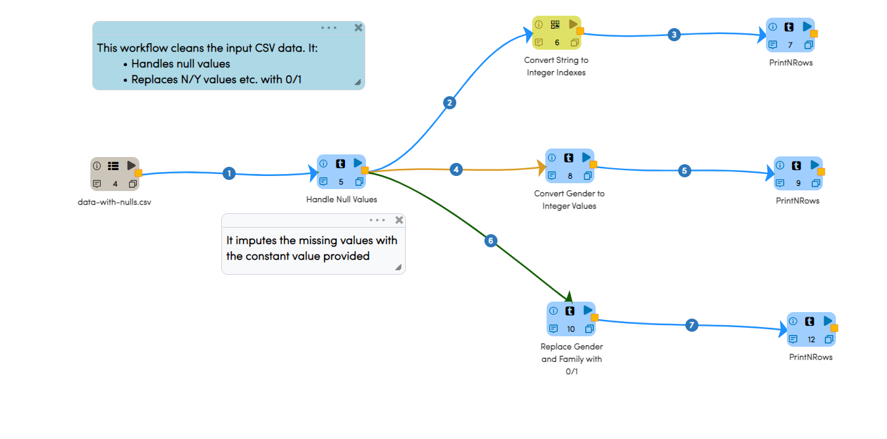
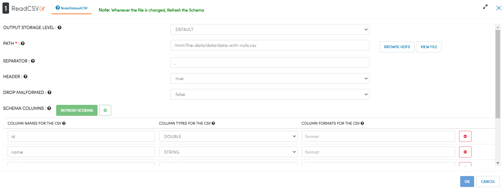
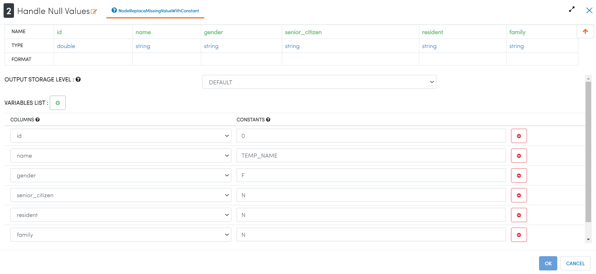
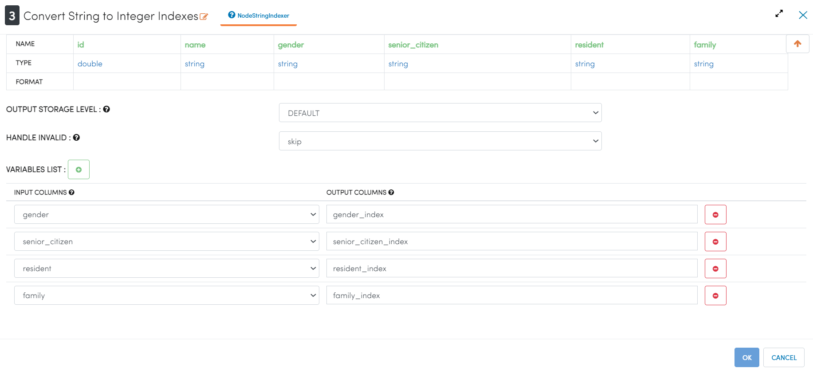

Removing Null Values
====================

This example removes null values from the input dataset.

Workflow
--------

Below is the workflow. It does the following:

* Reads data from a CSV file.
* Removes null values from certain columns.
* Converts certain columns to 0/1 based on their value

   
Reading from CSV File
---------------------

   
   
Removing null values
---------------------

   
Converting to 0/1
---------------------

   
   
