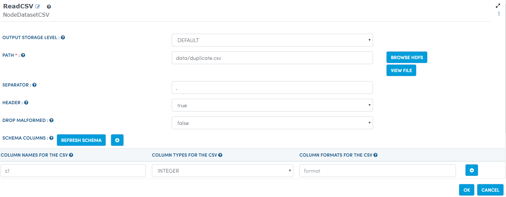
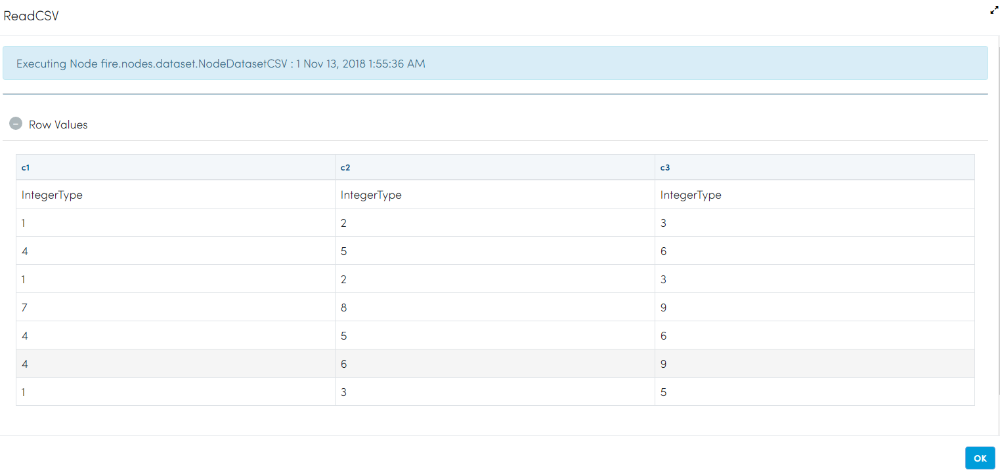
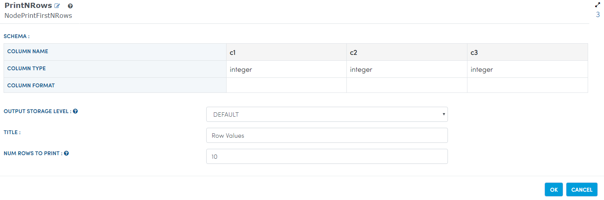

Remove Duplicate Rows
=====================

This workflow reads CSV file. It then remove duplicate rows from the original CSV file and prints the results.

Worklow
-------

Below is the workflow. It does the following:

* Reads data from a CSV file.
* It then remove duplicate rows from the original CSV file.
* prints the results.

.. figure:: ../../_assets/tutorials/data-cleaning/remove-duplicate-rows/1.PNG
   :alt: Remove Duplicate Rows
   :align: center
   :width: 60%
   
Reading from CSV file
---------------------

It reads CSV file.

Processor Configuration
^^^^^^^^^^^^^^^^^^

   
Processor Output
^^^^^^

   
Remove Duplicate Rows
---------------------

It Remove Duplicate Rows available.

Processor Configuration
^^^^^^^^^^^^^^^^^^

.. figure:: ../../_assets/tutorials/data-cleaning/remove-duplicate-rows/3.PNG
   :alt: Remove Duplicate Rows
   :align: center
   :width: 60%

Processor Output
^^^^^^

.. figure:: ../../_assets/tutorials/data-cleaning/remove-duplicate-rows/3a.PNG
   :alt: Remove Duplicate Rows
   :align: center
   :width: 60%   
 
Prints the Results
------------------

It prints the results after Removing Duplicate Rows.

Processor Configuration
^^^^^^^^^^^^^^^^^^

Processor Output
^^^^^^

.. figure:: ../../_assets/tutorials/data-cleaning/remove-duplicate-rows/4a.PNG
   :alt: remove-duplicate-rows
   :align: center
   :width: 60%  
