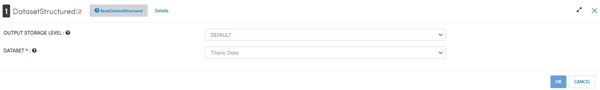
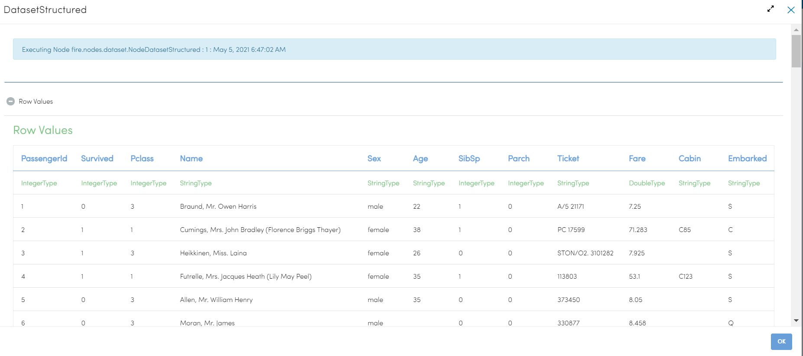
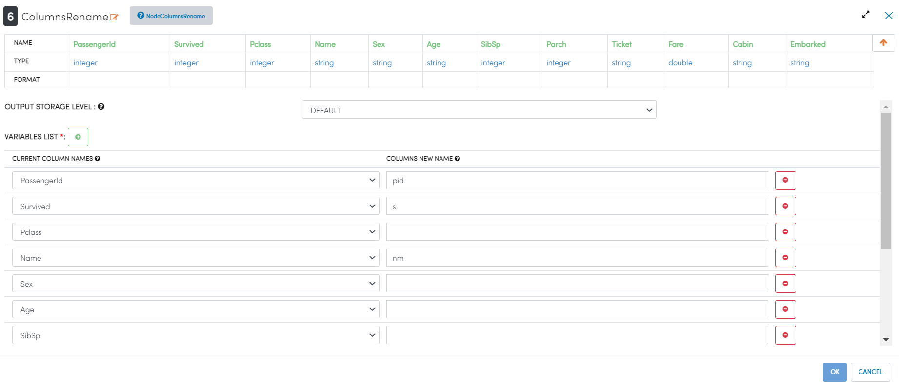
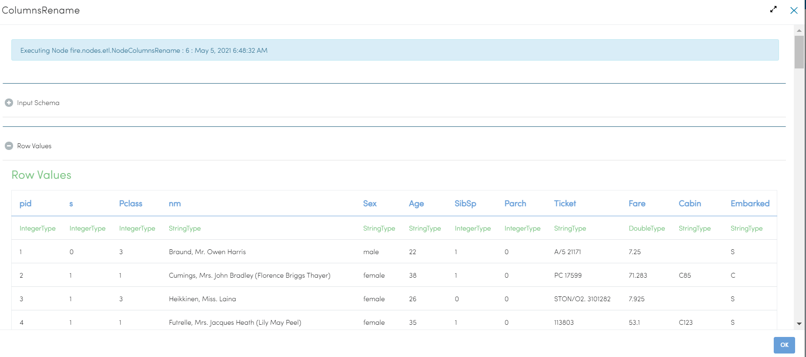
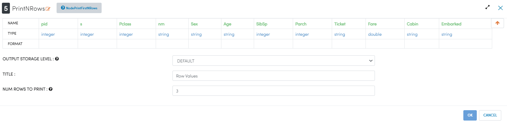

Rename Columns
==============

This workflow reads in a dataset. It then rename columns from the original dataset and prints the results.

Worklow
-------

Below is the workflow. It does the following:

* Reads data from a dataset.
* It then rename columns from the original dataset.
* prints the results.

.. figure:: ../../_assets/tutorials/data-cleaning/rename-columns/1.PNG
   :alt: Rename Columns
   :align: center
   :width: 60%
   
Reading from Dataset
---------------------

It reads Dataset file.

Processor Configuration
^^^^^^^^^^^^^^^^^^

   
Processor Output
^^^^^^

   
Rename Columns
------------

It Rename Columns we wanted.

Processor Configuration
^^^^^^^^^^^^^^^^^^

Processor Output
^^^^^^

   
Prints the Results
------------------

It prints the results after Renaming Columns.

Processor Configuration
^^^^^^^^^^^^^^^^^^

Processor Output
^^^^^^

