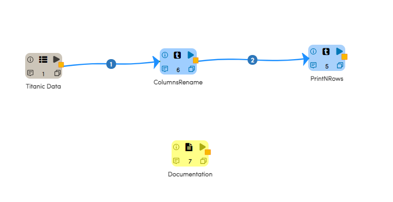

Rename Columns
==============

This workflow reads in a dataset. It then rename columns from the original dataset and prints the results.

Worklow
-------

Below is the workflow. It does the following:

* Reads data from a dataset.
* It then rename columns from the original dataset.
* prints the results.

