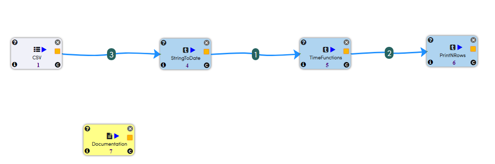
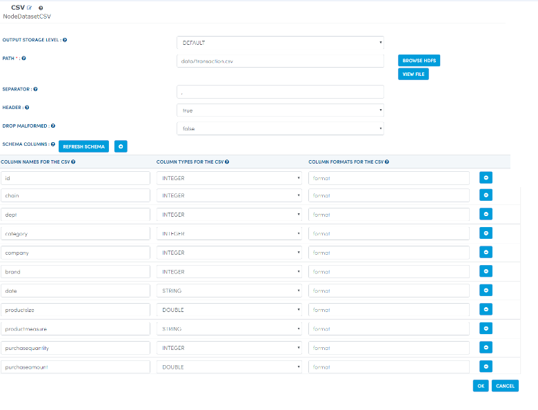
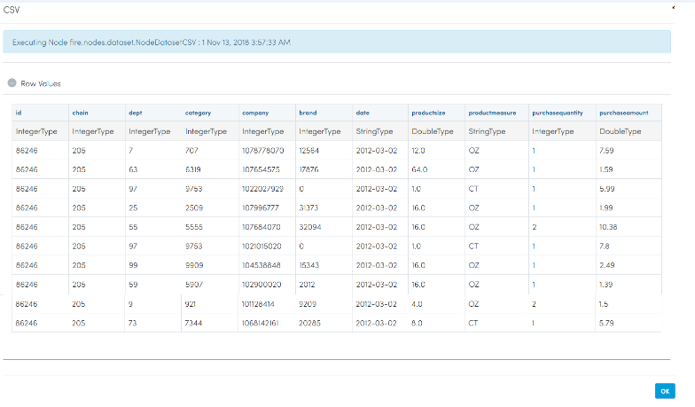
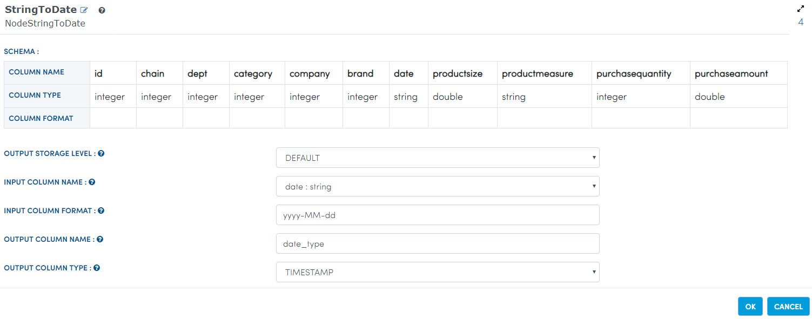
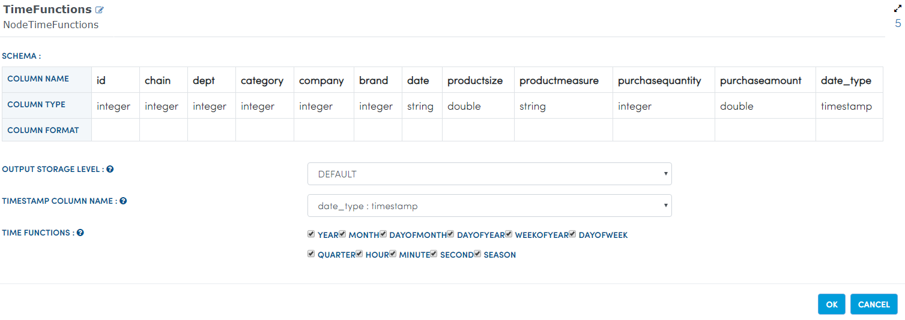
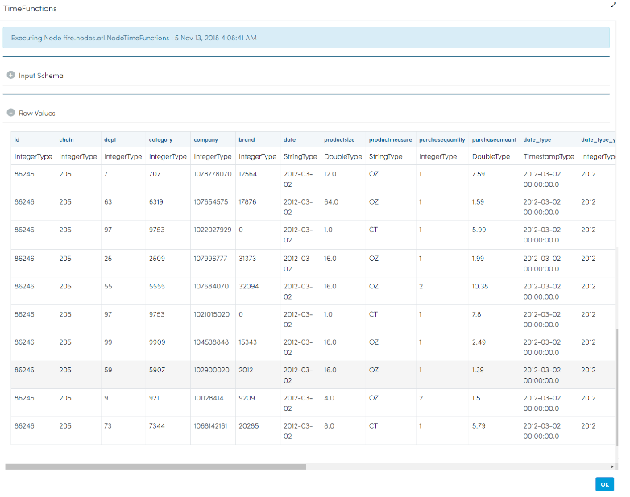
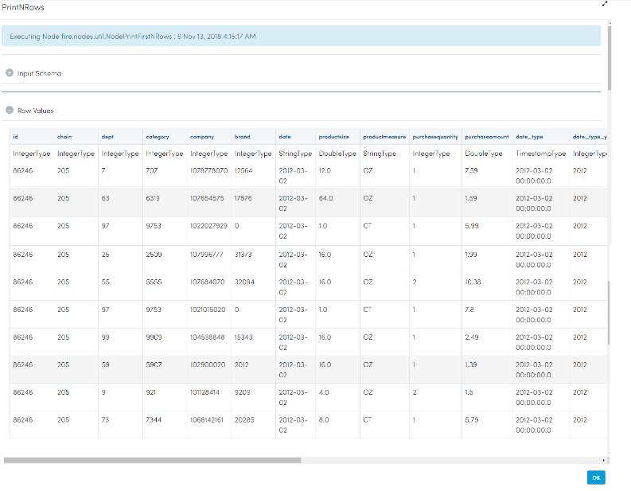

String To Date Timefunctions
============================

This workflow reads a CSV file. It then convert it into stringtodate and then to timefunctions and prints the results.

Worklow
-------

Below is the workflow. It does the following:

* Reads a CSV file.
* It then convert it into stringtodate using stringtodate Node.
* Convert it into timefunctions using timefunctions Node.
* prints the results.

Reading from CSV file
---------------------

It reads Data from CSV file.

Processor Configuration
^^^^^^^^^^^^^^^^^^

   
Processor Output
^^^^^^

   
String to Date
------------

It convert it into stringtodate using stringtodate Node.

Processor Configuration
^^^^^^^^^^^^^^^^^^

Processor Output
^^^^^^

.. figure:: ../../_assets/tutorials/data-cleaning/string-to-date-timefunctions/3a.PNG
   :alt: String To Date Timefunctions
   :align: center
   :width: 60%  

Time Functions
------------

It convert it into timefunctions using timefunctions Node.

Processor Configuration
^^^^^^^^^^^^^^^^^^

Processor Output
^^^^^^

Prints the Results
------------------

It prints the results after using string to date timefunctions.

Processor Configuration
^^^^^^^^^^^^^^^^^^

.. figure:: ../../_assets/tutorials/data-cleaning/string-to-date-timefunctions/5.PNG
   :alt: String To Date Timefunctions
   :align: center
   :width: 60%

Processor Output
^^^^^^

