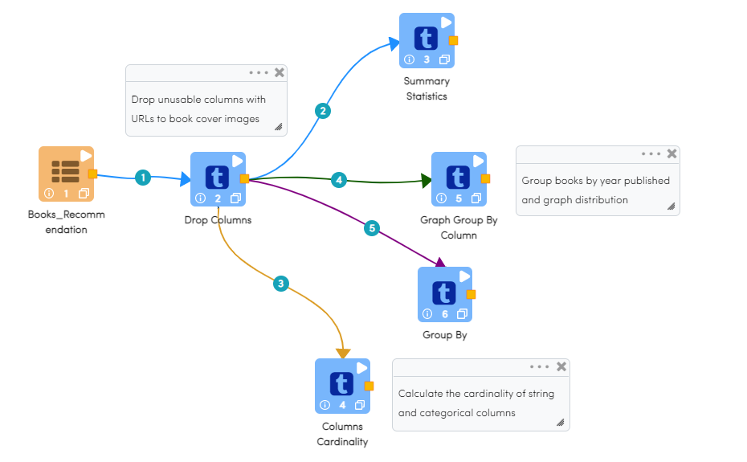
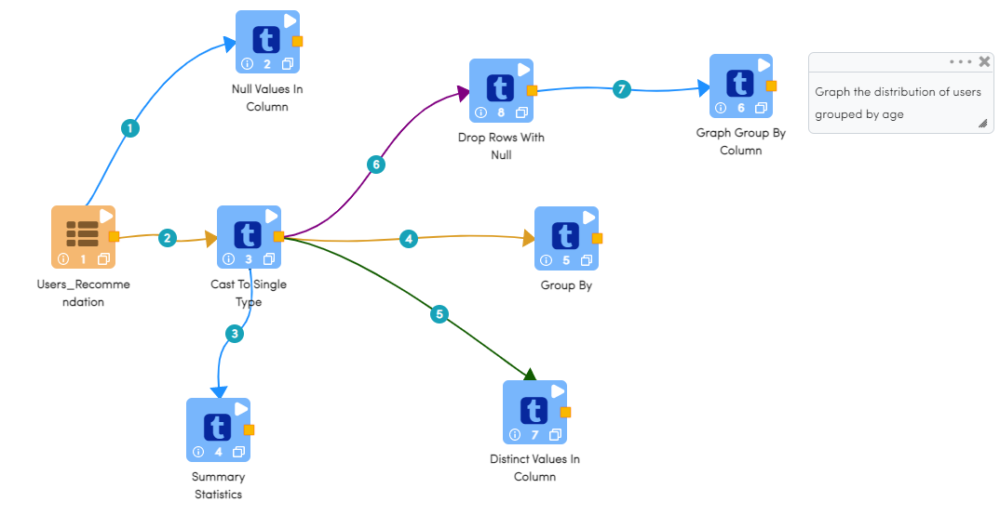
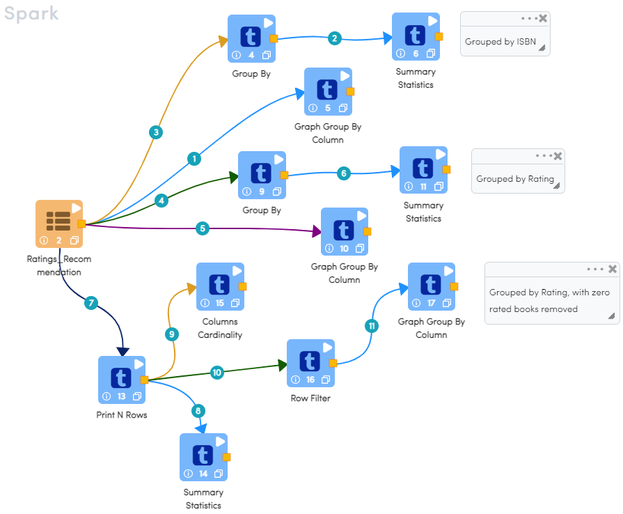
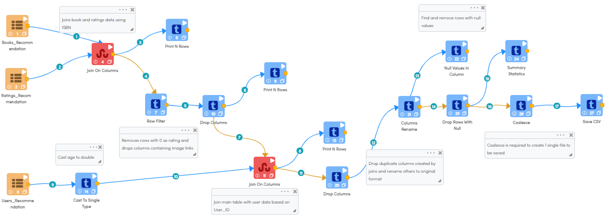
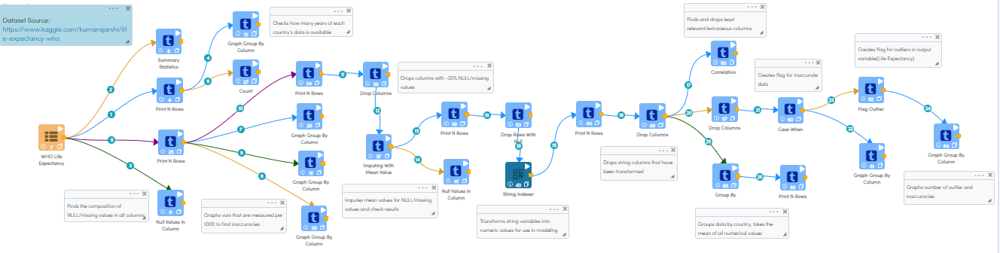

End-to-End Book Recommendations
*********************************

This tutorial will cover how to explore, clean, and model data related to book sales. The data has been taken from Kaggle courtesy of the BookCrossing project. 

The data for this project is split into 3 datasets. One dataset contains data related to the users, one dataset contains data related to the books, and the final dataset contains all of the user-generated ratings of the books. 

To more accurately represent how data analysis would be done in Sparkflows, different tasks have been split up into different workflows. This keeps the project more organized, allows for more expansion in the future, and will provide performance benefits during testing and execution. 

.. contents::
   :depth: 2

Data Exploration
******************

Exploring Books Dataset
-------------------------
The below workflow: 

* Graphs the distribution of books by the year published
* Calculates the cardinality of the string columns

   

Grouping Books by Year Published
-----------------------------------

We use the ``Graph Group by Column`` processor to visually gauge the profile of our data. 

Processor Configuration
^^^^^^^^^^^^^^^^^^^^^^^^^

.. figure:: ../../_assets/tutorials/data-engineering/books-recommendations/BE_Graph_Group_Config.PNG
   :alt: titanic-data-cleaning
   :width: 90%

   
Processor Output
^^^^^^^^^^^^^^^^^

.. figure:: ../../_assets/tutorials/data-engineering/books-recommendations/BE_Graph_Group_Output.PNG
   :alt: titanic-data-cleaning
   :width: 90%

   
Columns Cardinality
-----------------------

We use the ``Columns Cardinality`` node to find the number of unique values in a string variable. In this case we are using cardinality to gauge the relationship between publishers, authors, and books. We can see that publishers on average publish 14 books, while authors on average write 2.4 books. 

Processor Configuration
^^^^^^^^^^^^^^^^^^^^^^^^^

.. figure:: ../../_assets/tutorials/data-engineering/books-recommendations/BE_Cardinality_Config.PNG
   :alt: titanic-data-cleaning
   :width: 90%

   
Processor Output
^^^^^^^^^^^^^^^^^

.. figure:: ../../_assets/tutorials/data-engineering/books-recommendations/BE_Cardinality_Output.PNG
   :alt: titanic-data-cleaning
   :width: 90%

Exploring Users Dataset
------------------------
The below workflow: 

* Graphs a count of the users grouped by age
* Finds the number of NULL values in each column

   

Grouping Users by Age
------------------------

We use the ``Graph Group by Column`` processor to visually gauge the profile of our data. 

Processor Configuration
^^^^^^^^^^^^^^^^^^^^^^^^^

.. figure:: ../../_assets/tutorials/data-engineering/books-recommendations/UE_Graph_Group_Config.PNG
   :alt: titanic-data-cleaning
   :width: 90%

   
Processor Output
^^^^^^^^^^^^^^^^^

.. figure:: ../../_assets/tutorials/data-engineering/books-recommendations/UE_Graph_Group_Output.PNG
   :alt: titanic-data-cleaning
   :width: 90%

   
Finding Number of NULL Values in Columns
----------------------

We use the ``Null Values in Column`` processor counts the number and percentage of NULL values in the selected columns. In this case we can see that the Age column has a significant number of NULL values that will need to be dealt with in successive data cleaning steps. 

Processor Configuration
^^^^^^^^^^^^^^^^^^^^^^^^^

.. figure:: ../../_assets/tutorials/data-engineering/books-recommendations/UE_Null_Values_Config.PNG
   :alt: titanic-data-cleaning
   :width: 90%

   
Processor Output
^^^^^^^^^^^^^^^^^

.. figure:: ../../_assets/tutorials/data-engineering/books-recommendations/UE_Null_Values_Output.PNG
   :alt: titanic-data-cleaning
   :width: 90%

Exploring Ratings Dataset
-------------------
The below workflow: 

* Graphs the distribution of reviews by rating, excluding the zero rating
* Prints a sample of the dataset out

   

Grouping Reviews by Rating
------------------------------

We use the ``Graph Group by Column`` processor to visually gauge the profile of our data. 

Processor Configuration
^^^^^^^^^^^^^^^^^^^^^^^^^

.. figure:: ../../_assets/tutorials/data-engineering/books-recommendations/RE_Graph_Group_Config.PNG
   :alt: titanic-data-cleaning
   :width: 90%

   
Processor Output
^^^^^^^^^^^^^^^^^

.. figure:: ../../_assets/tutorials/data-engineering/books-recommendations/RE_Graph_Group_Output.PNG
   :alt: titanic-data-cleaning
   :width: 90%

   
Printing Row Values
-----------------------

We use the ``Print N Rows`` to print a sample of the data for inspection. An important thing to note is that while an ISBN is usually a numeric, there are some books which are identified by an ISBN which is alphanumeric in nature. This is important to know for data modelling, because many models require only numeric values. 

Processor Configuration
^^^^^^^^^^^^^^^^^^^^^^^^^

.. figure:: ../../_assets/tutorials/data-engineering/books-recommendations/RE_Print_Config.PNG
   :alt: titanic-data-cleaning
   :width: 90%

   
Processor Output
^^^^^^^^^^^^^^^^^

.. figure:: ../../_assets/tutorials/data-engineering/books-recommendations/RE_Print_Output.PNG
   :alt: titanic-data-cleaning
   :width: 90%

Data Cleaning
***************

Workflow Overview
-------------------
The below workflow: 

* Casts a string columns to a double type column
* Joins the Books and Ratings datasets
* Filters out rows that will be detrimental to modelling
* Joins the Users with other datasets
* Drops unnecessary columns
* Calculates summary statistics
* Coalesces data for export
* Saves data to HDFS for later use

   
Casting String to Double
----------------------------
``Drop Columns`` Processor creates a new dataframe, excluding the columns selected.

Processor Configuration
^^^^^^^^^^^^^^^^^^^^^^^^

.. figure:: ../../_assets/tutorials/data-engineering/books-recommendations/BDP_Cast_Config.PNG
   :alt: titanic-data-cleaning
   :width: 90%
   
   
Joining Books and Ratings Datasets
--------------------------------------------
``Drop Columns`` Processor creates a new dataframe, excluding the columns selected.

Processor Configuration
^^^^^^^^^^^^^^^^^^^^^^^^

.. figure:: ../../_assets/tutorials/data-engineering/books-recommendations/BDP_Join_One_Config.PNG
   :alt: titanic-data-cleaning
   :width: 90%
   
   
Filtering Rows
-------------------
``Drop Columns`` Processor creates a new dataframe, excluding the columns selected.

Processor Configuration
^^^^^^^^^^^^^^^^^^^^^^^^

.. figure:: ../../_assets/tutorials/data-engineering/books-recommendations/BDP_Row_Filter_Config.PNG
   :alt: titanic-data-cleaning
   :width: 90%
   
   
Joining Users and Other Datasets
----------------------------------
``Drop Columns`` Processor creates a new dataframe, excluding the columns selected.

Processor Configuration
^^^^^^^^^^^^^^^^^^^^^^^^

.. figure:: ../../_assets/tutorials/data-engineering/books-recommendations/BDP_Join_Two_Config.PNG
   :alt: titanic-data-cleaning
   :width: 90%
   
   
Dropping Useless Columns
--------------------------
``Drop Columns`` Processor creates a new dataframe, excluding the columns selected.

Processor Configuration
^^^^^^^^^^^^^^^^^^^^^^^^

.. figure:: ../../_assets/tutorials/data-engineering/books-recommendations/BDP_Drop_Columns_Config.PNG
   :alt: titanic-data-cleaning
   :width: 90%
   
   
Calculating Summary Statistics
---------------------------------

``Null Values in Column`` Processor counts the number and percentage of NULL values in the selected columns.

Processor Configuration
^^^^^^^^^^^^^^^^^^^^^^^^^

.. figure:: ../../_assets/tutorials/data-engineering/books-recommendations/BDP_Summary_Stats_Config.PNG
   :alt: titanic-data-cleaning
   :width: 90%

   
Processor Output
^^^^^^^^^^^^^^^^^

.. figure:: ../../_assets/tutorials/data-engineering/books-recommendations/BDP_Summary_Stats_Output.PNG
   :alt: titanic-data-cleaning
   :width: 90%
   
   
Coalesce Data
----------------
``Drop Columns`` Processor creates a new dataframe, excluding the columns selected.

Processor Configuration
^^^^^^^^^^^^^^^^^^^^^^^^

.. figure:: ../../_assets/tutorials/data-engineering/books-recommendations/BDP_Coalesce_Config.PNG
   :alt: titanic-data-cleaning
   :width: 90%
   
   
Saving Data to CSV
---------------------

``Null Values in Column`` Processor counts the number and percentage of NULL values in the selected columns.

Processor Configuration
^^^^^^^^^^^^^^^^^^^^^^^^^

.. figure:: ../../_assets/tutorials/data-engineering/books-recommendations/BDP_Save_Config.PNG
   :alt: titanic-data-cleaning
   :width: 90%

   
Processor Output
^^^^^^^^^^^^^^^^^

.. figure:: ../../_assets/tutorials/data-engineering/books-recommendations/BDP_Save_Output.PNG
   :alt: titanic-data-cleaning
   :width: 90%

   

Data Modelling / Recommendations
**********************************

Workflows Overview
-------------------
The below workflow: 

* Reads the WHO Life Expectancy dataset
* Finds the number of NULL values in each column
* Drops columns with an unacceptable proportion of NULL values
* Imputes mean values in the place of remaining NULL values
* Indexes string type variables into numeric values for use in modelling
* Flags rows with potentially inaccurate data
* Flags outliers in the output column (Life Expectancy)

   

