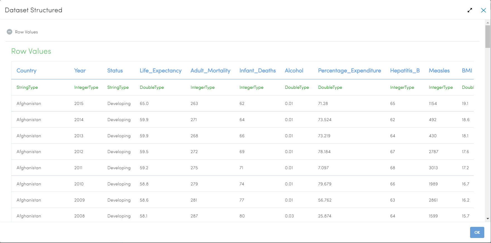
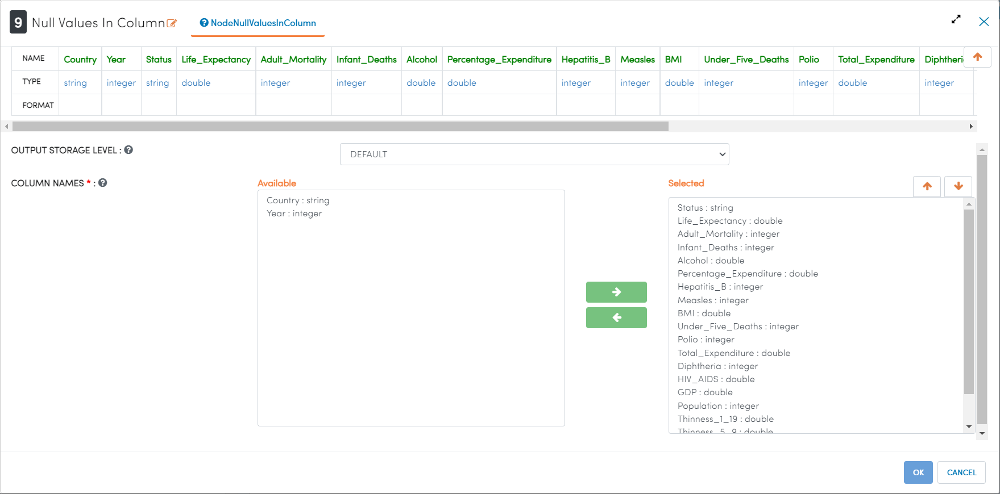
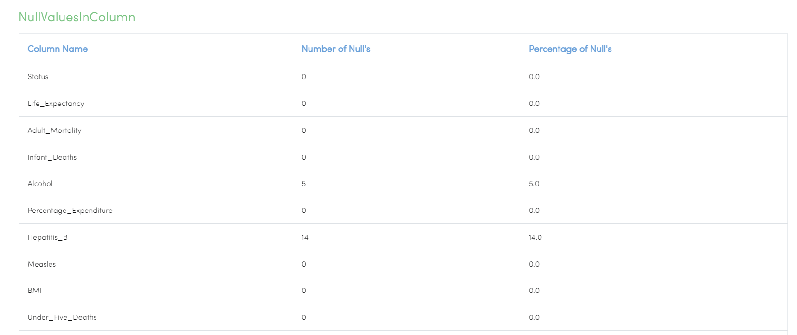
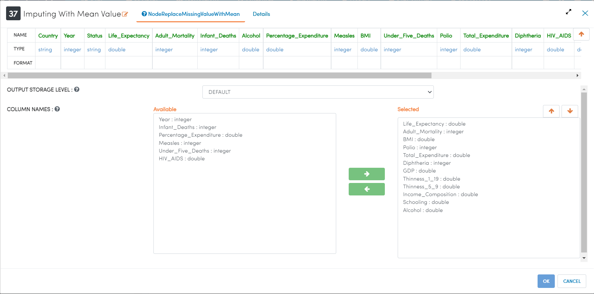
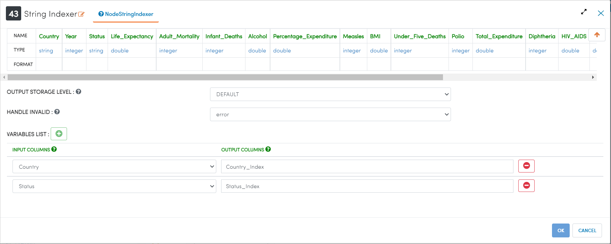
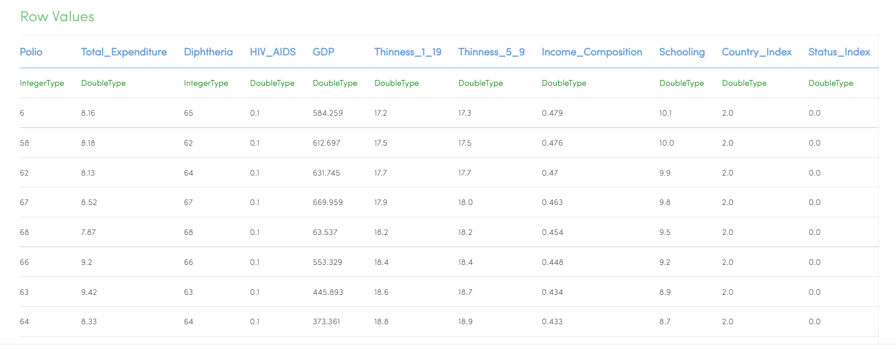
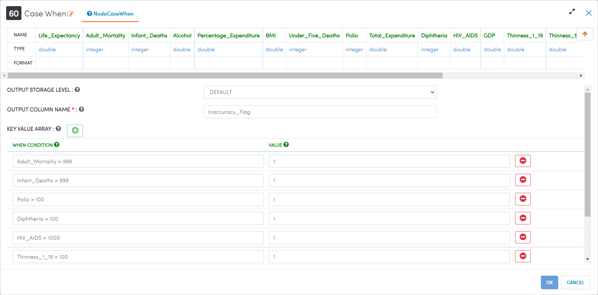
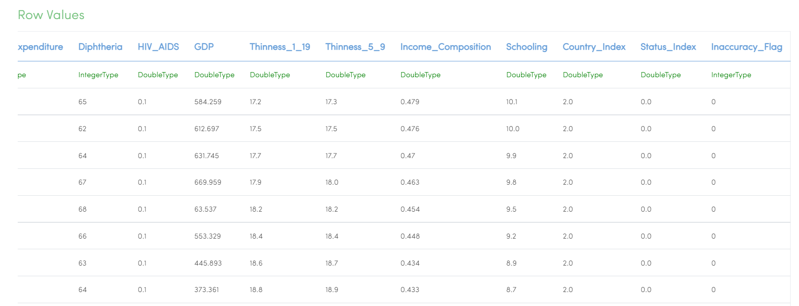
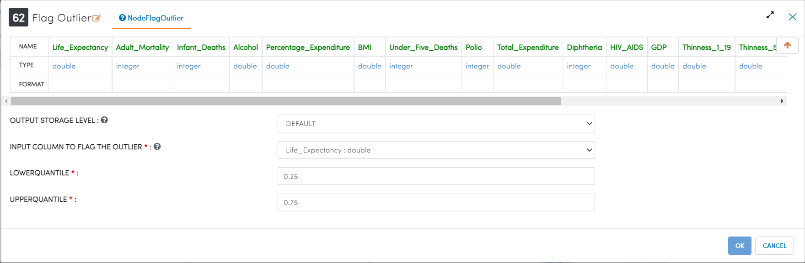
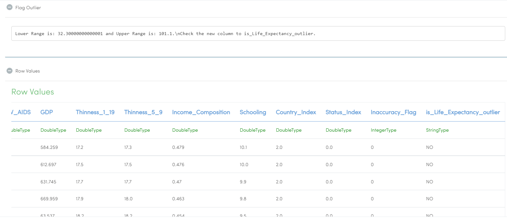

End-to-End Book Recommendations
=========================

This tutorial will cover how to explore, clean, and model data related to book sales. The data has been taken from Kaggle courtesy of the BookCrossing project. 

The data for this project is split into 3 datasets. One dataset contains data related to the users, one dataset contains data related to the books, and the final dataset contains all of the user-generated ratings of the books. 

To more accurately represent how data analysis would be done in Sparkflows, different tasks have been split up into different workflows. This keeps the project more organized, allows for more expansion in the future, and will provide performance benefits during testing and execution. 

.. contents::
   :depth: 2

Data Exploration
=================

Workflows Overview
-------------------
The below workflow: 

* Reads the WHO Life Expectancy dataset
* Finds the number of NULL values in each column
* Drops columns with an unacceptable proportion of NULL values
* Imputes mean values in the place of remaining NULL values
* Indexes string type variables into numeric values for use in modelling
* Flags rows with potentially inaccurate data
* Flags outliers in the output column (Life Expectancy)

.. figure:: ../../_assets/tutorials/data-engineering/who-data-cleaning/Overview.PNG
   :alt: titanic-data-cleaning
   :width: 90%
   
Reading WHO Life Expectancy Dataset
---------------------

``DatasetStructured`` Processor creates a Dataframe of your dataset named ``WHO Life Expectancy`` by reading data from HDFS, HIVE etc. which have been defined earlier in Fire by using the Dataset feature.

Processor Output
^^^^^^^^^^^^^^^^^^

   

Counting Number of NULL Values in Columns
--------------

``Null Values in Column`` Processor counts the number and percentage of NULL values in the selected columns.

Processor Configuration
^^^^^^^^^^^^^^^^^^

   
Processor Output
^^^^^^

Dropping Columns With Too Many NULL Values
----------------
``Drop Columns`` Processor creates a new dataframe, excluding the columns selected.

Processor Configuration
^^^^^^

.. figure:: ../../_assets/tutorials/data-engineering/who-data-cleaning/DropColumns_Config.PNG
   :alt: titanic-data-cleaning
   :width: 90%
   
Imputing Mean Values to Replace Remaining NULL Values
----------------
``Imputing with Mean Value`` Processor imputes the mean value of each column in place of NULL values in each column.

Processor Configuration
^^^^^^

Indexing String Values into Numeric Values
---------------

``String Indexer`` Processor creates an numeric index for string values and creates a new column with the created index values. 

Processor Configuration
^^^^^^^^^^^^^^^^^^

   
Processor Output
^^^^^^

Creating a Flag for Potentially Inaccurate Data
---------------

``Case When`` Processor creates a new column and populates it with values based on user-set conditions. 

Processor Configuration
^^^^^^^^^^^^^^^^^^

   
Processor Output
^^^^^^

Creating a Flag for Outliers in Output Column
---------------

``Flag Outlier`` Processor creates a new column to indicate whether values in the given column are outliers based on the box and whisker method. 

Processor Configuration
^^^^^^^^^^^^^^^^^^

   
Processor Output
^^^^^^

Data Cleaning
===============

Workflows Overview
-------------------
The below workflow: 

* Reads the WHO Life Expectancy dataset
* Finds the number of NULL values in each column
* Drops columns with an unacceptable proportion of NULL values
* Imputes mean values in the place of remaining NULL values
* Indexes string type variables into numeric values for use in modelling
* Flags rows with potentially inaccurate data
* Flags outliers in the output column (Life Expectancy)

.. figure:: ../../_assets/tutorials/data-engineering/who-data-cleaning/Overview.PNG
   :alt: titanic-data-cleaning
   :width: 90%
   
Reading WHO Life Expectancy Dataset
---------------------

``DatasetStructured`` Processor creates a Dataframe of your dataset named ``WHO Life Expectancy`` by reading data from HDFS, HIVE etc. which have been defined earlier in Fire by using the Dataset feature.

Processor Output
^^^^^^^^^^^^^^^^^^

   

Counting Number of NULL Values in Columns
--------------

``Null Values in Column`` Processor counts the number and percentage of NULL values in the selected columns.

Processor Configuration
^^^^^^^^^^^^^^^^^^

   
Processor Output
^^^^^^

Dropping Columns With Too Many NULL Values
----------------
``Drop Columns`` Processor creates a new dataframe, excluding the columns selected.

Processor Configuration
^^^^^^

.. figure:: ../../_assets/tutorials/data-engineering/who-data-cleaning/DropColumns_Config.PNG
   :alt: titanic-data-cleaning
   :width: 90%
   
Imputing Mean Values to Replace Remaining NULL Values
----------------
``Imputing with Mean Value`` Processor imputes the mean value of each column in place of NULL values in each column.

Processor Configuration
^^^^^^

Indexing String Values into Numeric Values
---------------

``String Indexer`` Processor creates an numeric index for string values and creates a new column with the created index values. 

Processor Configuration
^^^^^^^^^^^^^^^^^^

   
Processor Output
^^^^^^

Creating a Flag for Potentially Inaccurate Data
---------------

``Case When`` Processor creates a new column and populates it with values based on user-set conditions. 

Processor Configuration
^^^^^^^^^^^^^^^^^^

   
Processor Output
^^^^^^

Creating a Flag for Outliers in Output Column
---------------

``Flag Outlier`` Processor creates a new column to indicate whether values in the given column are outliers based on the box and whisker method. 

Processor Configuration
^^^^^^^^^^^^^^^^^^

   
Processor Output
^^^^^^

Data Modelling / Recommendations
=================================

Workflows Overview
-------------------
The below workflow: 

* Reads the WHO Life Expectancy dataset
* Finds the number of NULL values in each column
* Drops columns with an unacceptable proportion of NULL values
* Imputes mean values in the place of remaining NULL values
* Indexes string type variables into numeric values for use in modelling
* Flags rows with potentially inaccurate data
* Flags outliers in the output column (Life Expectancy)

.. figure:: ../../_assets/tutorials/data-engineering/who-data-cleaning/Overview.PNG
   :alt: titanic-data-cleaning
   :width: 90%
   
Reading WHO Life Expectancy Dataset
---------------------

``DatasetStructured`` Processor creates a Dataframe of your dataset named ``WHO Life Expectancy`` by reading data from HDFS, HIVE etc. which have been defined earlier in Fire by using the Dataset feature.

Processor Output
^^^^^^^^^^^^^^^^^^

   

Counting Number of NULL Values in Columns
--------------

``Null Values in Column`` Processor counts the number and percentage of NULL values in the selected columns.

Processor Configuration
^^^^^^^^^^^^^^^^^^

   
Processor Output
^^^^^^

Dropping Columns With Too Many NULL Values
----------------
``Drop Columns`` Processor creates a new dataframe, excluding the columns selected.

Processor Configuration
^^^^^^

.. figure:: ../../_assets/tutorials/data-engineering/who-data-cleaning/DropColumns_Config.PNG
   :alt: titanic-data-cleaning
   :width: 90%
   
Imputing Mean Values to Replace Remaining NULL Values
----------------
``Imputing with Mean Value`` Processor imputes the mean value of each column in place of NULL values in each column.

Processor Configuration
^^^^^^

Indexing String Values into Numeric Values
---------------

``String Indexer`` Processor creates an numeric index for string values and creates a new column with the created index values. 

Processor Configuration
^^^^^^^^^^^^^^^^^^

   
Processor Output
^^^^^^

Creating a Flag for Potentially Inaccurate Data
---------------

``Case When`` Processor creates a new column and populates it with values based on user-set conditions. 

Processor Configuration
^^^^^^^^^^^^^^^^^^

   
Processor Output
^^^^^^

Creating a Flag for Outliers in Output Column
---------------

``Flag Outlier`` Processor creates a new column to indicate whether values in the given column are outliers based on the box and whisker method. 

Processor Configuration
^^^^^^^^^^^^^^^^^^

   
Processor Output
^^^^^^

