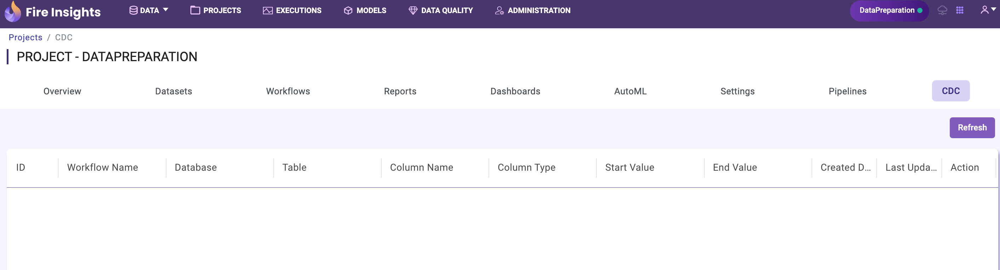
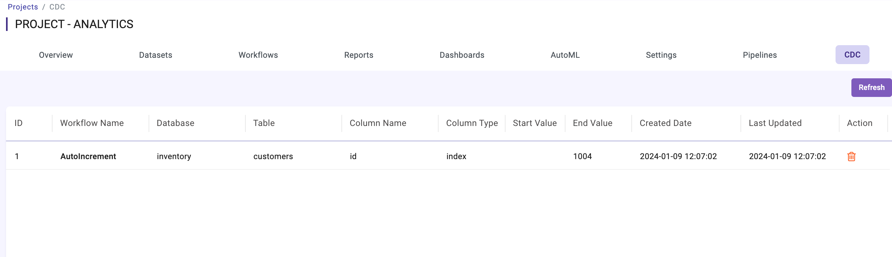
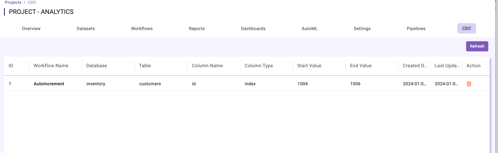
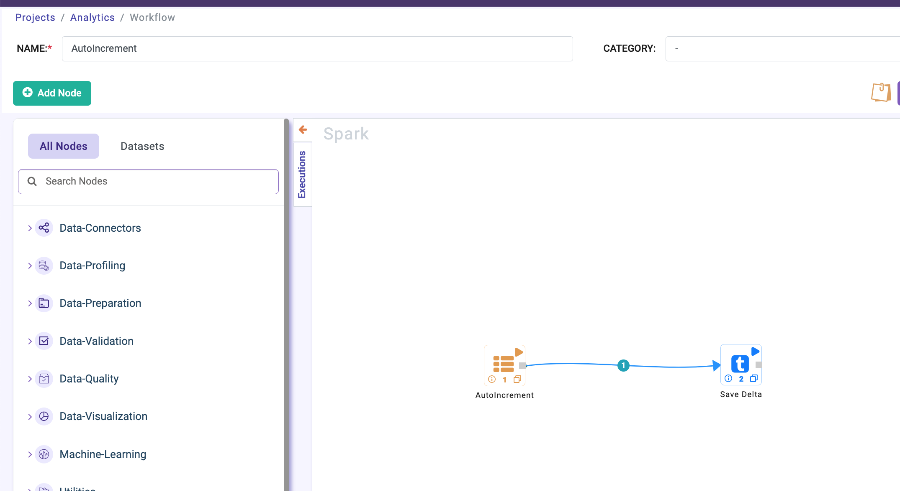

CDC With AutoIncrement Node
======================
Sparkflows provide the support for incremental load of changes in relation table with workflow and summary page.

Once CDC is enabled in Administration -> Configurations -> Module tab, in each project CDC module is visible where details of the incremental data pull is captured.

Create the workflow with **AutoIncrement Node** by selecting the connection to mysql, postgress, oracle, etc. and configure the database, table, keycolumn name & key column type.

Currently key column type **timestamp** and **index** only supported.

.. figure:: ../../_assets/tutorials/cdc/node-configuration.png
   :alt: cdc
   :width: 60%

CDC summary page after the first execution of the workflow with above configuration.

After the second run summary page details.

Workflow:

Read the incremental changes from relation source and save it any file system. Later merge the incremental changes with original data (Update, Delete and Insert).

