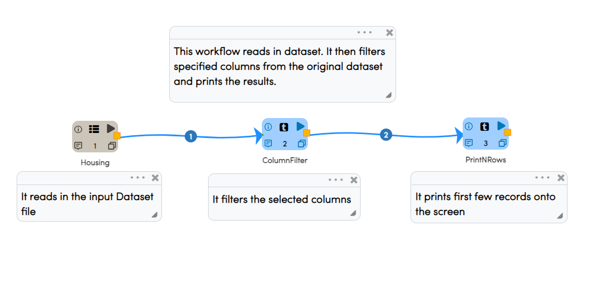
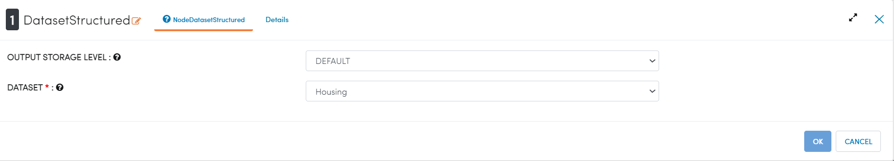
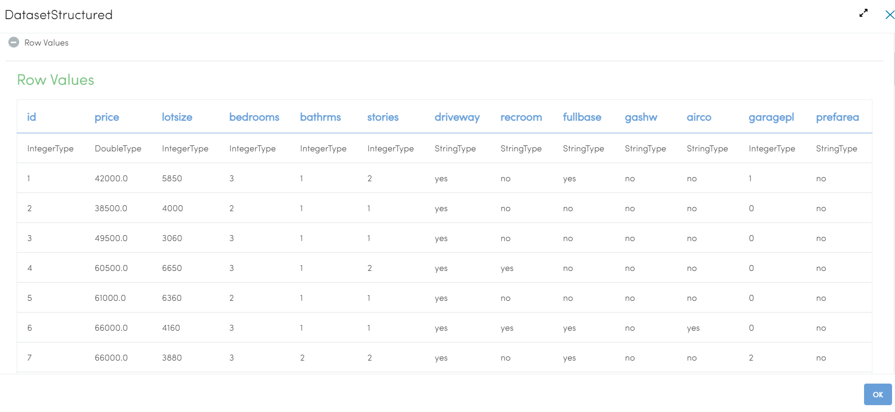
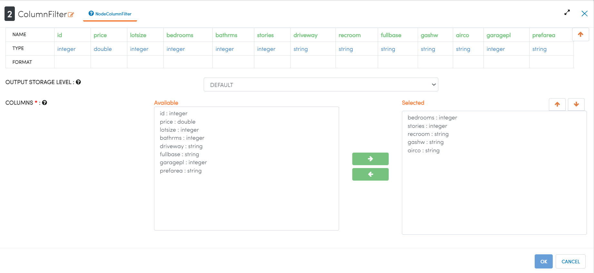
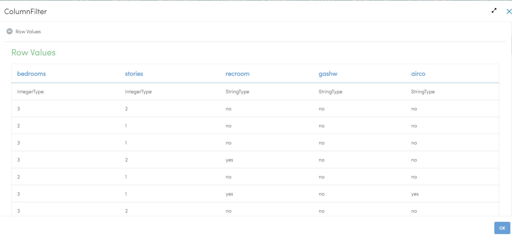

Column Filter
=============

This workflow reads in a dataset. It then filters specified columns from the original dataset and prints the result.

Workflow
-------

The below workflow:

* Reads data from a dataset.
* It then filters specified columns from the original dataset.
* Prints the results.

   

   
Reading from Dataset
---------------------

It reads the input Dataset File.

Processor Configuration
^^^^^^^^^^^^^^^^^^
   

   
Processor Output
^^^^^^

   
   
Column Filter
------------

It filters the selected columns.

Processor Configuration
^^^^^^^^^^^^^^^^^^

   
Processor Output
^^^^^^

  
Prints the Result
------------------

It prints the first few records onto the screen.

