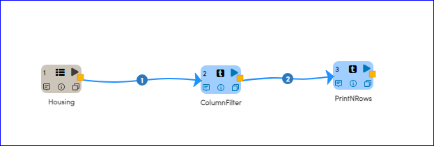
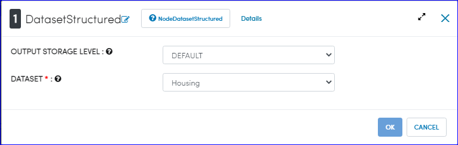
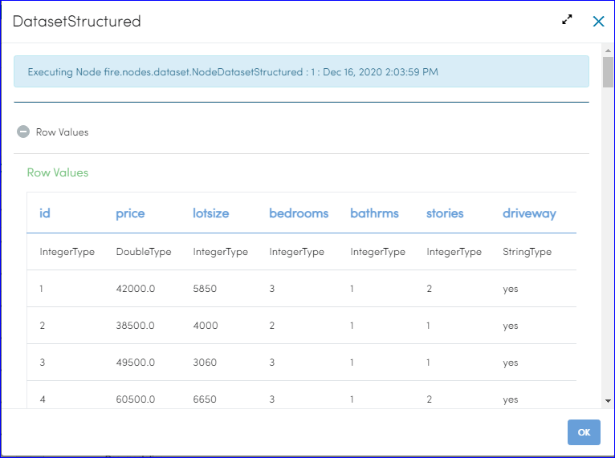
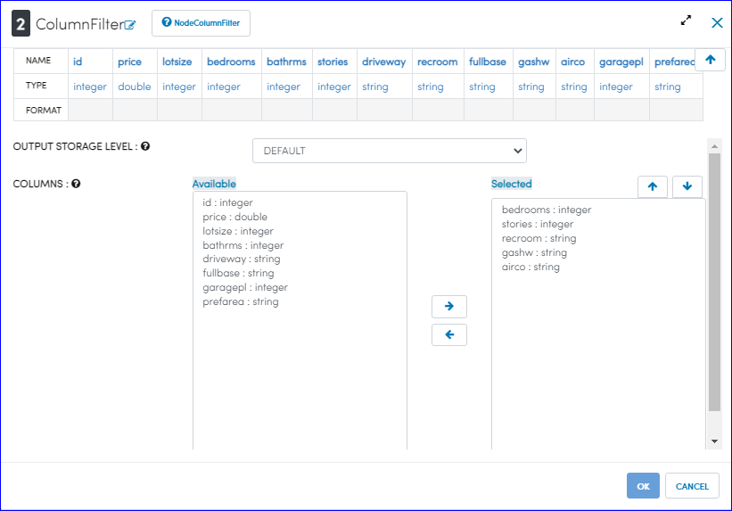
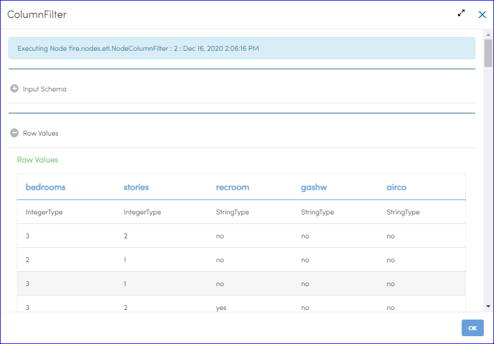
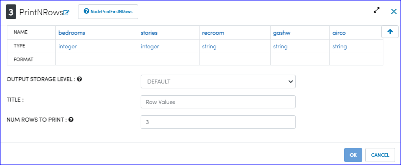
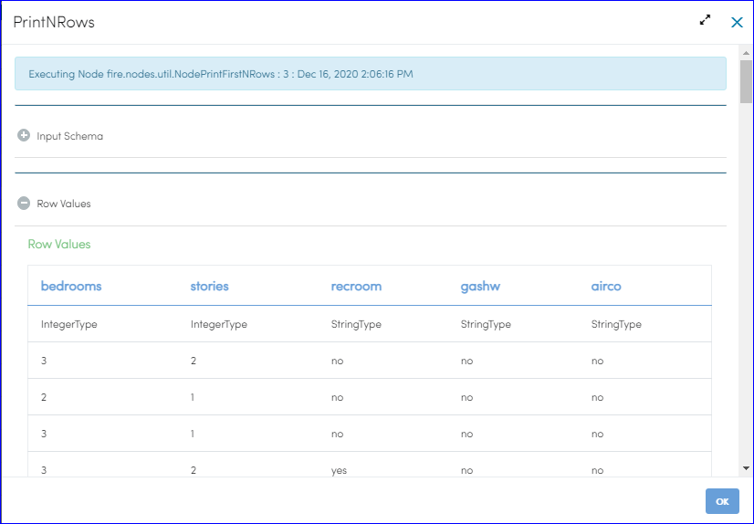

Column Filter
=============

This workflow reads in a dataset. It then filters specified columns from the original dataset and prints the results.

Workflow
-------

Below is the workflow. It does the following:

* Reads data from a dataset.
* It then filters specified columns from the original dataset.
* Prints the results.

   
Reading from Dataset
---------------------

It reads Dataset File.

Processor Configuration
^^^^^^^^^^^^^^^^^^

   
Processor Output
^^^^^^

   
Column Filter
------------

It filters the columns whichever we want.

Processor Configuration
^^^^^^^^^^^^^^^^^^

Processor Output
^^^^^^

  
Prints the Results
------------------

It prints the results after filtering the columns.

Processor Configuration
^^^^^^^^^^^^^^^^^^

Processor Output after executing workflow
^^^^^^

