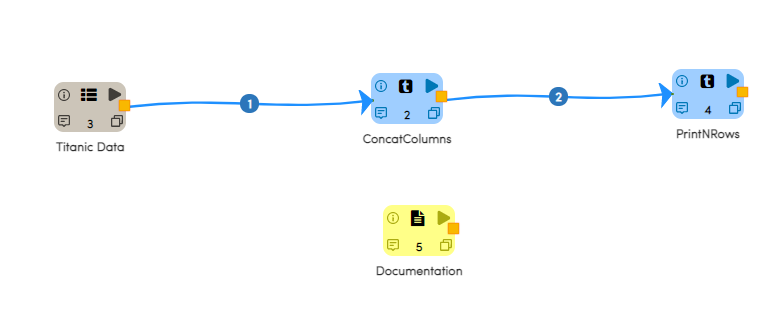
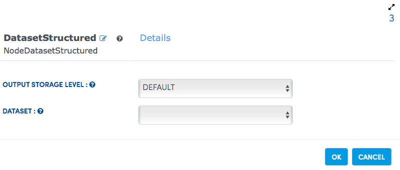
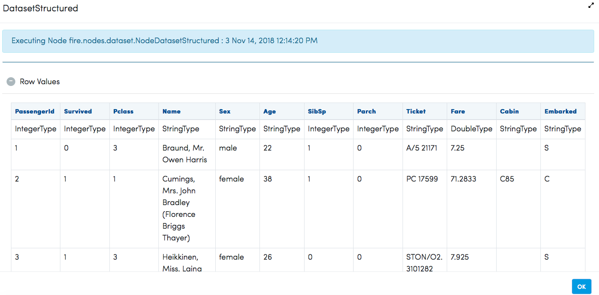
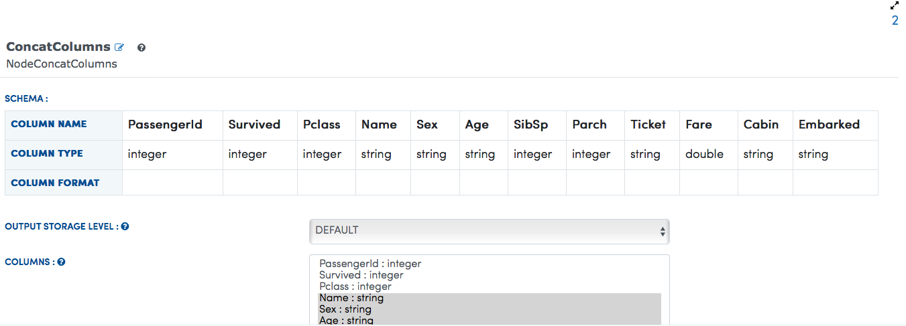
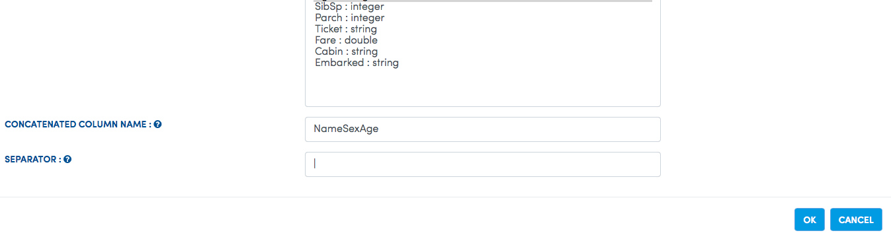
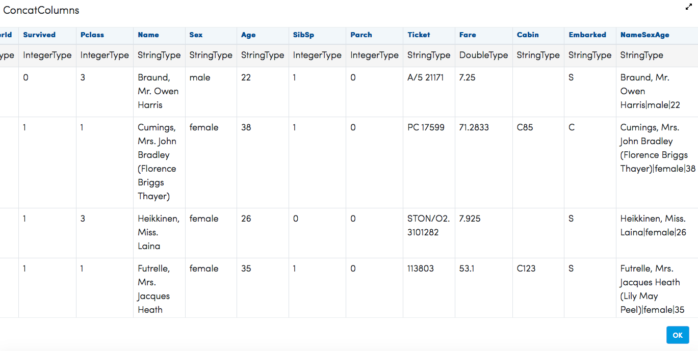

Concat Columns
==============

This example concats columns in the input dataset with the specified separator.

Workflow
--------

Below is the workflow. It does the following:

* Reads data from file present on HDFS.
* Concats the specified columns with specified separator.

   
Reading from HDFS File
---------------------

It reads data from a file present on HDFS. 

Processor Configuration
^^^^^^^^^^^^^^^^^^

   
Processor Output
^^^^^^

   
Concating columns
-----------------

It concats the specified columns in cofiguration with the specified separator.

Processor Configuration
^^^^^^^^^^^^^^^^^^

We need to provide all the desired columns to be concatenated without any separator or space, like NameSexAge etc.
Columns would get concatenated in same order defined in configuration like Name then Sex then Age.

   

Processor Output
^^^^^^

