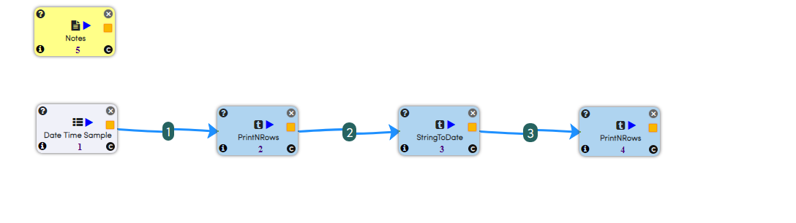
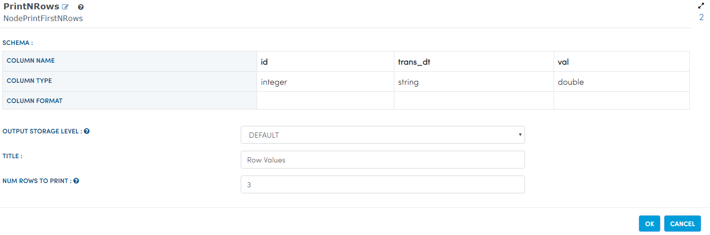
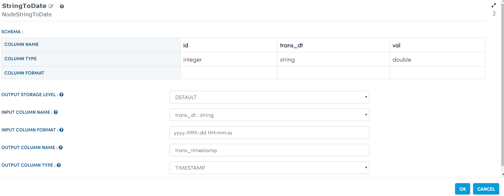
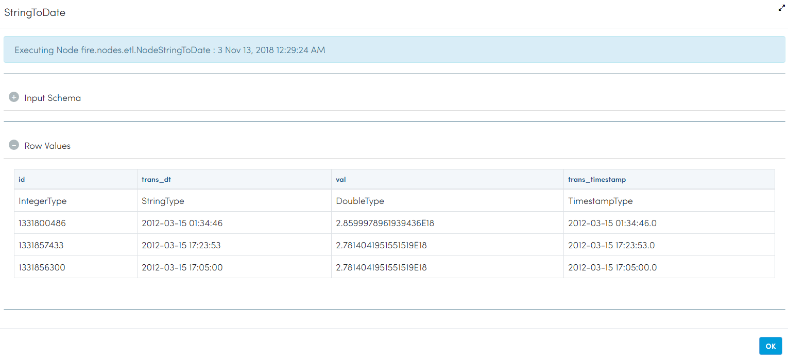
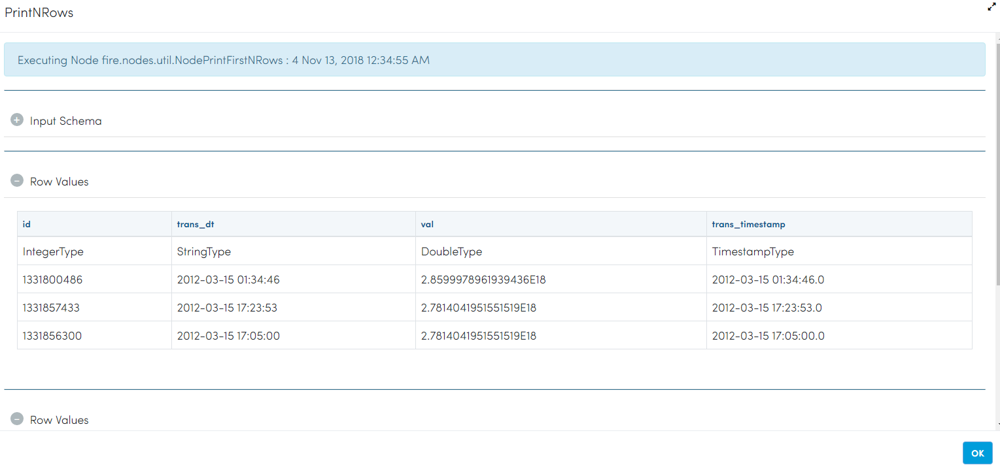

Convert To Timestamps
====================

This example converts to timestamp from the input sample dataset using string to date Node.

Workflow
--------

Below is the workflow. It does the following:

* Reads data from a sample dataset file.
* Prints sample dataset result.
* Converts sample string to timestamp.
* Prints the expected result.

   
Reading from Dataset
---------------------

It reads sample Dataset File.

Processor Configuration
^^^^^^^^^^^^^^^^^^^^^^^

.. figure:: ../../_assets/tutorials/data-cleaning/convert-to-timestamps/2.PNG
   :alt: Convert To Timestamps
   :align: center
   :width: 60%
   
Processor Output
^^^^^^^^^^^^^^^^

.. figure:: ../../_assets/tutorials/data-cleaning/convert-to-timestamps/2a.PNG
   :alt: Convert To Timestamps
   :align: center
   :width: 60%
   
Prints the sample Dataset Results
---------------------------------

It prints the results of the sample dataset available.

Processor Configuration
^^^^^^^^^^^^^^^^^^

Processor Output
^^^^^^

.. figure:: ../../_assets/tutorials/data-cleaning/convert-to-timestamps/3a.PNG
   :alt: Convert To Timestamps
   :align: center
   :width: 60% 
   
Convert To Timestamps
---------------------

It converts To Timestamps using stringtodate Node.

Processor Configuration
^^^^^^^^^^^^^^^^^^

Processor Output
^^^^^^

   
Prints the Results
------------------

It prints the results after converting to Timestamps.

Processor Configuration
^^^^^^^^^^^^^^^^^^

.. figure:: ../../_assets/tutorials/data-cleaning/convert-to-timestamps/5.PNG
   :alt: Convert To Timestamps
   :align: center
   :width: 60%

Processor Output
^^^^^^

