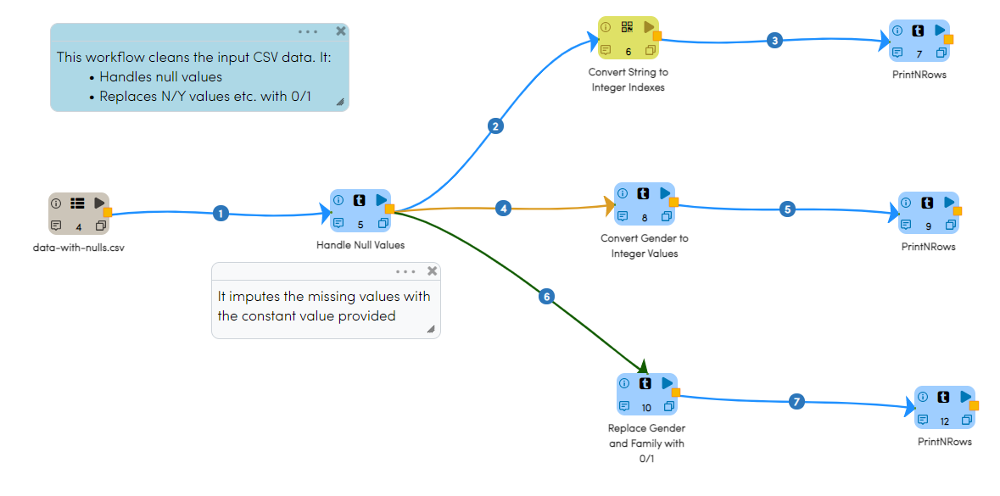
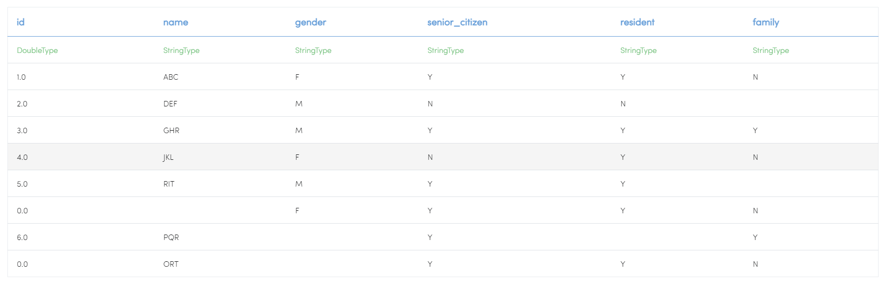
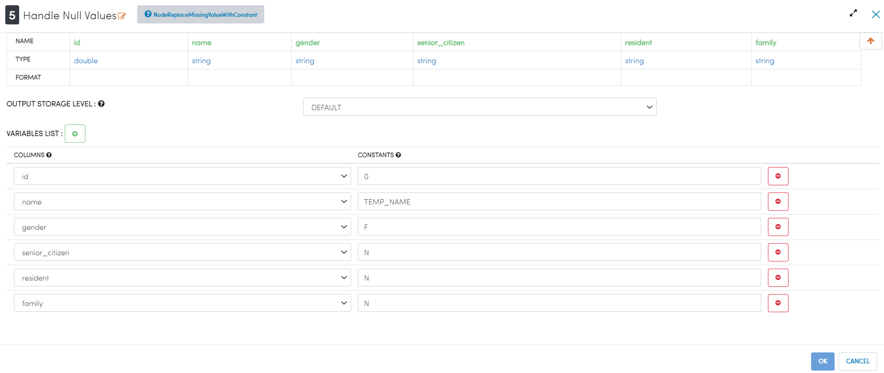
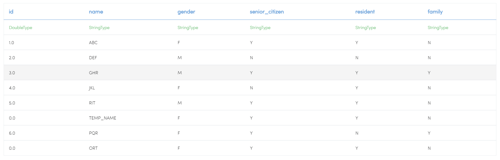
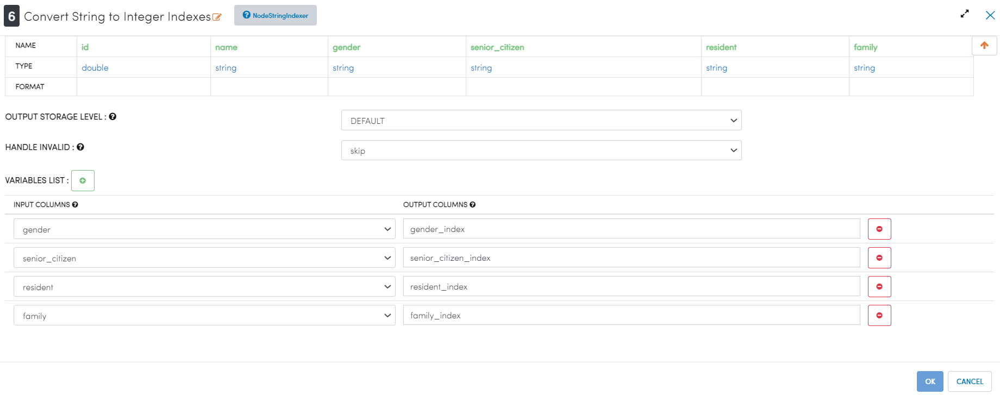
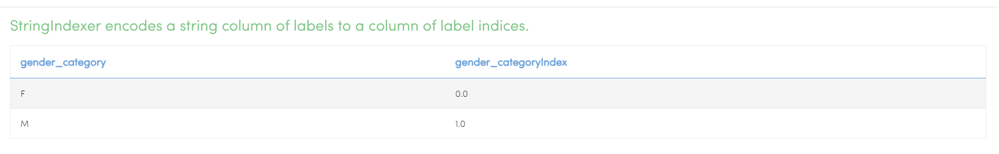
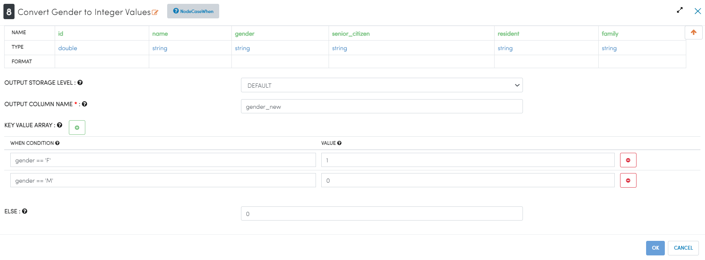
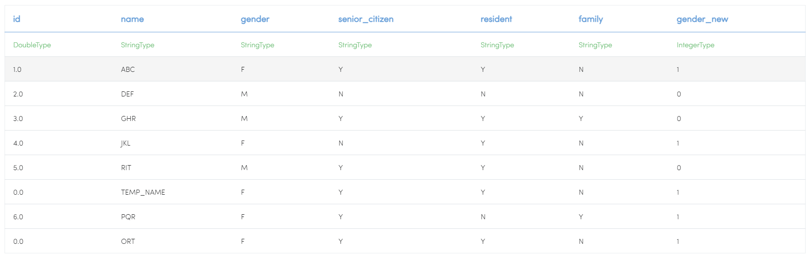
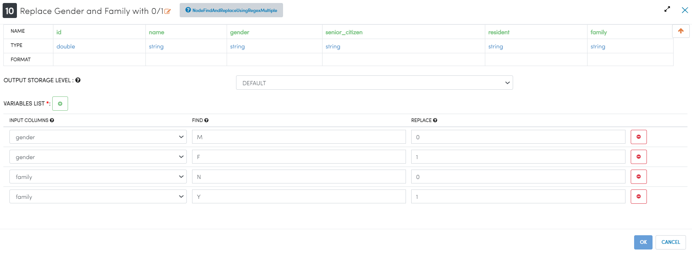
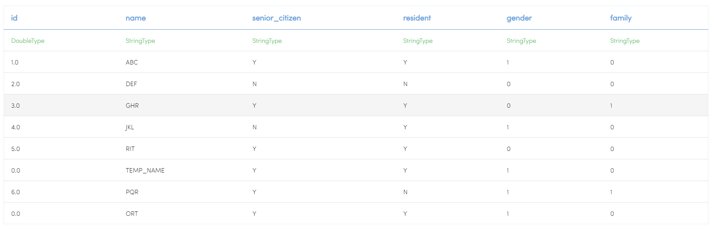

Data Cleaning
=============

This workflow cleans the input data. 

It also:

* Handles null values

* Replaces ``N/Y`` values etc. with ``0/1``

Workflow
-------

The below workflow:

* Reads data from a dataset
* Handles the null values by imputing the missing values with the constant value provided in the specified columns
* Converts Strings to Integer Indexes
* Converts Gender to Integer Values
* Replaces Gender and Family with ``0/1``

   
Reading from Dataset
---------------------

``DatasetCSV`` reads in the input Dataset file and creates DataFrame from it.

Processor Output
^^^^^^

   
   
Handling Null Values
------------

``ReplaceMissingValueWithConstant`` Processor handles the null values by imputing the missing values with the constant value provided in the specified columns.

Processor Configuration
^^^^^^^^^^^^^^^^^^

Processor Output
^^^^^^

  

Convert Strings to Integer Indexes
------------

``StringIndexer`` Processor encodes a string type column to a column of label indices.

Processor Configuration
^^^^^^^^^^^^^^^^^^

Processor Output
^^^^^^

   
Convert Gender to Integer Values
------------

``CaseWhen`` Processor sets values for the variables based on conditions, as shown below:

Processor Configuration
^^^^^^^^^^^^^^^^^^

Processor Output
^^^^^^

   
Replace Gender and Family with 0/1
------------

``FindAndReplaceUsingRegexMultiple`` processor sets values for the variables based on conditions, as shown below:

Processor Configuration
^^^^^^^^^^^^^^^^^^

Processor Output
^^^^^^

   
   
Prints the Results
------------------

It prints the first few records onto the screen.
