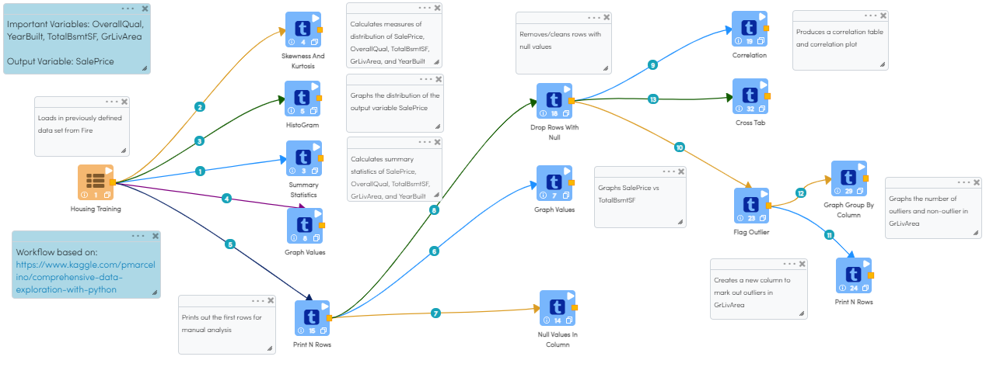
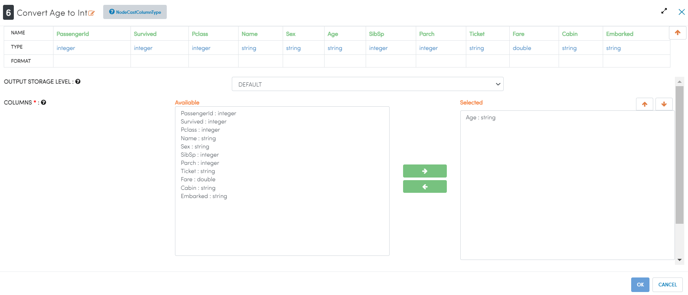
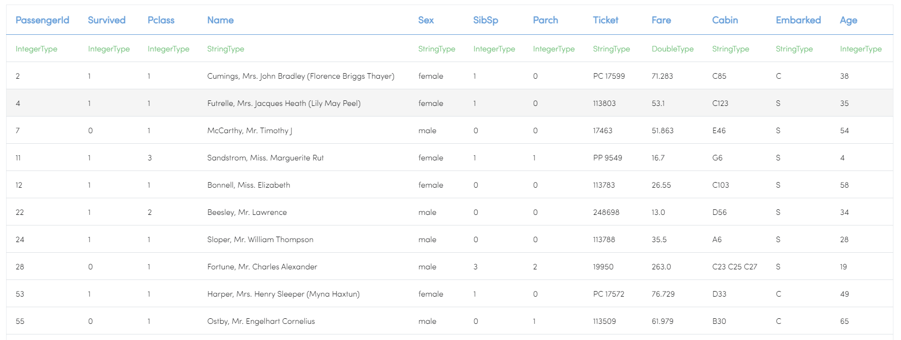
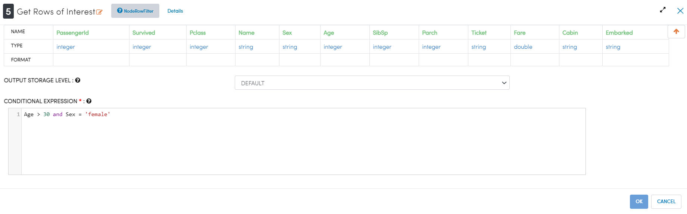
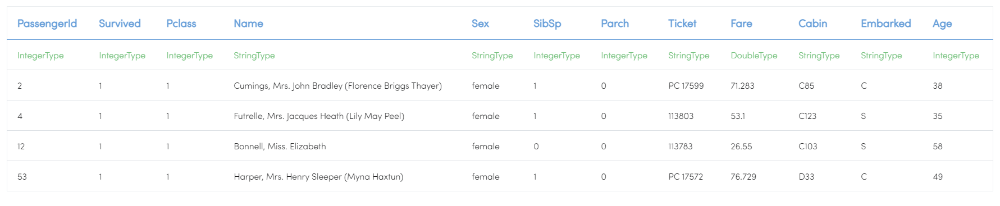

Data Exploration of Housing Data
=========================

This workflow shows how to explore the Housing Dataset from Kaggle with Sparkflows.

Workflow
--------
The below workflow: 

* Reads the Housing dataset
* Calculates summary statistics for important variables
* Creates a histogram to show the distribution of the Sale Price variable
* Creates a graph to show the relationship between Sale Price and Basement Square Footage
* Creates a matrix to show the correlation between important variables
* Flags outliers in Ground Living Area and graphs the results

   
Reading Housing Dataset
---------------------

``DatasetStructured`` Processor creates a Dataframe of your dataset named ``Housing Training`` by reading data from HDFS, HIVE etc. which have been defined earlier in Fire by using the Dataset feature.

Processor Output
^^^^^^^^^^^^^^^^^^

.. figure:: ../../_assets/tutorials/data-engineering/data-exploration-housing-data/DatasetStructured_Output.PNG
   :alt: titanic-data-cleaning
   :width: 90%
   

Calculate Summary Statistics
----------------
``Summary Statistics`` Processor calculates summary statistics for the selected variables.

Processor Configuration
^^^^^^^^^^^^^^^^^^

.. figure:: ../../_assets/tutorials/data-engineering/data-exploration-housing-data/SummaryStats_Config.PNG
   :alt: titanic-data-cleaning
   :width: 90%
   
Processor Output
^^^^^^

.. figure:: ../../_assets/tutorials/data-engineering/data-exploration-housing-data/SummaryStats_Output.PNG
   :alt: titanic-data-cleaning
   :width: 90%

Create Histogram Graph
----------------
``HistoGram`` Processor creates a histogram to show distribution by count of Sale Price.

Processor Configuration
^^^^^^^^^^^^^^^^^^

.. figure:: ../../_assets/tutorials/data-engineering/data-exploration-housing-data/HistoGram_Config.PNG
   :alt: titanic-data-cleaning
   :width: 90%
   
Processor Output
^^^^^^

.. figure:: ../../_assets/tutorials/data-engineering/data-exploration-housing-data/HistoGram_Output.PNG
   :alt: titanic-data-cleaning
   :width: 90%
   
Convert Age to Integer
---------------------

``CastColumnType`` Processor performs conversion of Age to integer type.

Processor Configuration
^^^^^^^^^^^^^^^^^^

   
Processor Output
^^^^^^

Get Rows of Interest
---------------

``RowFilter`` Processor filters the data based on provided conditions as below:

Processor Configuration
^^^^^^^^^^^^^^^^^^

   
Processor Output
^^^^^^

Prints the result
-------------

It prints the first few records onto the screen.
