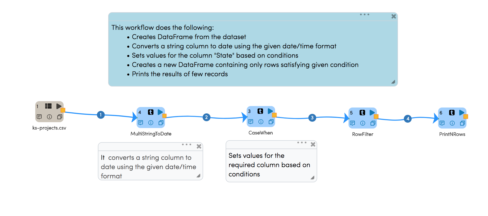
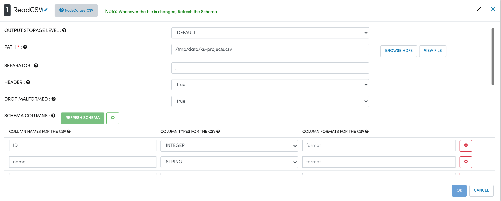
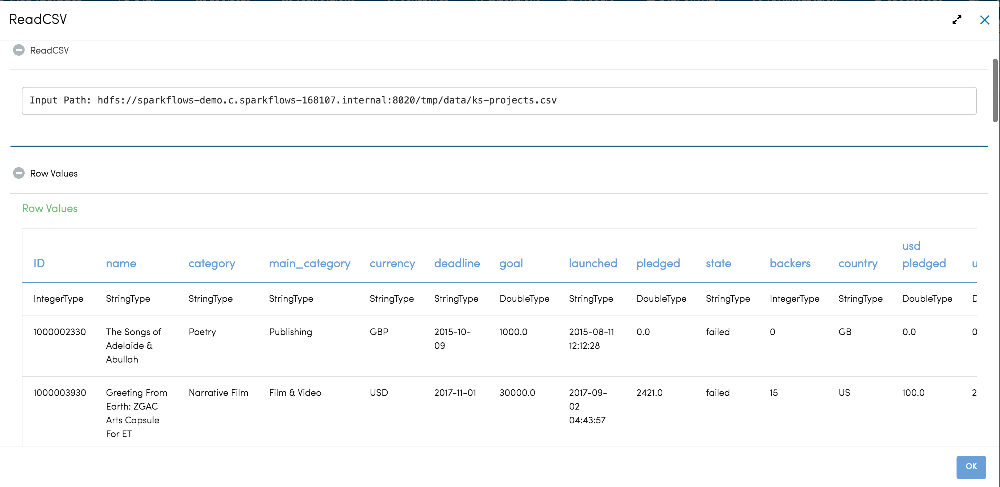
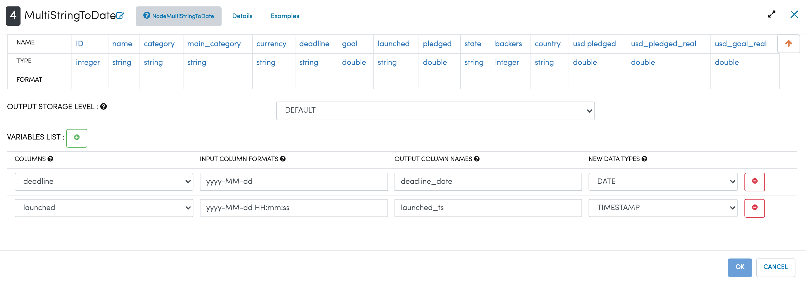
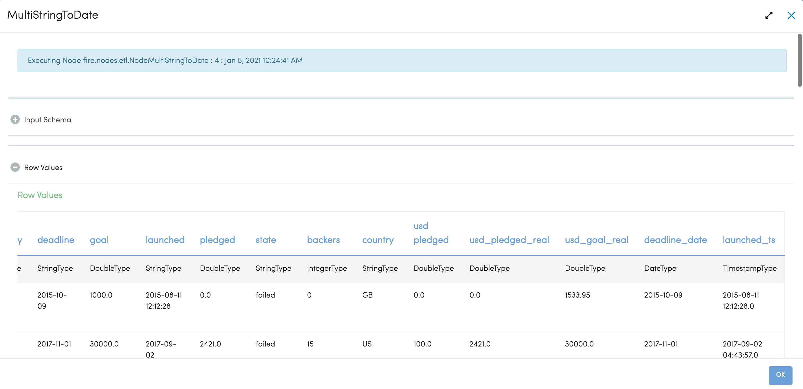
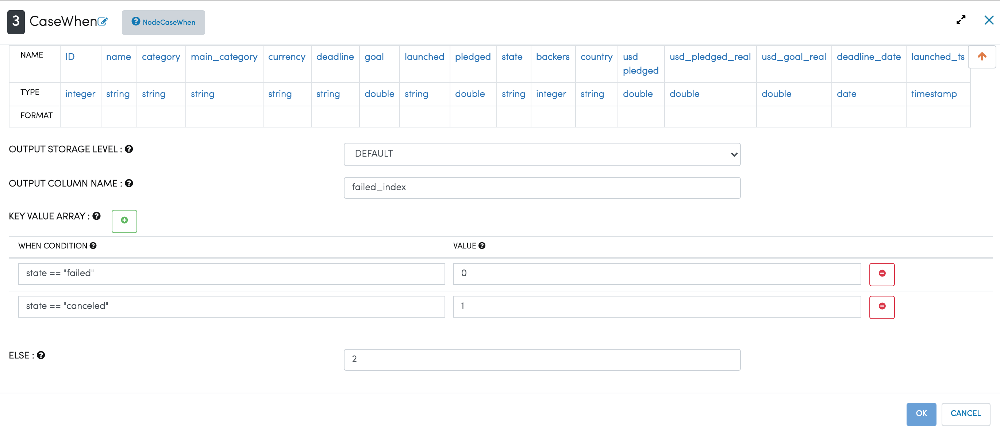
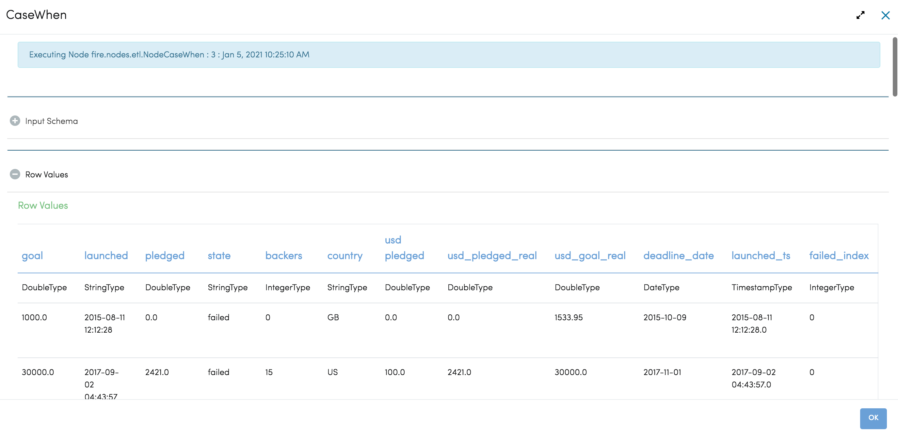
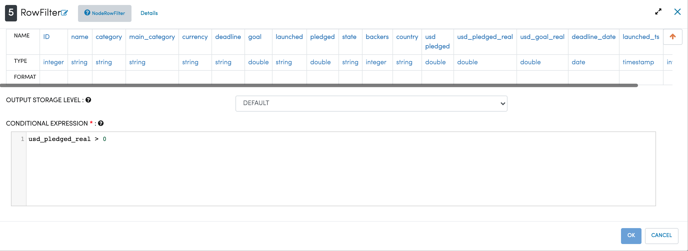
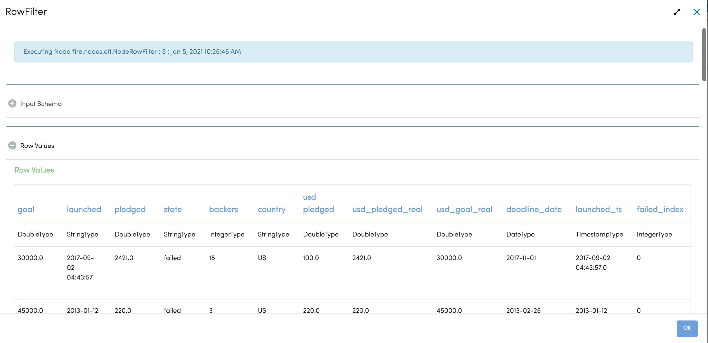

Data Preparation-1
=============

Data preparation is the process of cleaning and transforming raw data prior to processing and analysis. 
It is an important step prior to processing and often involves reformatting data, making corrections to data and the combining of data sets to enrich data.

Workflow
-------

Below is the workflow. It does the following:

* Reads data from the dataset
* converts a string column to date using the given date/time format
* Sets values for the column "State" based on conditions
* Creates a new DataFrame containing only rows satisfying given condition
* Prints the results of few records

   
Reading from Dataset
---------------------

It reads in the input Dataset File.

Processor Configuration
^^^^^^^^^^^^^^^^^^

   
   
Processor Output
^^^^^^

   
   
Convert String to Date
------------

``MultiStringToDate`` converts a string column to date using the given date/time format.

Processor Configuration
^^^^^^^^^^^^^^^^^^

Processor Output
^^^^^^

  

Settings values for required Column
------------

``CaseWhen`` sets values for the required column based on conditions as shown in example below:

Processor Configuration
^^^^^^^^^^^^^^^^^^

Processor Output
^^^^^^

   
Creating DataFrame with required rows
------------

``RowFilter`` creates a new DataFrame containing only rows required.

Processor Configuration
^^^^^^^^^^^^^^^^^^

   
   
Processor Output
^^^^^^

   

Prints the Results
------------------

It prints the first few records onto the screen.
