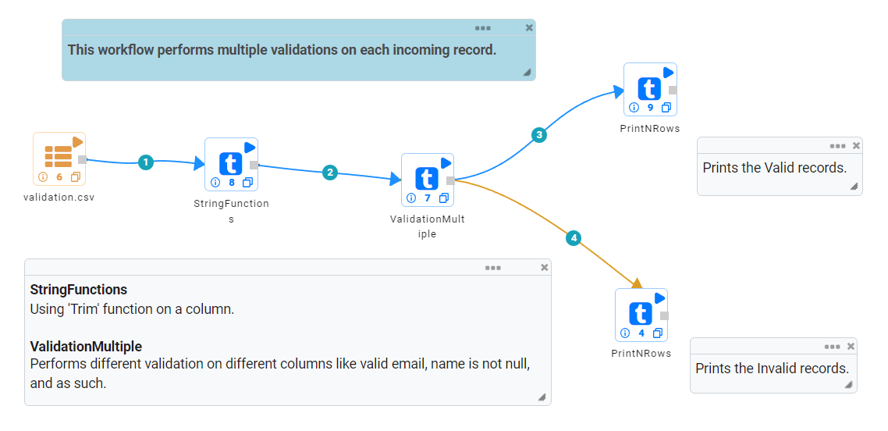
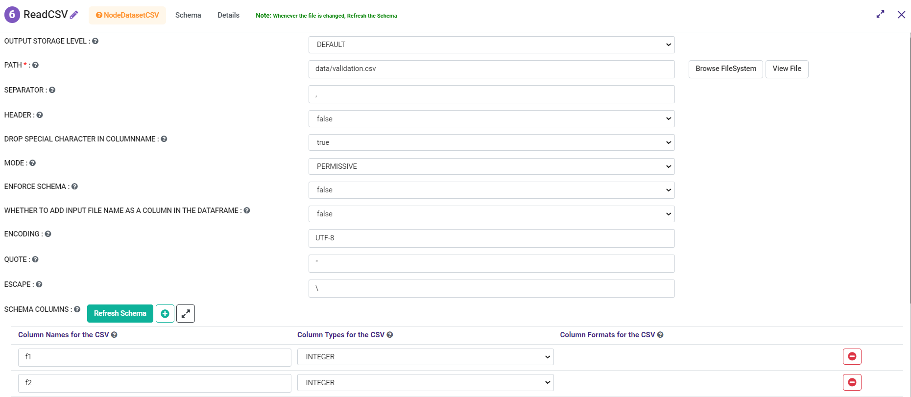
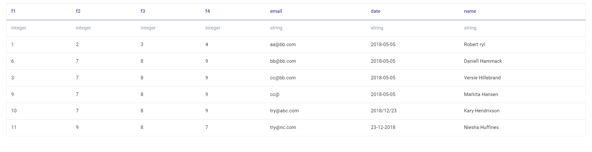
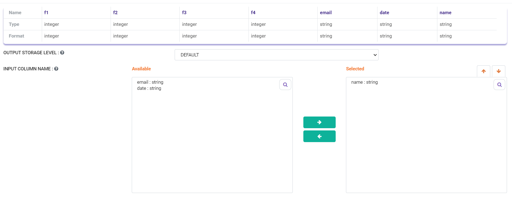
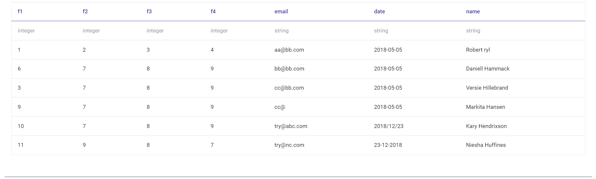
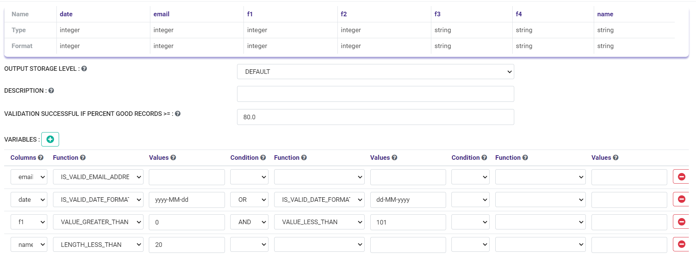
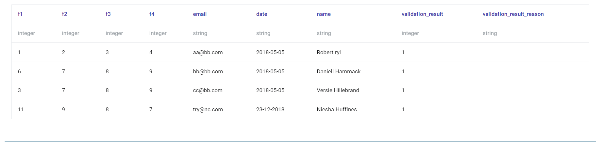
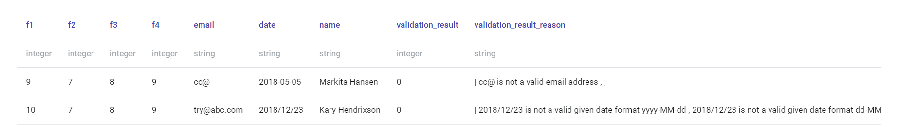
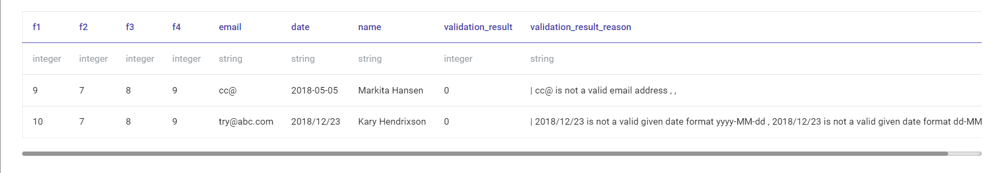

Data Validation II
===============

This workflow performs multiple validations on each incoming record.

It also:

* Records which pass validation are output into the first edge.
* Records which fail validation are output into the seconds edge.

Validations
-----------
* Ensures that field is greater than or equal to specified string value.
* Ensures that field is less than or equal to specified string value.
* Ensures that field matches given datePattern.
* Ensures that the email is valid.
* Ensures field length is greater than or equal to specified length.

Workflow
--------

The below workflow:

* Reads data from a CSV File.
* Performs specific validation on specific columns.

   
Reading from CSV File
---------------------

DatasetCSV Processor reads data from a CSV file. 

Processor Configuration
^^^^^^^^^^^^^^^^^^

   
   
Processor Output
^^^^^^

String Functions
----------------
StringFunctions Processor performs specified operation on the selected column (i.e. trim function for column 'name' in this case).

Processor Configuration
^^^^^^^^^^^^^^^^^^

   
Processor Output
^^^^^^

   

Performing Validation
---------------------

ValidationMultiple Processor performs different validation on different columns.

Processor Configuration
^^^^^^^^^^^^^^^^^^

   
Processor Output
^^^^^^

Prints the Valid Records
------------------

Processor Output
^^^^^^

Prints the Invalid Records
------------------

Processor Output
^^^^^^

