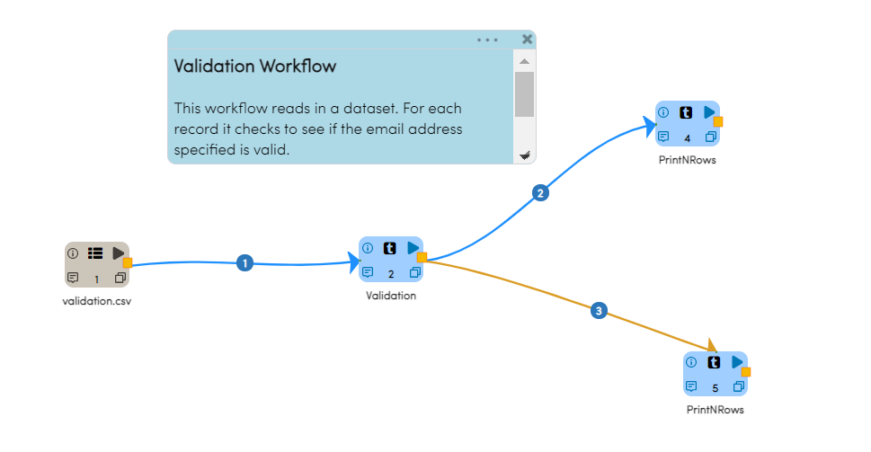
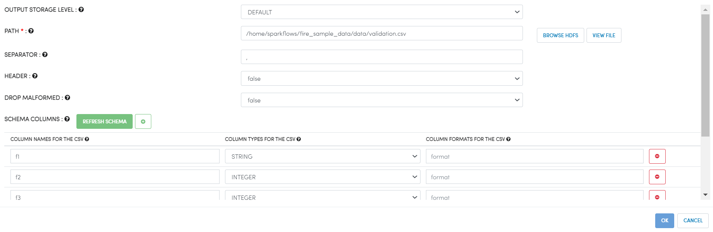
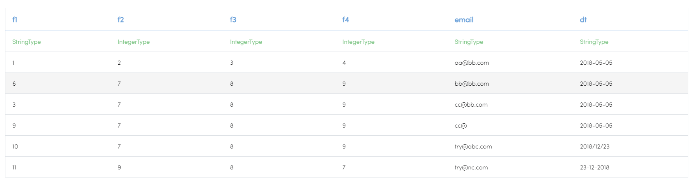
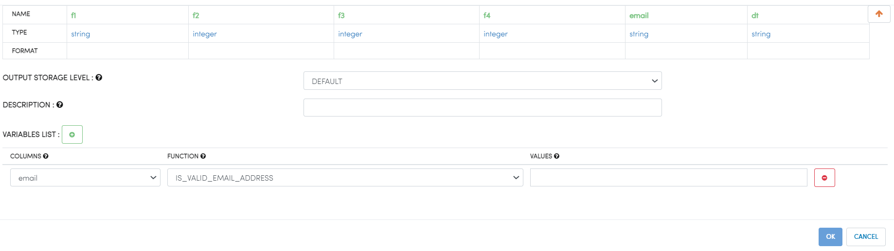
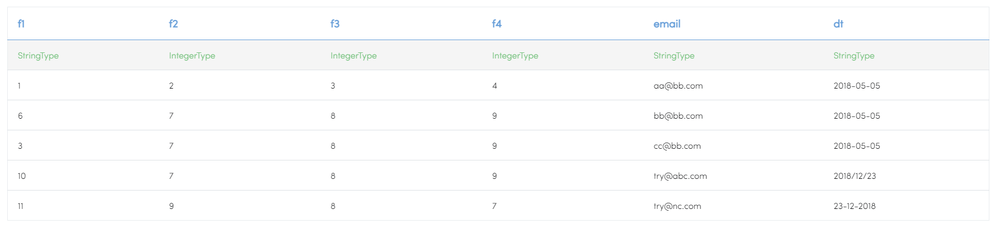

Data Validation
===============

This example performs different kinds of data validation on input dataset like valid/invalid email,valid/invalid date,null/not null check etc.

Workflow
--------

Below is the workflow. It does the following:

* Reads data from a CSV file.
* Performs specific validation on specific columns.

   
Reading from CSV File
---------------------

It reads data from a CSV file. 

Processor Configuration
^^^^^^^^^^^^^^^^^^

   
  
Processor Output
^^^^^^

   
Performing Validation
---------------------

It performs different validation on different columns.

Processor Configuration
^^^^^^^^^^^^^^^^^^

   
   
Processor Output
^^^^^^^

