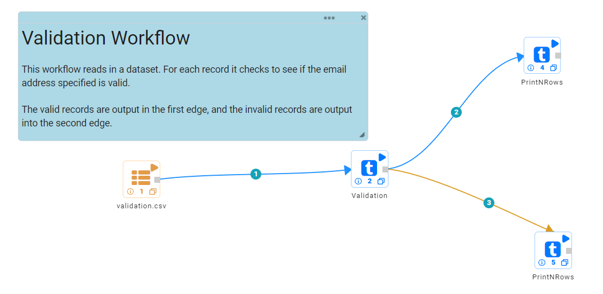
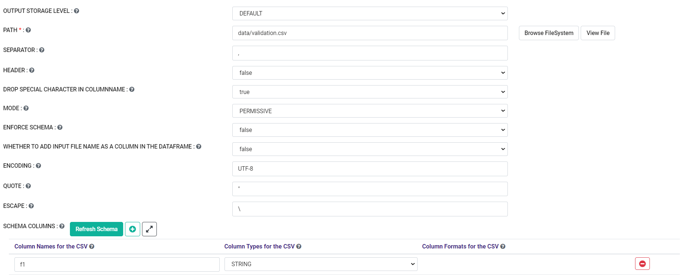
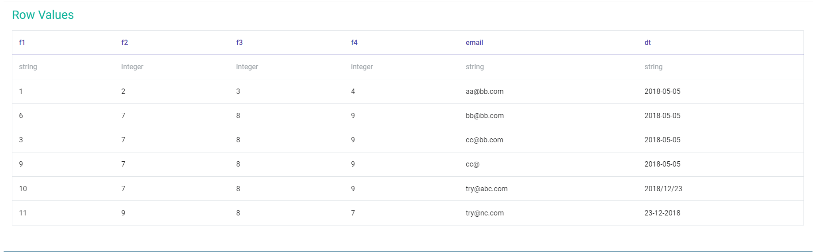
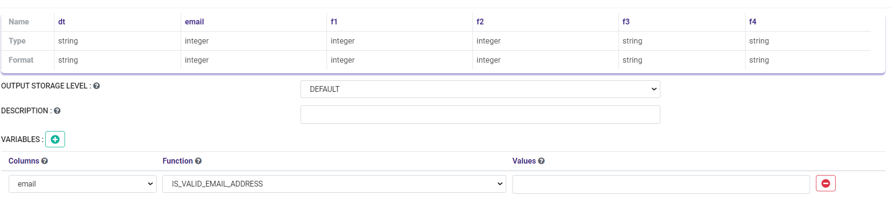
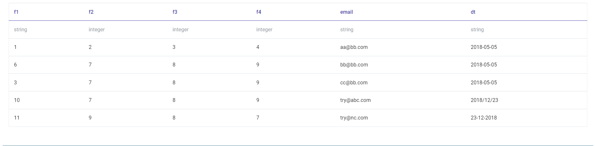

Data Validation I
===============

This sample workflow performs different kinds of data validation on input datasets like valid/invalid email, valid/invalid date, null/not null check, etc.

Workflow
--------
 The below workflow:

* Reads data from a CSV File.
* Performs specific validation on specific columns.

   
Reading from CSV File
---------------------

It reads data from a CSV File. 

Processor Configuration
^^^^^^^^^^^^^^^^^^

   
  
Processor Output
^^^^^^

   
Performing Validation
---------------------

It performs different validation on different columns.

Processor Configuration
^^^^^^^^^^^^^^^^^^

   
   
Processor Output
^^^^^^^

