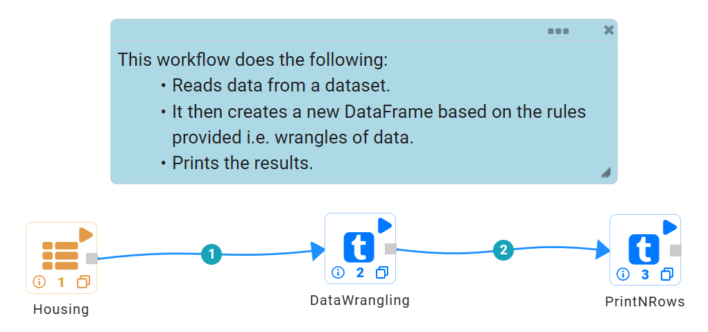
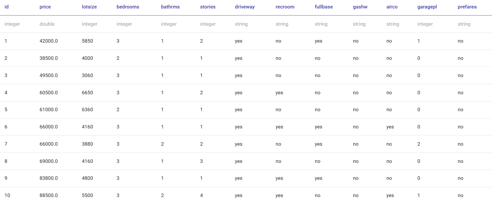
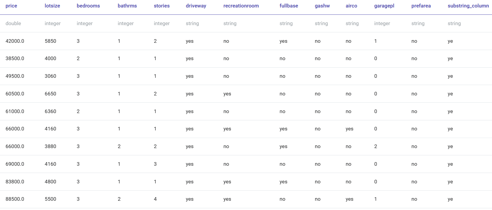

Data Wrangling
=============

Data wrangling is the process of gathering, selecting, and transforming data to answer an analytical question.  Also known as ``Data Cleaning`` or ``Munging``,
this workflow reads in a dataset. It then wrangles the dataset based on provided conditions and prints the results.

Workflow
-------

The below workflow:

* Reads data from a dataset.
* It then creates new DataFrame based on the rules provided.
* Prints the result.

   
Reading from Dataset
---------------------

``DatasetStructured`` Processor creates a DataFrame of your dataset by reading data from HDFS, HIVE, etc. which has been defined earlier in Fire by using the Dataset feature.

  
Processor Output
^^^^^^

   
   
Data Wrangling
------------

``DataWrangling`` Processor creates new DataFrame after applying the provided rules.

Processor Configuration
^^^^^^^^^^^^^^^^^^

.. figure:: ../../_assets/tutorials/data-engineering/data-wrangling/wrangle-config.png
   :alt: data-wrangling
   :width: 65%

Processor Output
^^^^^^

  
  
Prints the Results
------------------

It prints the first few records onto the screen.

