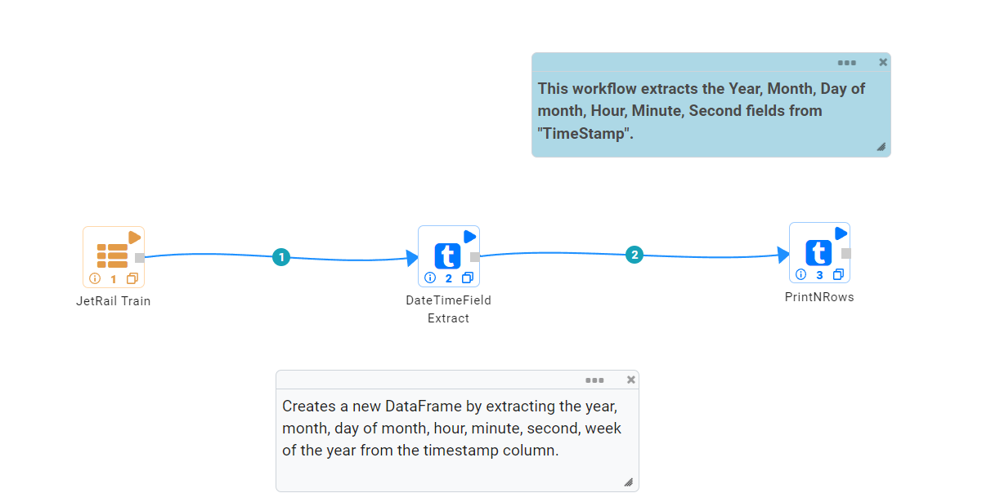
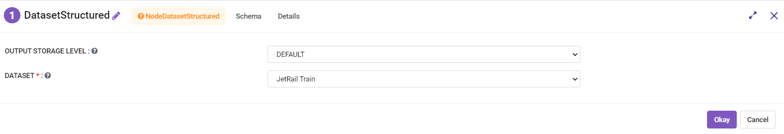
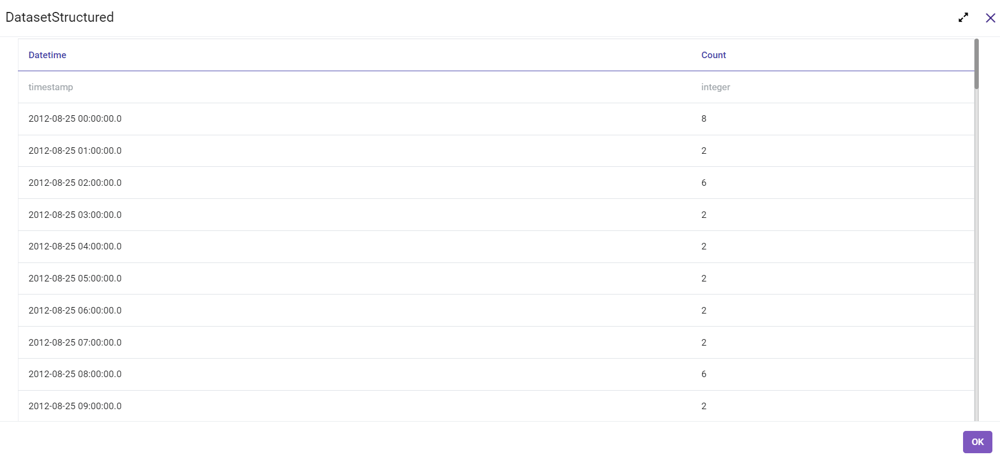
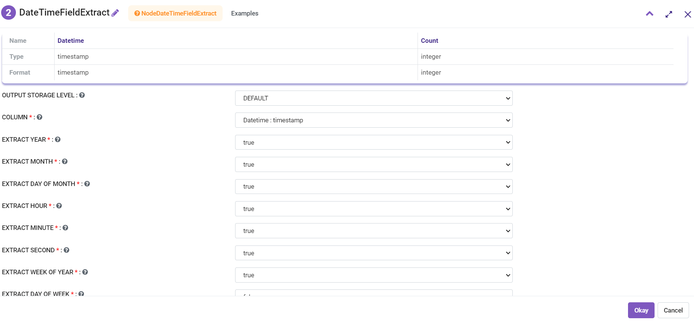
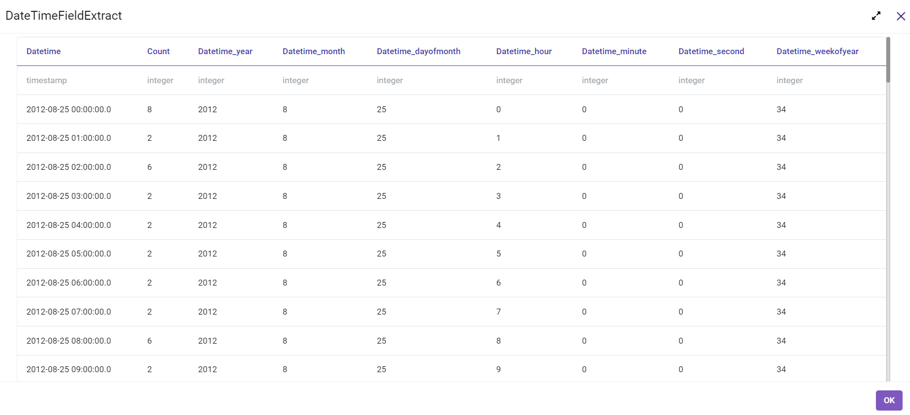

Date-Time Field Extract
=============

Workflow
-------

The below workflow:

* Reads data from a dataset.
* It creates a new DataFrame by extracting ``Year``, ``Month``, ``Day of month``, ``Hour``, ``Minute``, ``Second`` fields from **TimeStamp**.
* Prints the result.

   
Reading from Dataset
---------------------

It reads in the input Dataset file.

Processor Configuration
^^^^^^^^^^^^^^^^^^

   
Processor Output
^^^^^^

   
   
Date-Time Field Extract
------------

It creates a new DataFrame by extracting the ``year``, ``month``, ``day of month``, ``hour``, ``minute``, ``second``, ``week of the year`` from the **Timestamp Column**.

Processor Configuration
^^^^^^^^^^^^^^^^^^

   
   
Processor Output
^^^^^^

  
  
Prints the Result
------------------

It prints the first few records onto the screen.
