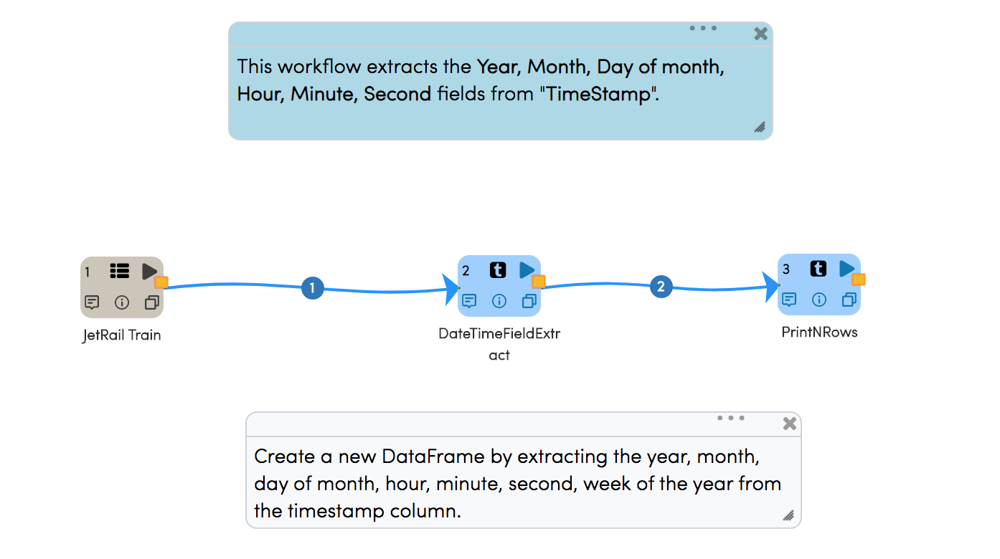
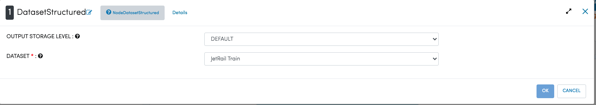
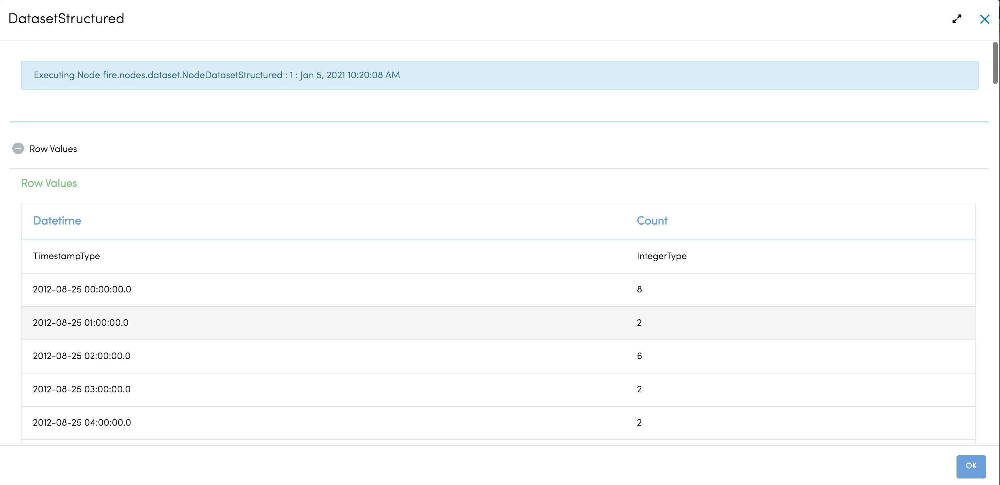
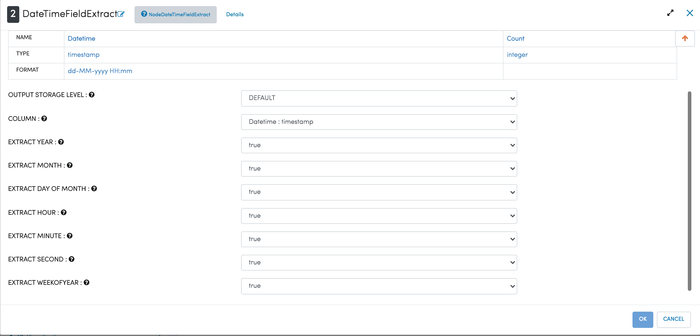

Date-Time Field Extract
=============

Workflow
-------

Below is the workflow. It does the following:

* Reads data from a dataset.
* It creates a new DataFrame by extracting Year, Month, Day of month, Hour, Minute, Second fields from "TimeStamp"
* Prints the results.

   
Reading from Dataset
---------------------

It reads in the input Dataset File.

Processor Configuration
^^^^^^^^^^^^^^^^^^

   
Processor Output
^^^^^^

.. figure:: ../../_assets/tutorials/data-engineering/date-time-field-extract/capture3.png
   :alt: DateTimeFieldExtract
   :width: 60%
   
   
Date-Time Field Extract
------------

It creates a new DataFrame by extracting the year, month, day of month, hour, minute, second, week of the year from the timestamp column.

Processor Configuration
^^^^^^^^^^^^^^^^^^

   
   
Processor Output
^^^^^^

  
  
Prints the Results
------------------

It prints the first few records onto the screen.
