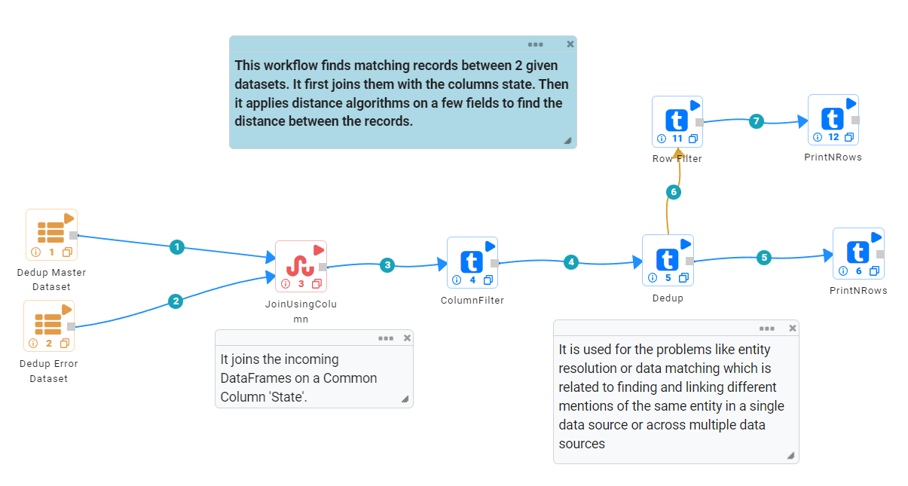
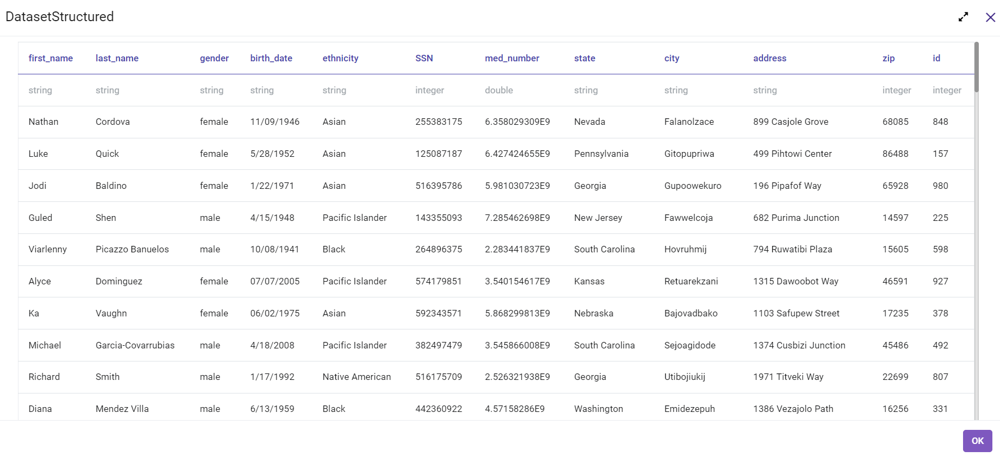
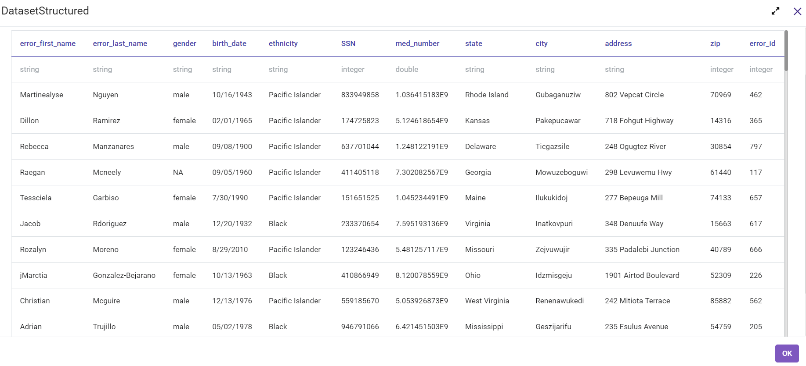
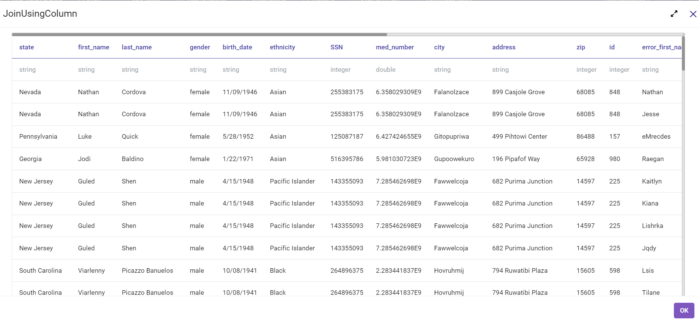
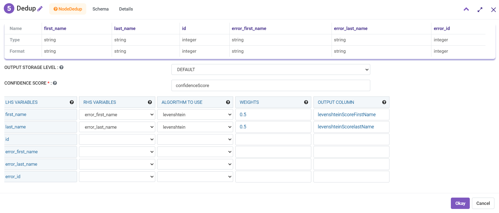
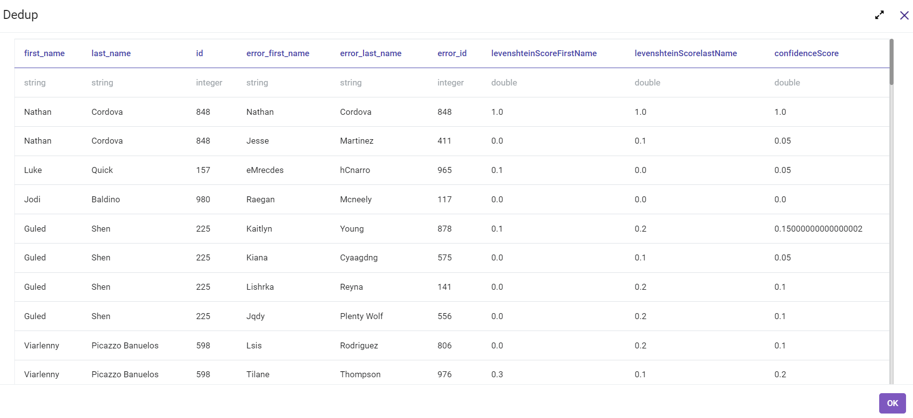

Dedup Customers
=============

Data Deduplication refers to a technique for eliminating redundant data in a dataset. 
In the process of Deduplication, extra copies of the same data are deleted, leaving only one copy to be stored.

Workflow
-------

The below workflow:

* Finds matching records between 2 given datasets. It first joins them with the column **State**.
* Then, it applies distance algorithms on a few fields to find the distance between the records.

   
Input Datasets
---------------------

There are 2 input datasets in this case **Dedup Master Dataset** & **Dedup Error Dataset** as shown below.

Dataset 1:
^^^^^^

   
   
Dataset 2:
^^^^^^

   
   
Join input DataFrames
------------

JoinUsingColum Processor joins the incoming DataFrames on a join column **State**. ColumnFilter Processor filters the columns to get the required DataFrame as shown below:

   
Data Deduplication
------------

**Dedup** is used for the problems like entity resolution or data matching.
Entity Resolution or Data Matching is the problem of finding and linking different mentions of the same entity in a single data source or across multiple data sources. Here, Levenshtein Algorithm is used for Data Deduplication. There are more options for Algorithms that can be used:

* **Full matching:** Full matching makes use of all individuals in the data by forming a series of matched sets in which each set has either 1 treated individual and multiple comparison individuals or 1 comparison individual and multiple treated individuals.

* **Levenshtein:** It counts the number of edits (insertions, deletions, or substitutions) needed to convert one string to the other.

* **Jaro-Winkler:** The Jaro–Winkler distance is a string metric measuring an edit distance between two sequences. Jaro-Winkler are suited for comparing smaller strings like words and names.

* **Jaccard (3 gram):** This takes consecutive words and groups them as a single object. A 3-gram is a consecutive set of 3 words. It's used for emails or small documents.

* **Longest Common Subsequence:** If a set of sequences are given, the longest common subsequence problem is to find a common subsequence of all the sequences that is of maximal length used in revision control systems, such as SVN and Git, for reconciling multiple changes made to a revision-controlled collection of files.

* **Date Difference:** Calculates the number of days between two dates.

* **Notional Distance:**

Dedup Processor Configuration 
^^^^^^^^^^^^^^^^^^

   
   
Dedup Processor Output
^^^^^^

   

Prints the Result
------------------

It prints the first few records onto the screen.
