Dedup Customers
=============

Data deduplication refers to a technique for eliminating redundant data in a data set. 
In the process of deduplication, extra copies of the same data are deleted, leaving only one copy to be stored.

Workflow
-------

Below is the workflow. This workflow does the following:
* Finds matching records between 2 given datasets. It first joins them with the columns state.
* Then it applies distance algorithms on a few fields to find the distance between the records.

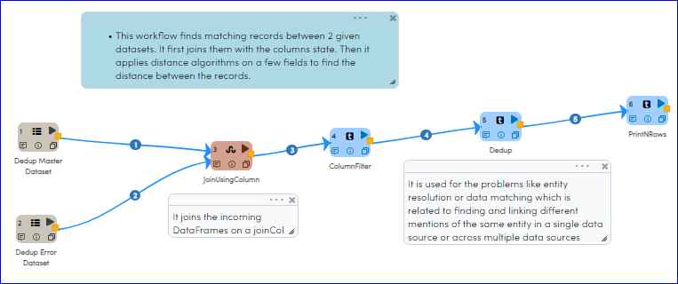
   
Reading from Dataset
---------------------

It reads in the input Dataset Files. There are 2 input datasets in this case.

Processor Configuration
^^^^^^^^^^^^^^^^^^

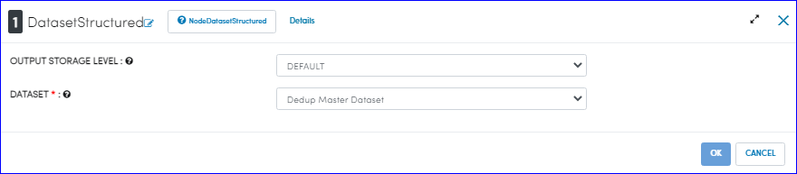
   
   
Processor Output
^^^^^^

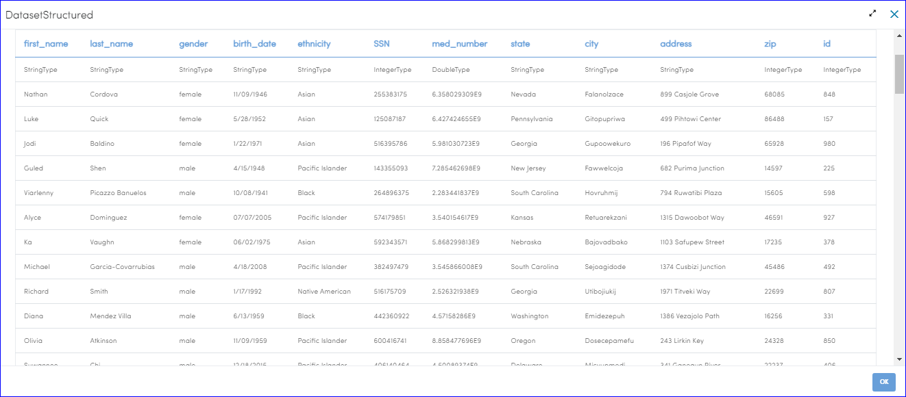
   
Processor Configuration
^^^^^^^^^^^^^^^^^^

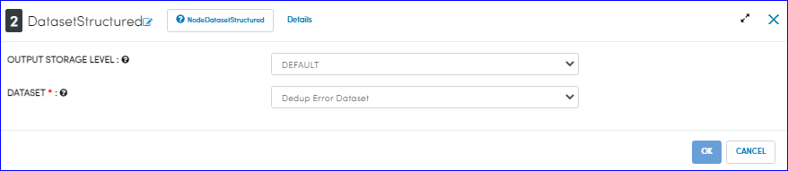
   
   
Processor Output
^^^^^^

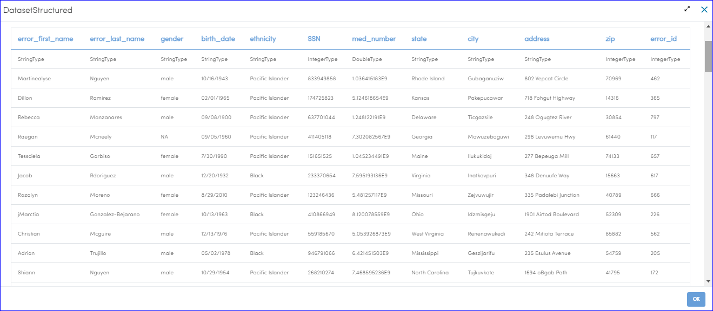
   
   
Join input DataFrames
------------

``JoinUsingColumn`` joins the incoming DataFrames on a joinCol.

Processor Configuration
^^^^^^^^^^^^^^^^^^

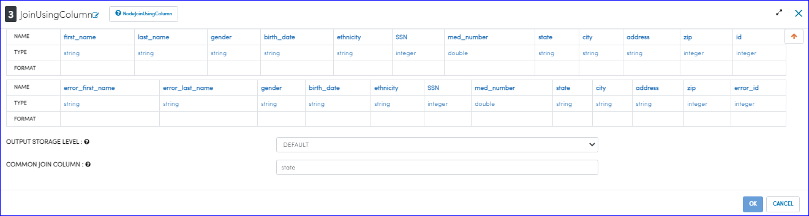

Processor Output
^^^^^^

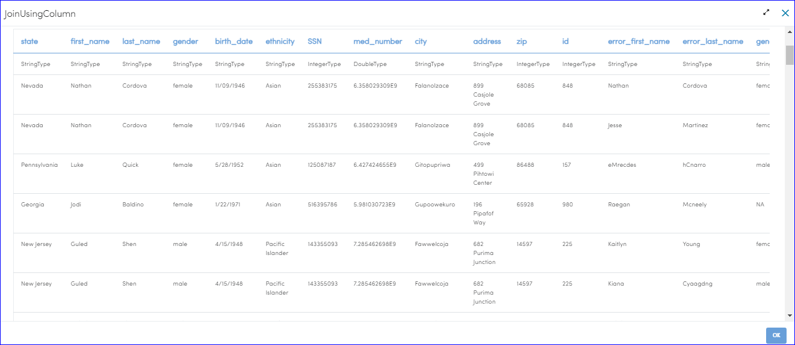
  

Creating DataFrame with required Columns
------------

``ColumnFilter`` creates a new DataFrame that contains only the selected columns as shown below:

Processor Configuration
^^^^^^^^^^^^^^^^^^

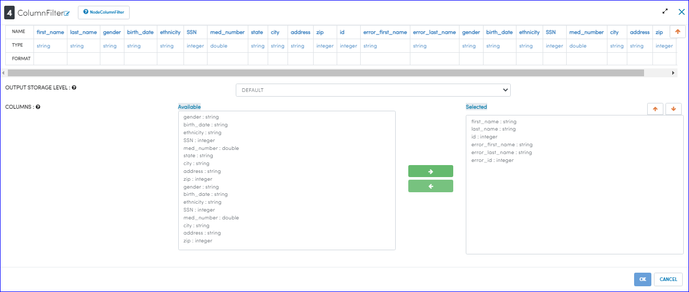

Processor Output
^^^^^^

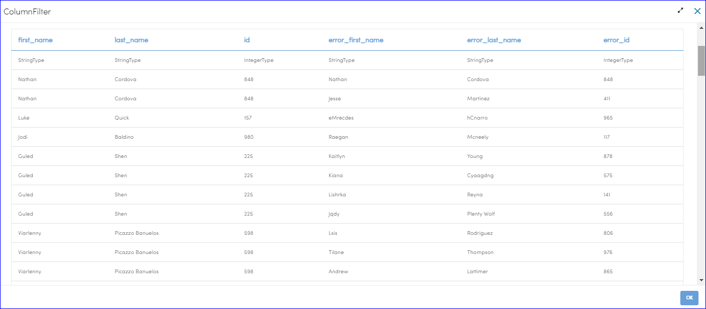
   
Creating DataFrame with required rows
------------

``Dedup`` is used for the problems like entity resolution or data mathching.
Entity resolution or data matching is the problem of finding and linking different mentions of the same entity in a single data source or across multiple data sources.

Processor Configuration
^^^^^^^^^^^^^^^^^^

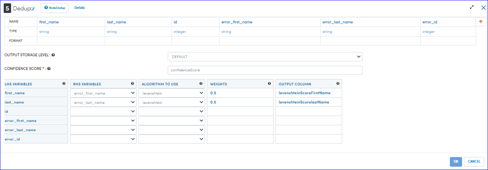
   
   
Processor Output
^^^^^^

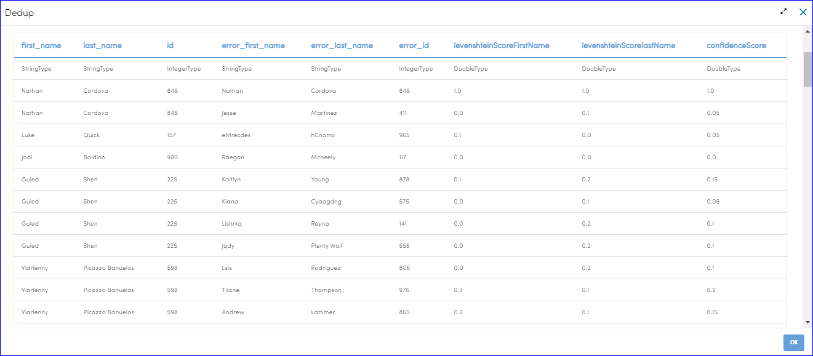
   

Prints the Results
------------------

It prints the first few records onto the screen.
