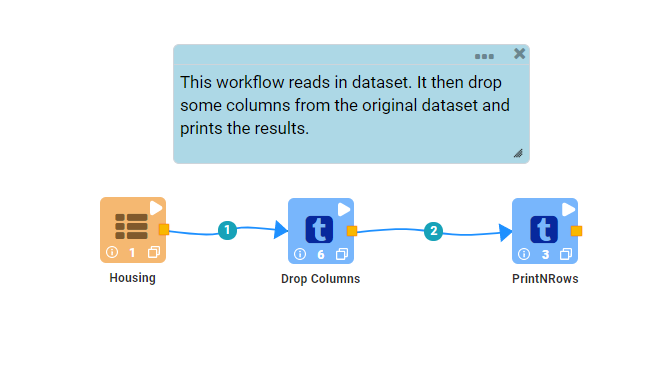
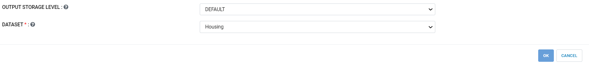
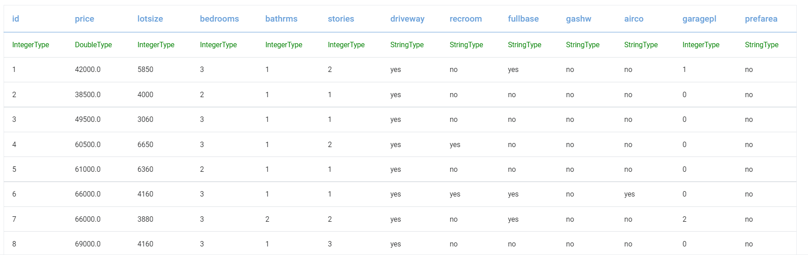
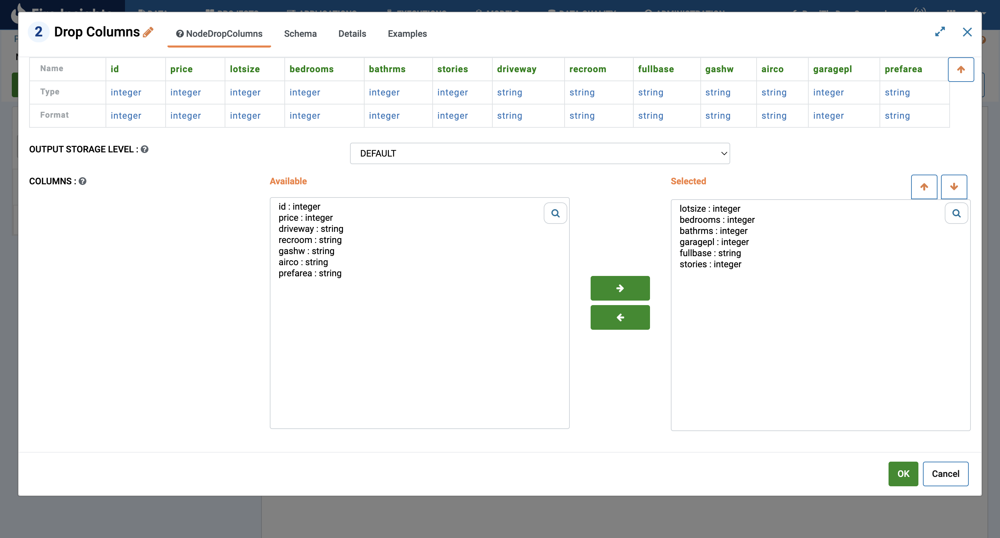
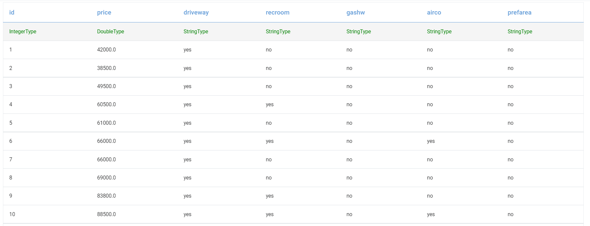
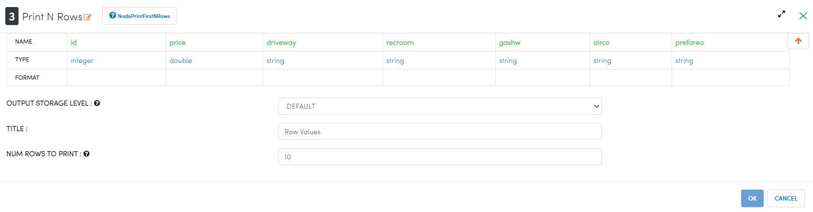
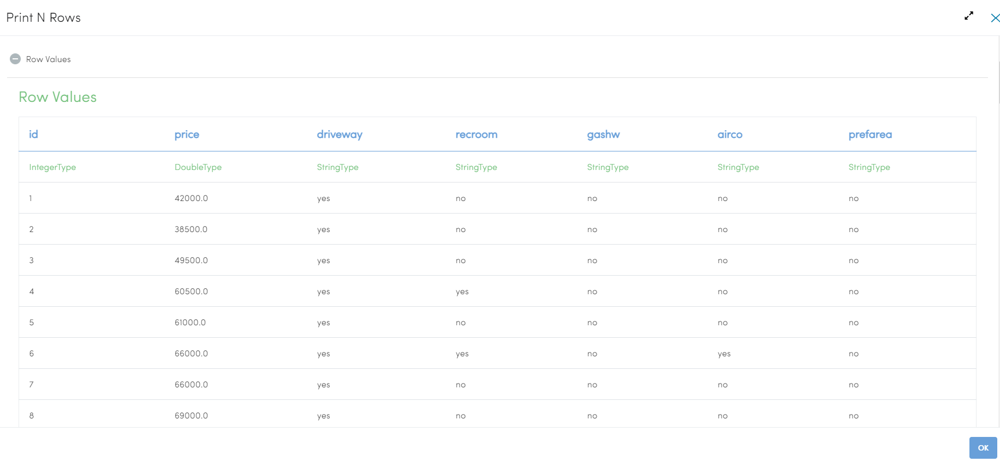

Drop Columns
=============

This workflow reads in a dataset. It then drops some columns from the original dataset and prints the results.

Workflow
-------

The below workflow:

* Reads data from a dataset.
* It then drops some columns from the original dataset.
* Prints the results.

   
Reading from Dataset
---------------------

It reads the Dataset File.

Processor Configuration
^^^^^^^^^^^^^^^^^^

   
Processor Output
^^^^^^

   
Drop Columns
------------

It drops the columns whichever we want.

Processor Configuration
^^^^^^^^^^^^^^^^^^

Processor Output
^^^^^^

  
Prints the Results
------------------

It prints the results after dropping the columns.

Processor Configuration
^^^^^^^^^^^^^^^^^^

Processor Output
^^^^^^

