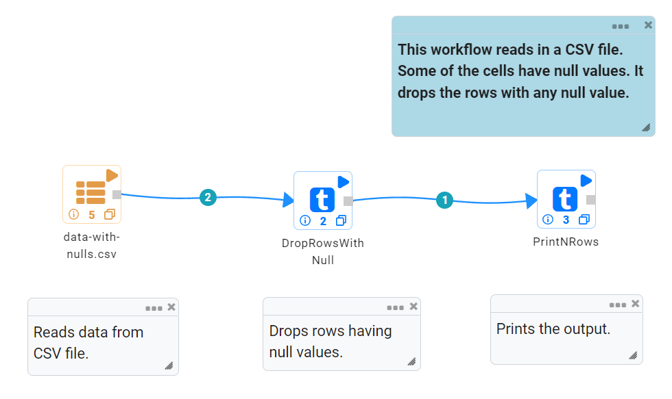
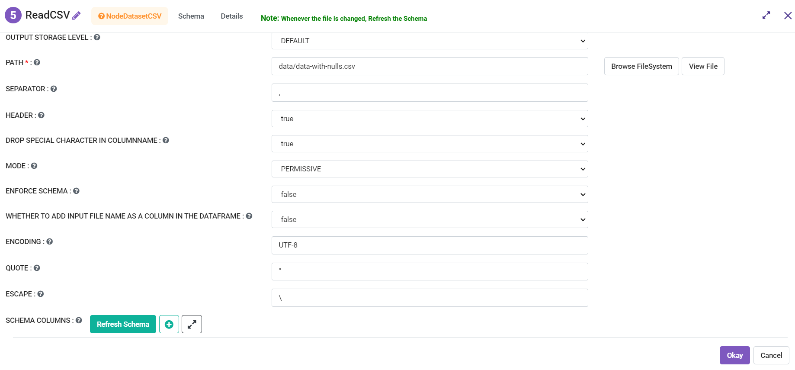
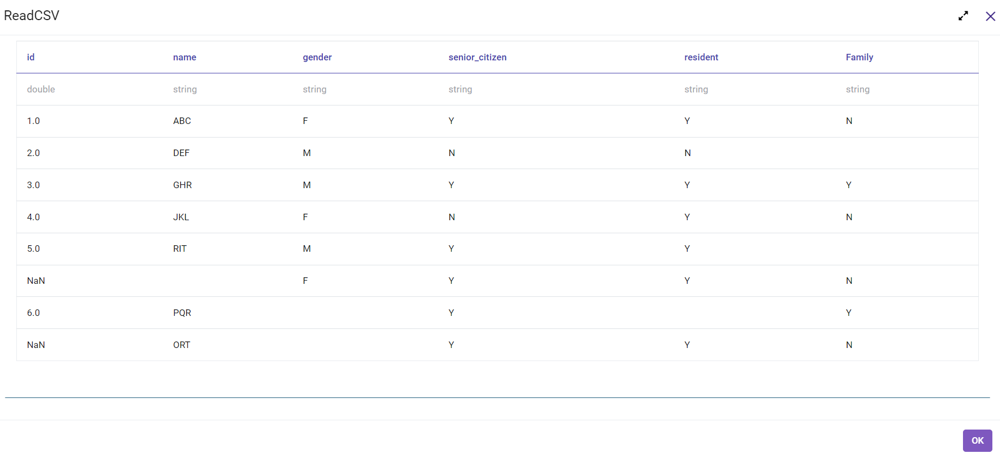
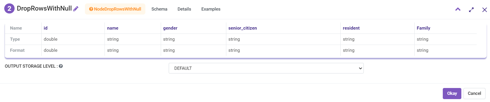
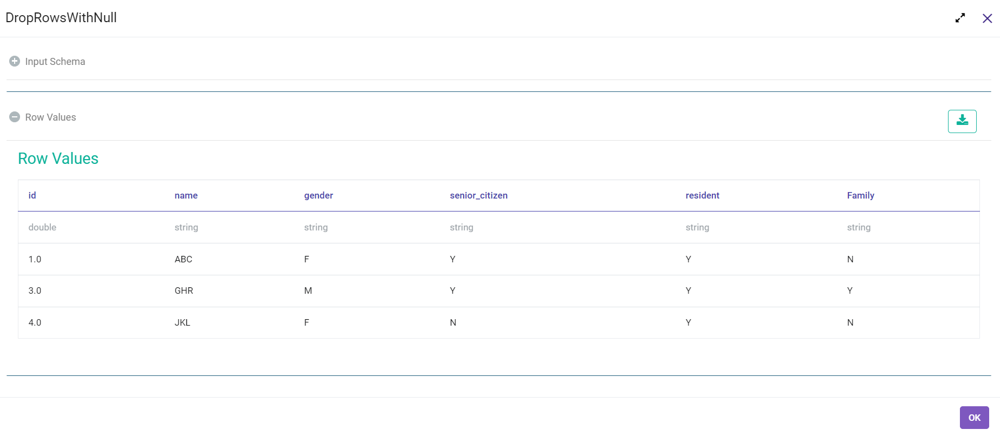

Drop Rows With Null
===================

This sample workflow drops or filters the rows containing any null values from the input dataset.

Workflow
--------

The below workflow:

* Reads data from a CSV File.
* Drops rows having any null values in any of the columns.

   
Reading from CSV File
---------------------

It reads data from a CSV File. 

Processor Configuration
^^^^^^^^^^^^^^^^^^

   

   
Processor Output
^^^^^^

   
Dropping rows with null
----------------------

It drops the rows which contain any null value.

Processor Configuration
^^^^^^^^^^^^^^^^^^

   
Processor Output
^^^^^^

   
   
