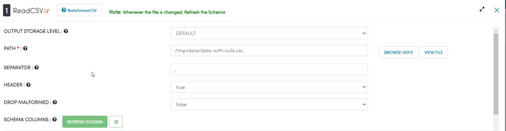
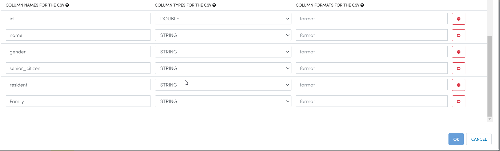
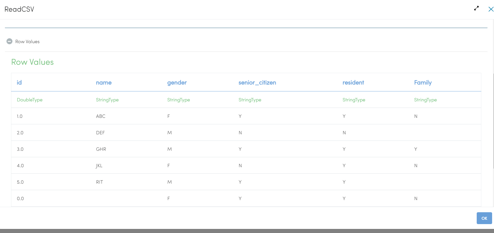
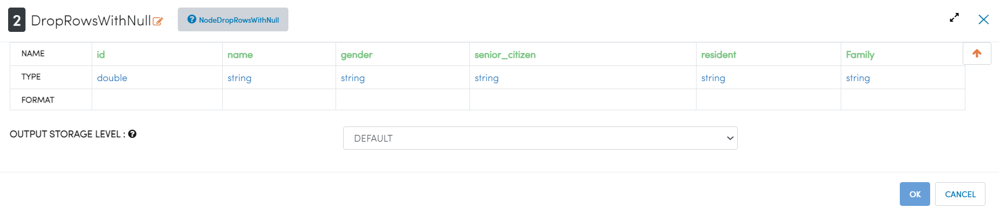
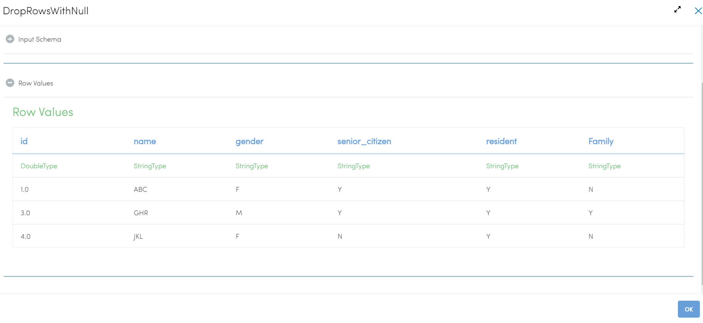

Drop Rows With Null
===================

This example drops/filters the rows containing any null values from the input dataset.

Workflow
--------

The below workflow:

* Reads data from a CSV File.
* Drops rows having any null values in any of the columns.

.. figure:: ../../_assets/tutorials/data-cleaning/drop-rows-with-null/1.png
   :alt: Drop Rows With Null
   :width: 100%
   
Reading from CSV File
---------------------

It reads data from a CSV File. 

Processor Configuration
^^^^^^^^^^^^^^^^^^

   

   
Processor Output
^^^^^^

   
Dropping rows with null
----------------------

It drops the rows which contain any null value.

Processor Configuration
^^^^^^^^^^^^^^^^^^

   
Processor Output
^^^^^^

   
   
