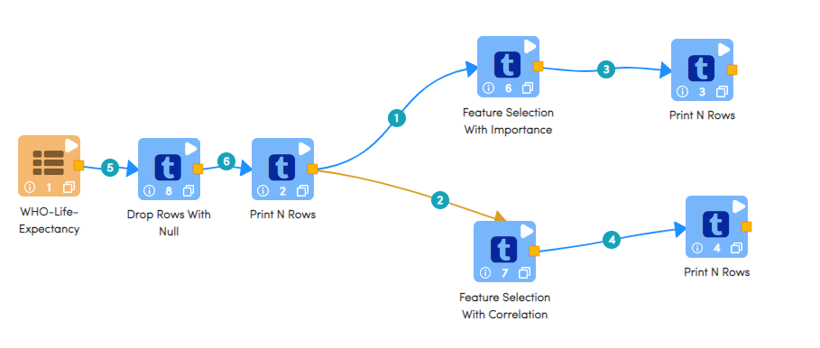

Feature Selection
====================

This tutorial will cover how to perform feature selection using both feature importance and correlation. The data has been taken from Kaggle courtesy of the World Health Organization. 

.. contents::
   :depth: 2

Workflow Overview
-------------------------

The below workflow: 

* Performs feature selection using feature importance
* Performs feature selection using correlation

   

Grouping Books by Year Published
-----------------------------------

We use the ``Graph Group by Column`` processor to visually gauge the profile of our data. 

Processor Configuration
^^^^^^^^^^^^^^^^^^^^^^^^^

   
Processor Output
^^^^^^^^^^^^^^^^^

   
   
Processor Output
^^^^^^^^^^^^^^^^^

   
   
Columns Cardinality
-----------------------

We use the ``Columns Cardinality`` node to find the number of unique values in a string variable. In this case we are using cardinality to gauge the relationship between publishers, authors, and books. We can see that publishers on average publish 14 books, while authors on average write 2.4 books. 

Processor Configuration
^^^^^^^^^^^^^^^^^^^^^^^^^

   
Processor Output
^^^^^^^^^^^^^^^^^

Processor Output
^^^^^^^^^^^^^^^^^

