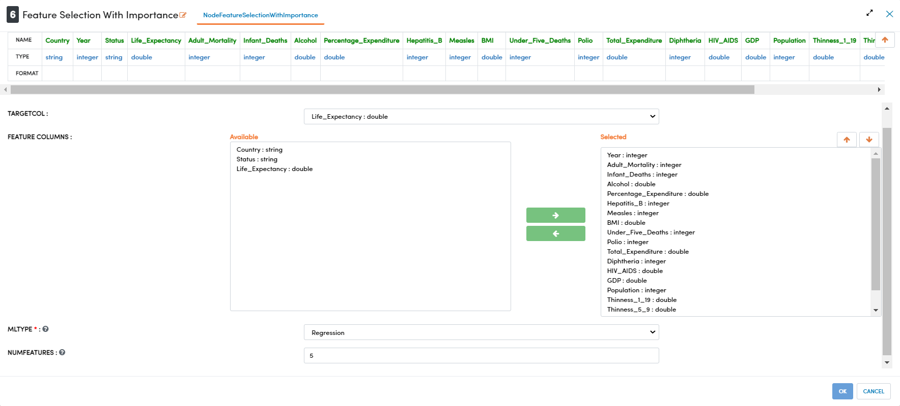
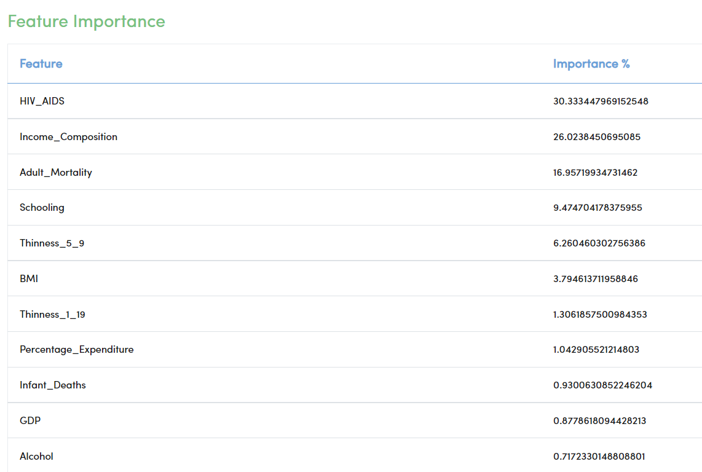
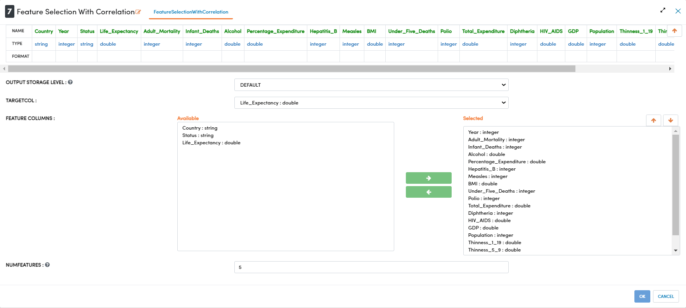
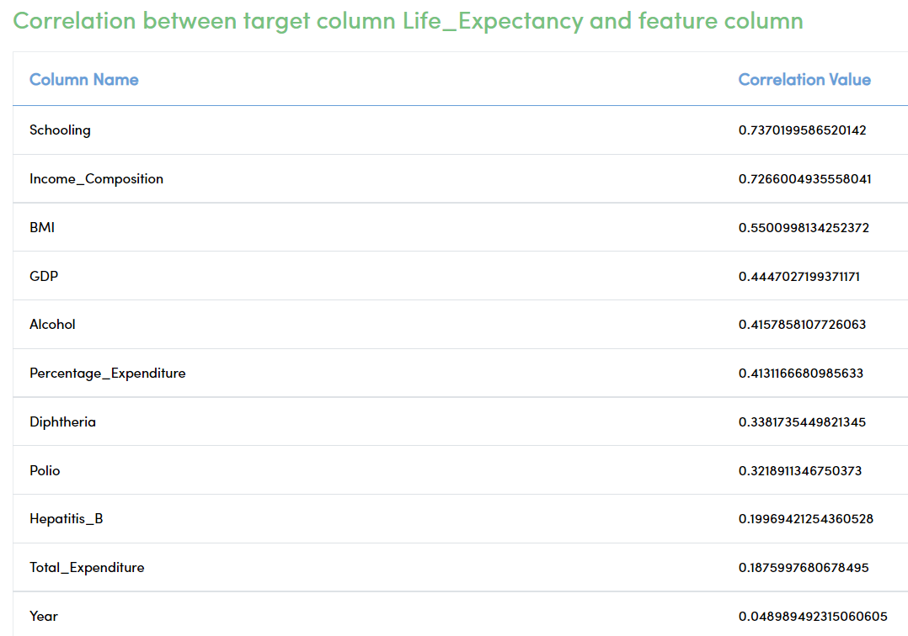
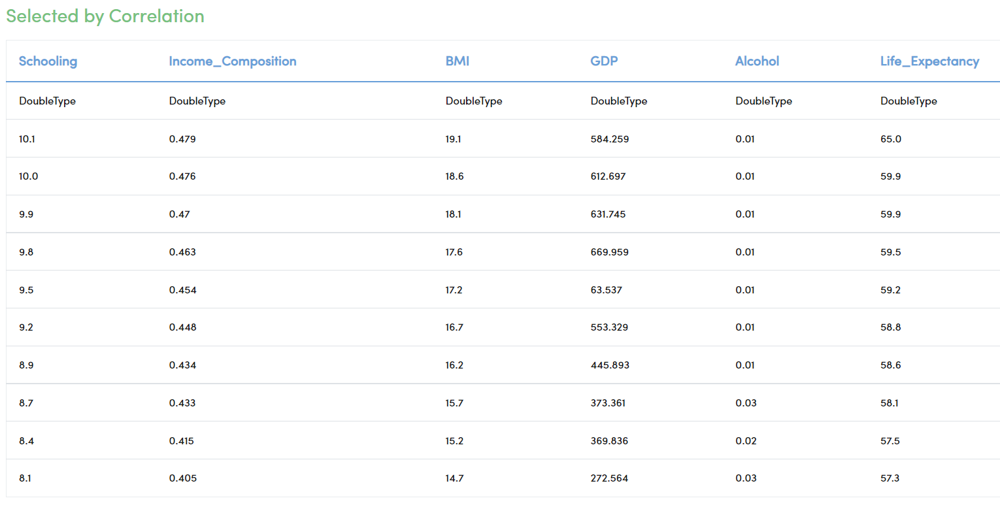

Feature Selection
====================

This tutorial will cover how to perform feature selection using both feature importance and correlation. The data has been taken from Kaggle courtesy of the World Health Organization. 

.. contents::
   :depth: 2

Workflow Overview
-------------------------

The below workflow: 

* Performs feature selection using feature importance
* Performs feature selection using correlation

.. figure:: ../../_assets/tutorials/data-engineering/feature-selection/Overview.PNG
   :alt: books-recommendations
   :width: 90%
   

Feature Selection With Importance
-----------------------------------

We use the ``Feature Selection With Importance`` processor to select features based on their importance in a linear regression model. This node builds a regression model containing all of the features, and ranks the features based on their predictive power. This processor has 2 outputs, it prints a list with the features ranked, and it passes on a dataset containing only the top 5 features. The number of features passed on can be changed in the configuration pane. The label column is always passed on along with the selected features. If the dataset is going to be used for classification models instead of regression, the user can select Classification in the MLTYPE option. 

Processor Configuration
^^^^^^^^^^^^^^^^^^^^^^^^^

   
Processor Output
^^^^^^^^^^^^^^^^^

   
   
Processor Output
^^^^^^^^^^^^^^^^^

.. figure:: ../../_assets/tutorials/data-engineering/feature-selection/Importance_Output2.PNG
   :alt: titanic-data-cleaning
   :width: 90%

   
   
Feature Selection With Correlation
-----------------------

We use the ``Feature Selection With Correlation`` processor to select features based on their correlation with the label column. This node builds a correlation matrix containing all of the features, and ranks the features based on their correlation. This processor has 2 outputs, it prints a list with the features ranked by correlation, and it passes on a dataset containing only the top 5 features. The number of features passed on can be changed in the configuration pane. The label column is always passed on along with the selected features.

Processor Configuration
^^^^^^^^^^^^^^^^^^^^^^^^^

   
Processor Output
^^^^^^^^^^^^^^^^^

Processor Output
^^^^^^^^^^^^^^^^^

