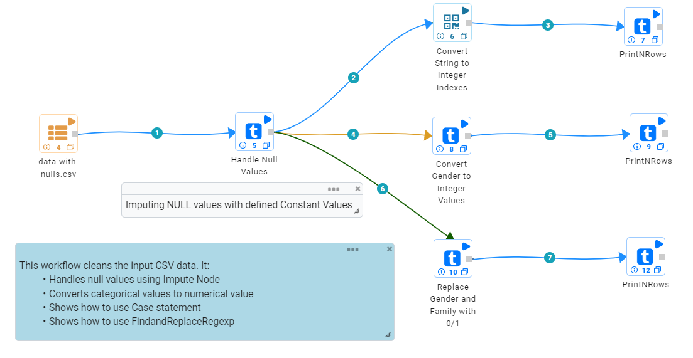
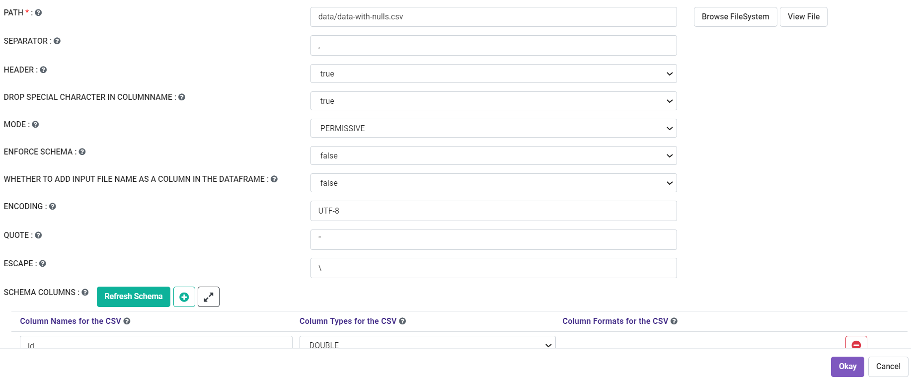
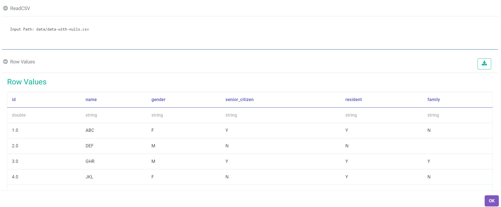
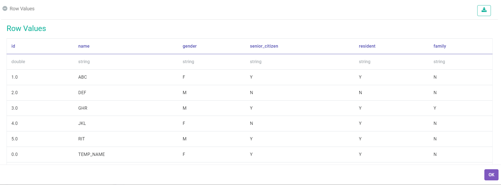
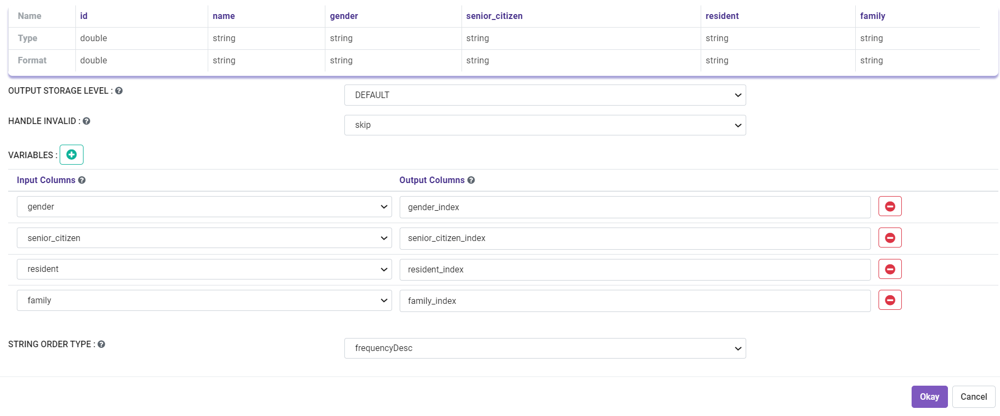
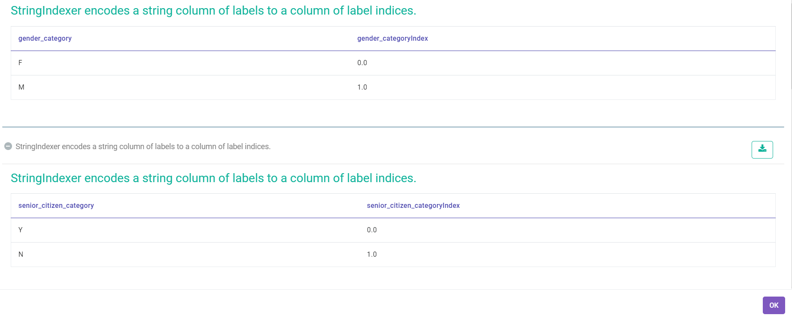
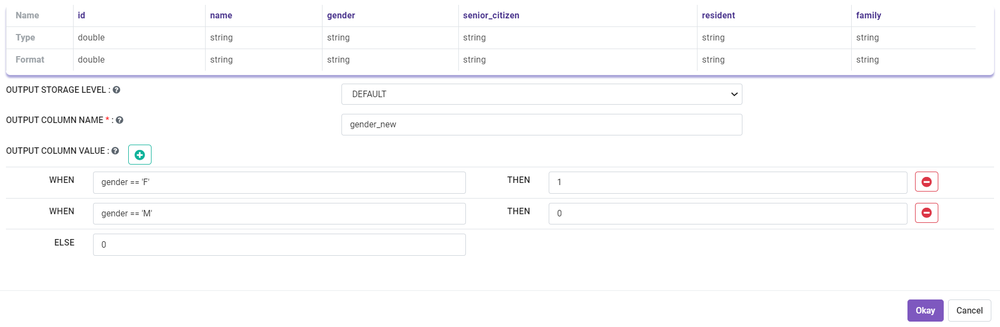
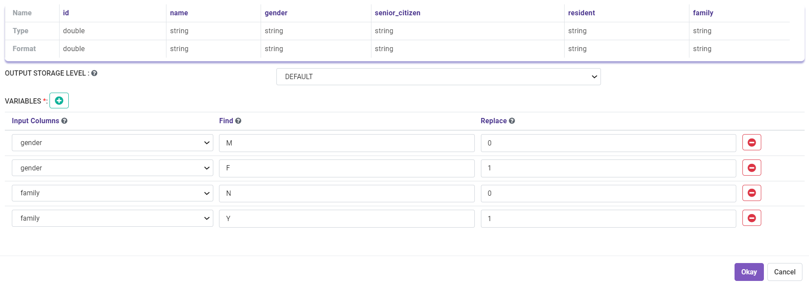
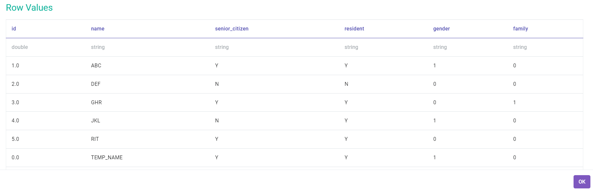

Handling Null Values
====================

This sample workflow removes null values from the input dataset.

Workflow
--------

The below workflow:

* Reads data from a CSV file.
* Replaces null values in certain columns with constant values.
* Converts certain columns to 0/1 based on their value. It does it in 3 different ways.

  * Using StringIndexer Processor.
  * Using CaseWhen Processor.
  * Using FindAndReplace using Regex Processor.

   
Reading from CSV File
---------------------

It reads in the CSV file data with-nulls.csv.

Processor Configuration
^^^^^^^^^^^^^^^^^^

   
Processor Output
^^^^^^

   
Replacing null values
---------------------

It replaces null values in certain columns with user defined constant values.

Processor Configuration
^^^^^^^^^^^^^^^^^^

.. figure:: ../../_assets/tutorials/data-cleaning/handling-null-values/impute_null_config.PNG
   :alt: Handling Null Values
   :width: 80%

Processor Output
^^^^^^

   
Converting to 0/1 using StringIndexer
---------------------

It converts strings like Y/N to 0/1 for the specified columns using the StringIndexer Processor.

Processor Configuration
^^^^^^^^^^^^^^^^^^

Processor Output
^^^^^^

   

Converting to 0/1 using CaseWhen
---------------------

It converts strings like Y/N to 0/1 for the specified columns using the CaseWhen Processor.

Processor Configuration
^^^^^^^^^^^^^^^^^^

Processor Output
^^^^^^

.. figure:: ../../_assets/tutorials/data-cleaning/handling-null-values/impute_convert_output.PNG
   :alt: Handling Null Values
   :width: 80%
   

Converting to 0/1 using FindAndReplaceUsingRegex
---------------------

It converts strings like Y/N to 0/1 for the specified columns using the FindAndReplaceUsingRegex Processor.

Processor Configuration
^^^^^^^^^^^^^^^^^^

Processor Output
^^^^^^

   

