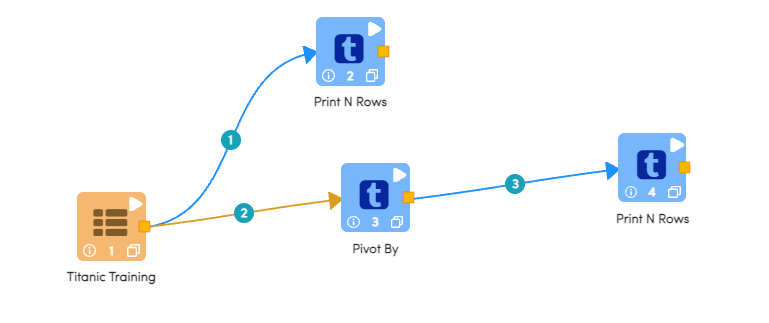
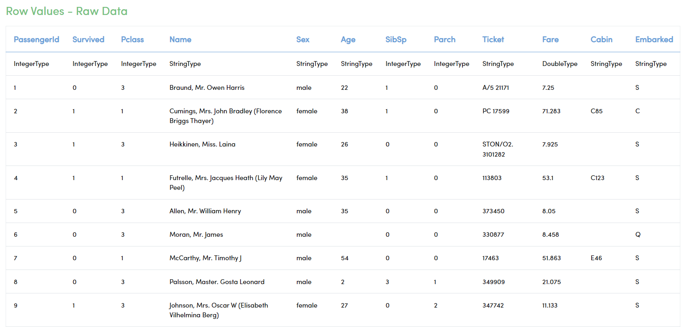
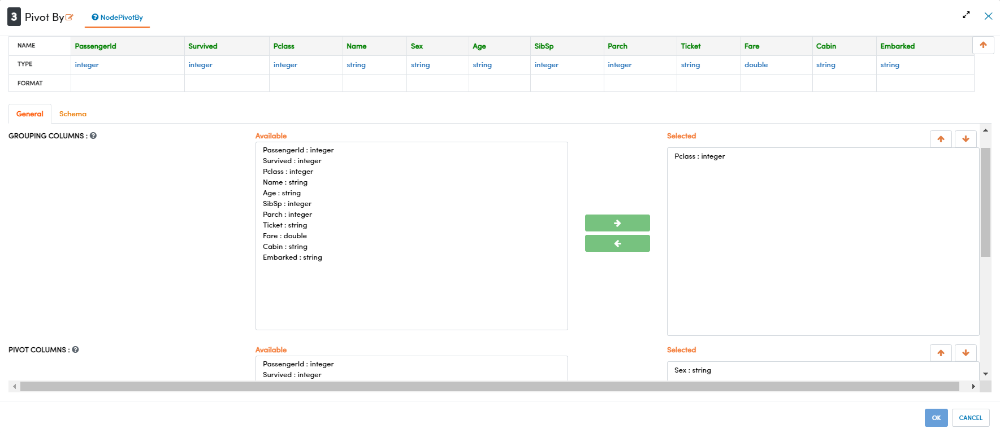
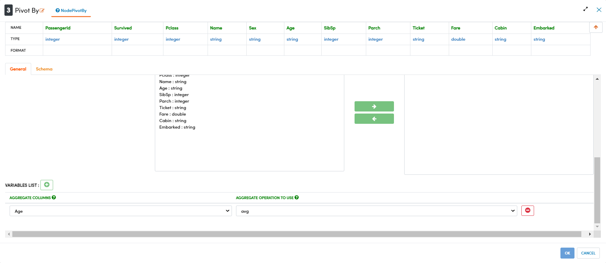
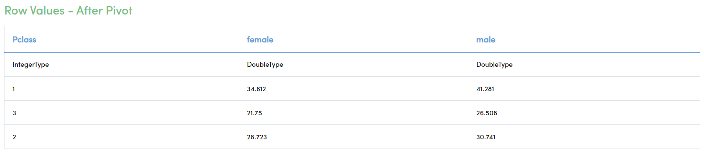

Pivot
================

This tutorial will cover how to pivot a data table and aggregate data to focus on a particular subset of a larger dataset. Pivot can also be used to feed into data visualization nodes and it provides additional dimensions that would not otherwise be available. This tutorial will use the widely available Titanic dataset that details the survival of the passengers aboard during the sinking of the Titanic ship. 

.. contents::
   :depth: 2

Pivoting Titanic Data
-------------------------

The below workflow: 

* Prints the raw data for comparison.
* Pivots the dataset and generate aggregate statistics.
* Prints the final result of the pivot.

   

Printing the Raw Dataset
-----------------------------------

We use the ``Print N Rows`` processor to print out a sample of the given dataset. In this case it is being used to compare the dataset before being pivoted.   

Processor Output
^^^^^^^^^^^^^^^^^^^^^^^^^

Pivoting the Dataset
-----------------------------------

We use the ``Pivot By`` processor to pivot a particular dataset and aggregate the data. The first option in the configuration pane allows us to select the column by which the data will be grouped, this will become essentially the index column in the resulting dataset. The second option allows us to select which column the data will be pivoted around, the unique values in this column will become the new columns generated. The final option allows us to select which column will provide the data in the body of the table, and which aggregate statistic to use. 

Processor Configuration
^^^^^^^^^^^^^^^^^^^^^^^^^

Processor Configuration
^^^^^^^^^^^^^^^^^^^^^^^^^

   
Printing the Pivoted Dataset
-----------------------------------

We use the ``Print N Rows`` processor to print out a sample of the given dataset. In this case it is being used to compare the dataset after being pivoted.   

Processor Output
^^^^^^^^^^^^^^^^^^^^^^^^^

