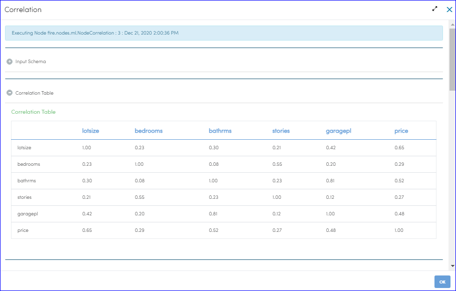
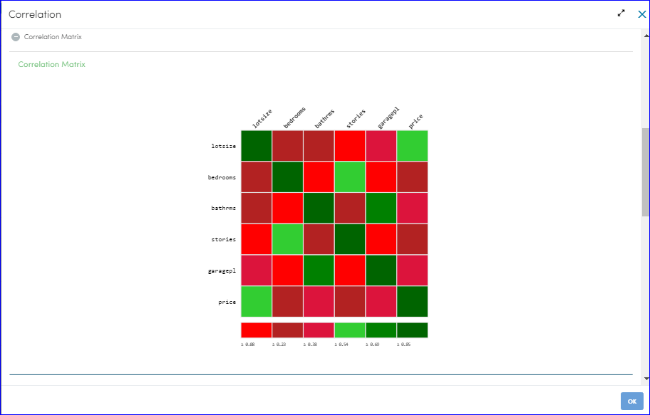
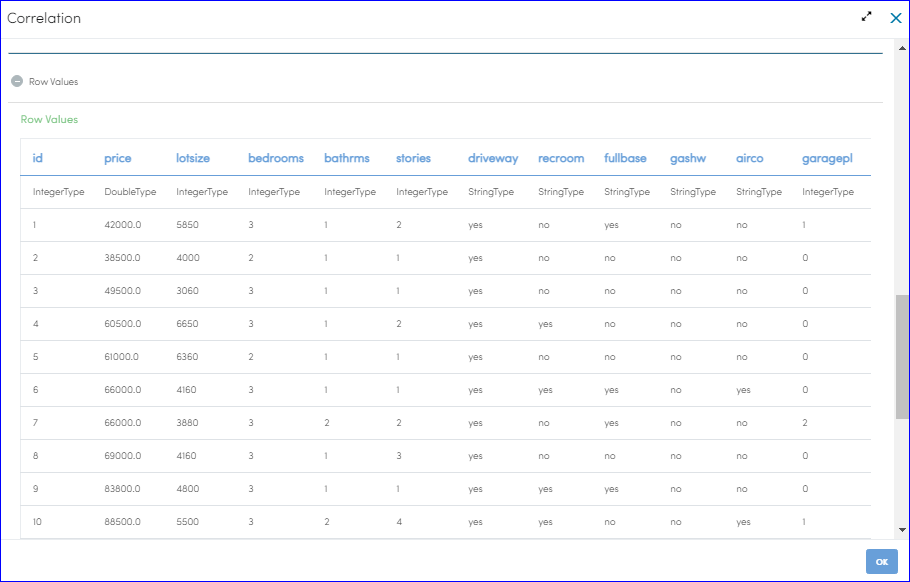
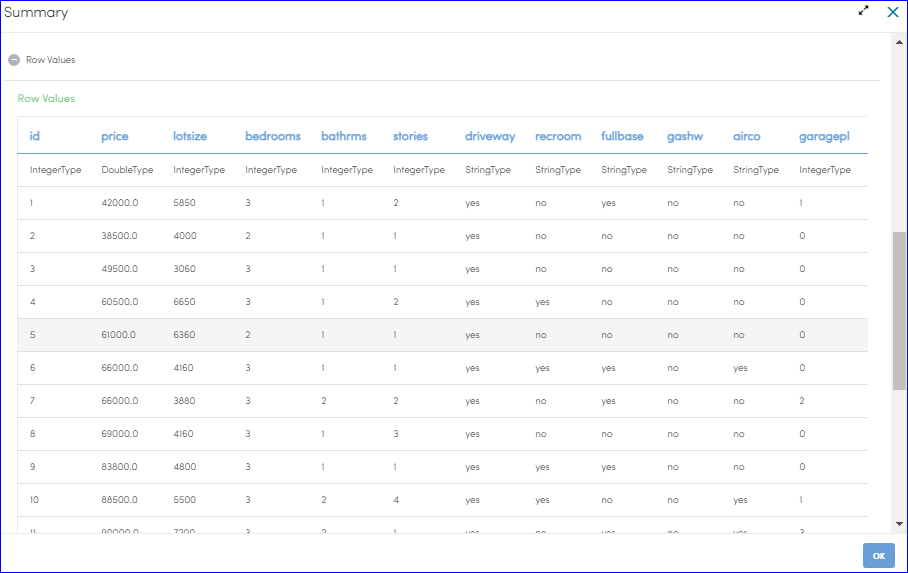

Profiling-Correlation
=============

This workflow reads in a dataset. It then creates the correlation analysis and summary statistics.

Workflow
-------

Below is the workflow. It does the following:

* Reads data from a dataset.
* Perform correlation analysis of the required columns 
* Provide summary statistics of the dataset

.. figure:: ../../_assets/tutorials/data-engineering/profiling-correlation.rst/Capture1.PNG
   :alt: ProfilingCorrelation
   :align: center
   :width: 60%
   
Performing Correltion analysis
---------------------

Select the required columns to perform correlation analysis

Processor Configuration
^^^^^^^^^^^^^^^^^^

.. figure:: ../../_assets/tutorials/data-engineering/profiling-correlation.rst/Capture2.PNG
   :alt: ProfilingCorrelation
   :align: center
   :width: 60%
   
Processor Output - Correlation matrix
^^^^^^

Processor Output - Correlation matrix heat map
^^^^^^

Processor Output - Sample rows of the input dataset
^^^^^^

   
Summary Statistics
------------

It provides summary statistics of the input dataset.

Summary statistics provides useful information about sample data. eg: measures of spread.

It provides a table with number of non-null entries (count), mean, standard deviation, and minimum and maximum value for each numerical column.

Processor Configuration
^^^^^^^^^^^^^^^^^^

.. figure:: ../../_assets/tutorials/data-engineering/profiling-correlation.rst/Capture6.PNG
   :alt: ProfilingCorrelation
   :align: center
   :width: 60%   

Processor Output: Summary Statistics
^^^^^^

.. figure:: ../../_assets/tutorials/data-engineering/profiling-correlation.rst/Capture7.PNG
   :alt: ProfilingCorrelation
   :align: center
   :width: 60%   
  
Processor Output: Sampele rows of input dataset
^^^^^^

