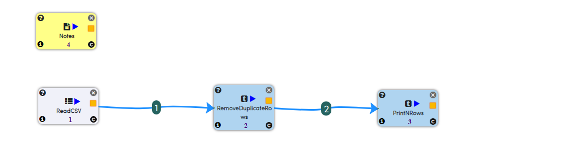
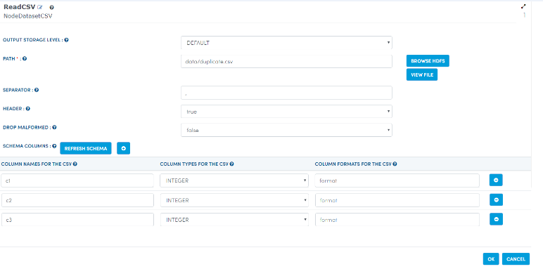
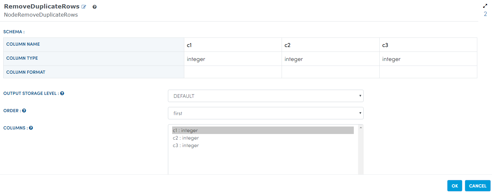
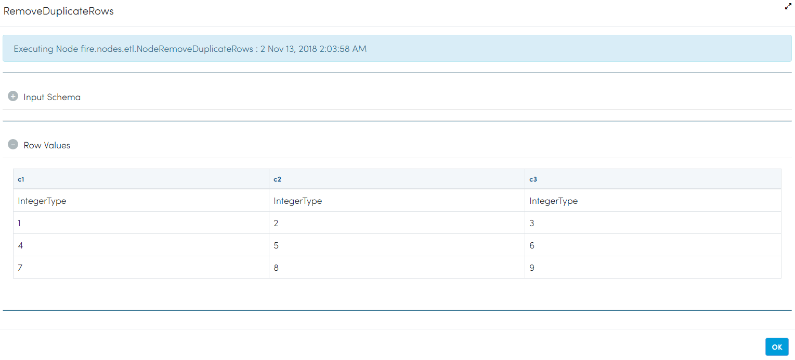
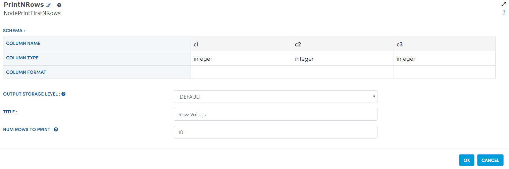
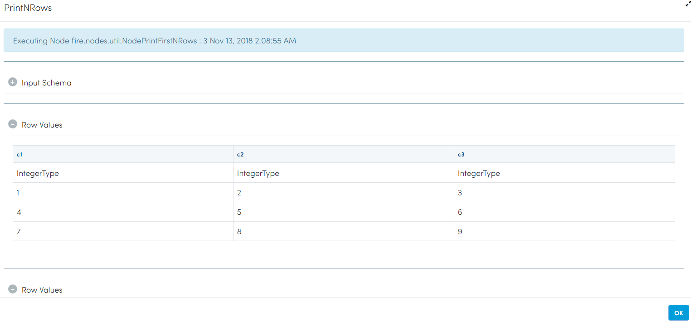

Remove Duplicate Rows
=====================

This workflow reads CSV files. It then removes duplicate rows from the original CSV file and prints the result.

Workflow
-------

The below workflow:

* Reads data from a CSV File.
* It then removes duplicate rows from the original CSV file.
* Print the results.

   
Reading from CSV file
---------------------

It reads a CSV file.

Processor Configuration
^^^^^^^^^^^^^^^^^^

   
Processor Output
^^^^^^

.. figure:: ../../_assets/tutorials/data-cleaning/remove-duplicate-rows/2aa.png
   :alt: Remove Duplicate Rows
   :width: 100%  
   
Remove Duplicate Rows
---------------------

It removes Duplicate Rows available.

Processor Configuration
^^^^^^^^^^^^^^^^^^

Processor Output
^^^^^^

 
Print the Results
------------------

It prints the result after removing Duplicate Rows.

Processor Configuration
^^^^^^^^^^^^^^^^^^

Processor Output
^^^^^^

