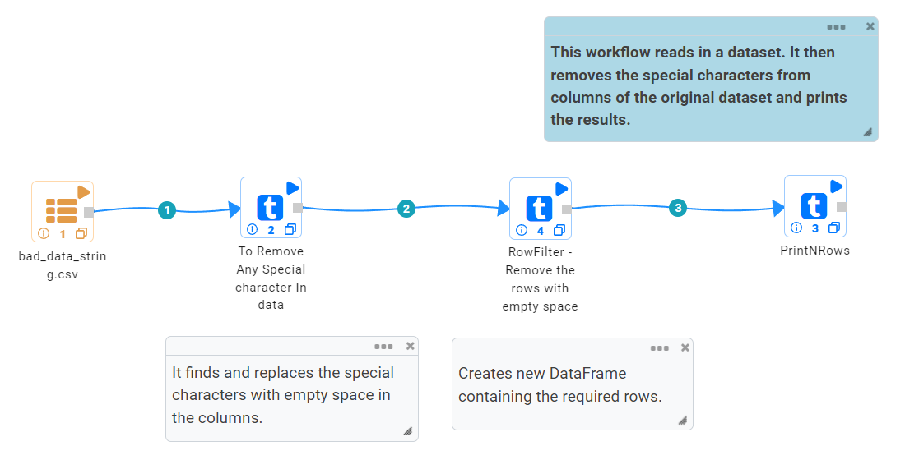
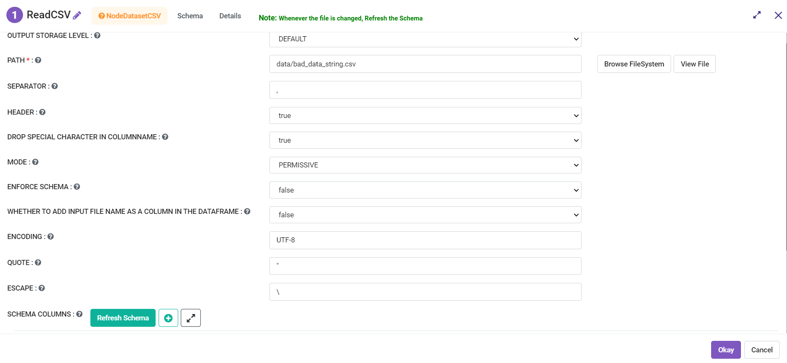
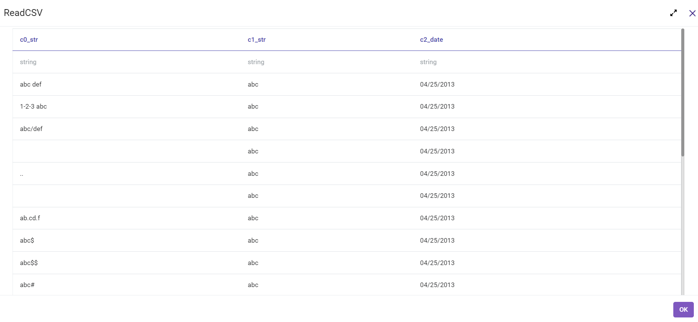
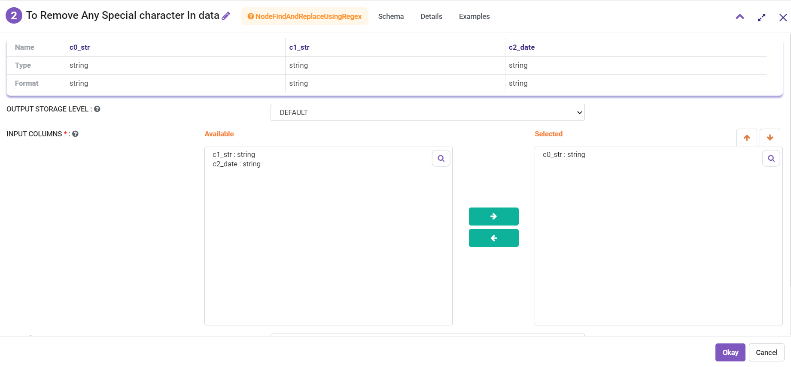
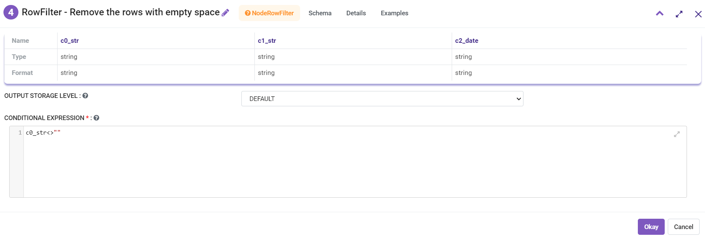
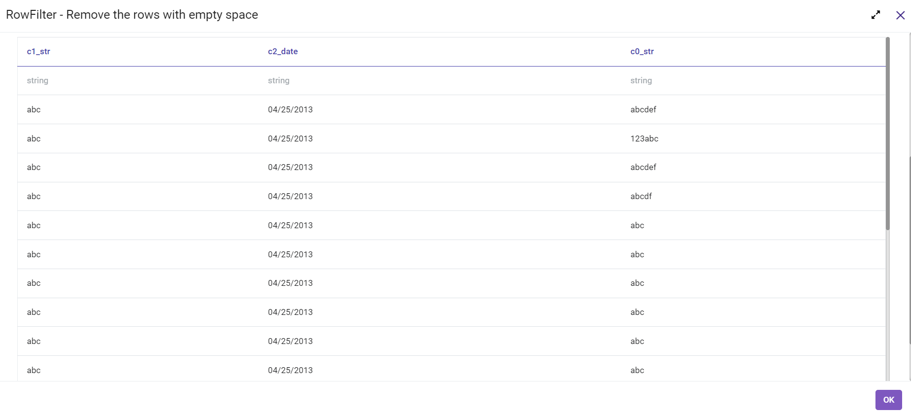

Removing Special Characters
=============

This workflow reads in a dataset. It then removes the special characters from columns of the original dataset and prints the result.

Workflow
-------

The below workflow:

* Reads the CSV and creates a DataFrame.
* Finds and replaces the special characters with empty space in the columns. 
* Creates new DataFrame containing the rows that satisfy the given condition (i.e. removes the rows with empty space).
* Prints the specified number of records in the DataFrame after execution of workflow.

   
Reading from Dataset
---------------------

DatasetCSV processor reads in the input Dataset File and creates DataFrame.

Processor Configuration
^^^^^^^^^^^^^^^^^^

   
Processor Output
^^^^^^

   
   
To Remove Any Special character in Data
------------

FindAndReplaceUsingRegex Processor finds and replaces the special characters with empty spaces in the columns. 

Processor Configuration
^^^^^^^^^^^^^^^^^^

Processor Output
^^^^^^

.. figure:: ../../_assets/tutorials/data-engineering/remove-special-characters/remove-spcl-output.png
   :alt: Remove special Characters
   :width: 60%
   
   
RowFilter - Removes the rows with empty spaces. 
------------

RowFilter Processor creates new DataFrame containing the rows that satisfy the condition provided (For example : Removes the rows with empty spaces as shown below). 
 
Processor Configuration
^^^^^^^^^^^^^^^^^^

Processor Output
^^^^^^

 
  
Print the Results
------------------

It prints the first few records onto the screen.

