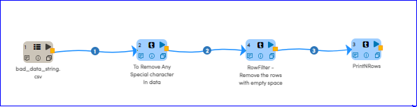
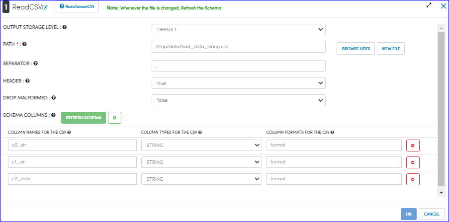
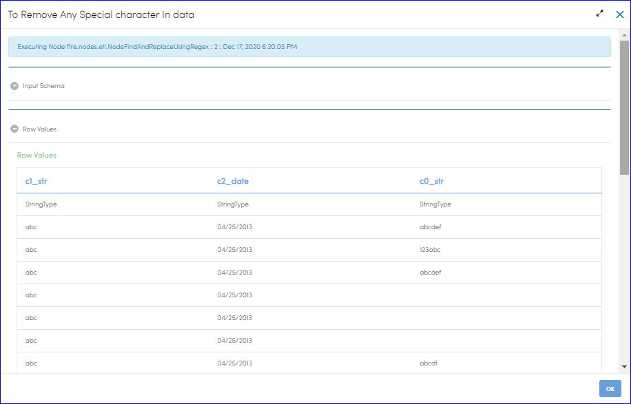
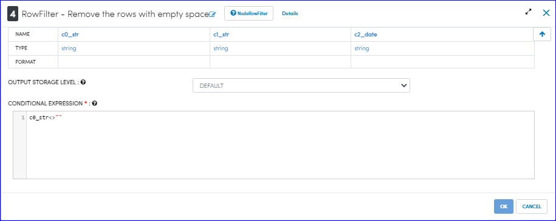

Removing Special Characters
=============

This workflow reads in a dataset. It then removes the special characters from columns of the original dataset and prints the results.

Workflow
-------

Below is the workflow. It does the following:

* It reads the CSV and creates a DataFrame.
* It find and replaces the special characters with empty space in the columns 
* Create new DataFrame containing the rows that satisfy the given condition (i.e. removes the rows with empty space)
* Print the specified number of records in the DataFrame after execution of workflow

   
Reading from Dataset
---------------------

``DatasetCSV`` processor reads in the input Dataset file and creates DataFrame.

Processor Configuration
^^^^^^^^^^^^^^^^^^

   
Processor Output
^^^^^^

.. figure:: ../../_assets/tutorials/data-engineering/remove-special-characters/Screenshot_3.PNG
   :alt: Remove special Characters
   :align: center
   :width: 60%   
   
   
To Remove Any Special character in data
------------

``FindAndReplaceUsingRegex`` processor find and replaces the special characters with empty space in the columns 

Processor Configuration
^^^^^^^^^^^^^^^^^^

.. figure:: ../../_assets/tutorials/data-engineering/remove-special-characters/Screenshot_4.PNG
   :alt: Remove special Characters
   :align: center
   :width: 60%

Processor Output
^^^^^^

   
   
RowFilter - Remove the rows with empty space 
------------
``RowFilter`` processor creates new DataFrame containing the rows that satisfy the condition provided (For example : Removes the rows with empty spaces as shown below) 
 
Processor Configuration
^^^^^^^^^^^^^^^^^^

Processor Output
^^^^^^

.. figure:: ../../_assets/tutorials/data-engineering/remove-special-characters/Screenshot_7.PNG
   :alt: Remove special Characters
   :align: center
   :width: 60%
 
  
Prints the Results
------------------

It prints the first few records onto the screen.

