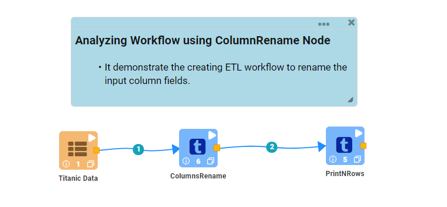
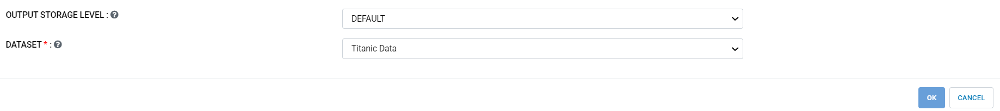
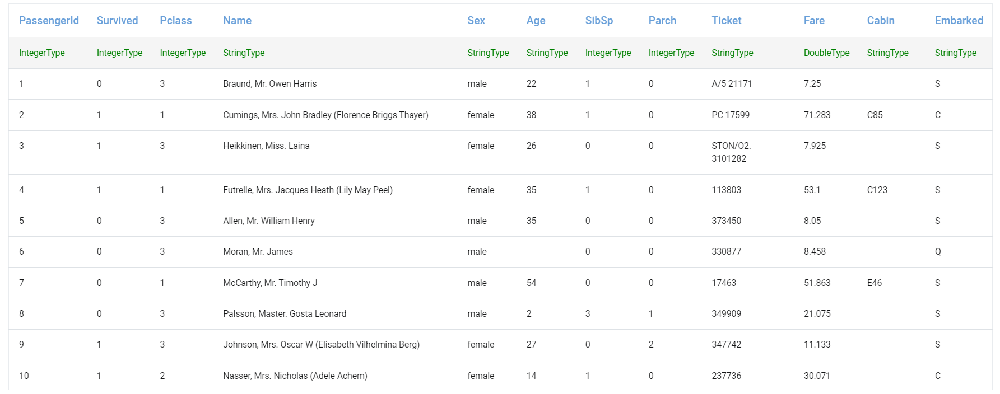
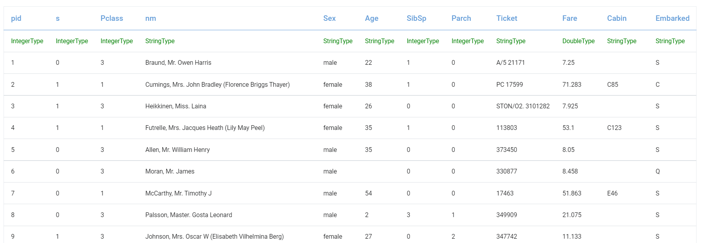

Rename Columns
==============

This workflow reads in a dataset. It then renames columns from the original dataset and prints the result.

Workflow
-------

The below workflow:

* Reads data from a dataset.
* It then renames columns from the original dataset.
* Prints the results.

   
Reading from Dataset
---------------------

It reads the selected Dataset file.

Processor Configuration
^^^^^^^^^^^^^^^^^^

   
Processor Output
^^^^^^

   
Rename Columns
------------

It renames the column name we want to.

Processor Configuration
^^^^^^^^^^^^^^^^^^

.. figure:: ../../_assets/tutorials/data-cleaning/rename-columns/8.PNG
   :alt: Rename Columns
   :width: 65% 

Processor Output
^^^^^^

   
Prints the Result
------------------

It prints the result after renaming columns.

