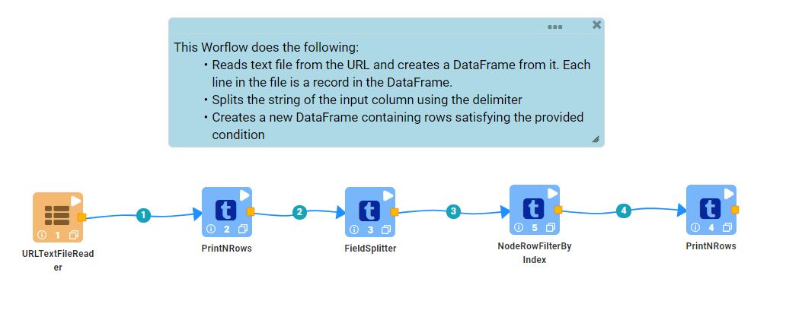
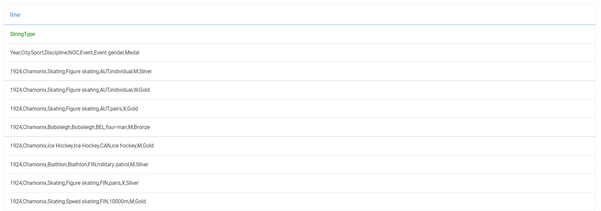
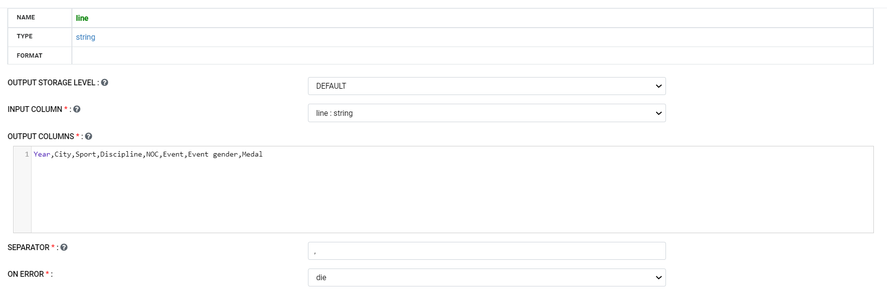
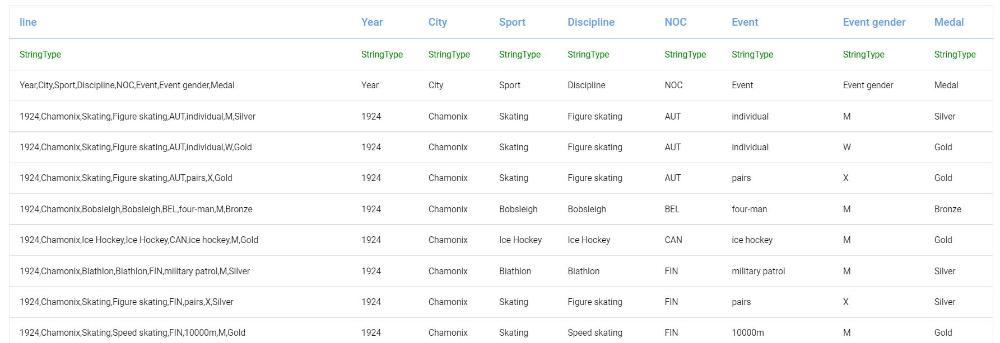
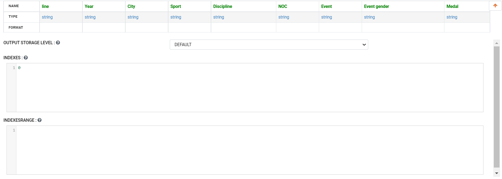
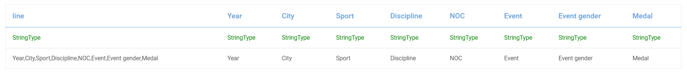

REST API Read and Parse CSV
=============

This workflow reads in a dataset from URL. It then parses the dataset and prints the result.

Workflow
-------

The below workflow:

* Reads data from the URL and creates a DataFrame.
* Prints few records.
* Splits the string of the input column using the delimiter.
* Creates a new DataFrame containing rows satisfying the provided condition.
* Prints the result.

   
Reading from URL
---------------------

``DatasetURLTextFileReader`` Processor uses the passed URL to download the data and create the DataFrame.

Processor Configuration
^^^^^^^^^^^^^^^^^^

.. figure:: ../../_assets/tutorials/data-engineering/rest-csv-reader-and-parse/2.PNG
   :alt: ReadandParse
   :width: 60%

  
Processor Output
^^^^^^

   
Prints the Records
------------------

It prints the first few records onto the screen.
   
   
Parsing the DataFrame
------------

``FieldSplitter`` Processor parses and creates new DataFrame by splitting the string of the input column using the delimiter as shown below:

Processor Configuration
^^^^^^^^^^^^^^^^^^

Processor Output
^^^^^^

   
Row Filter by Index
-------------

``RowFilterByIndex`` Processor creates a new DataFrame containing required rows as shown below:

Processor Configuration
^^^^^^^^^^^^^^^^^^

Processor Output
^^^^^^

     
  
Prints the Result
------------------

It prints the result onto the screen.
