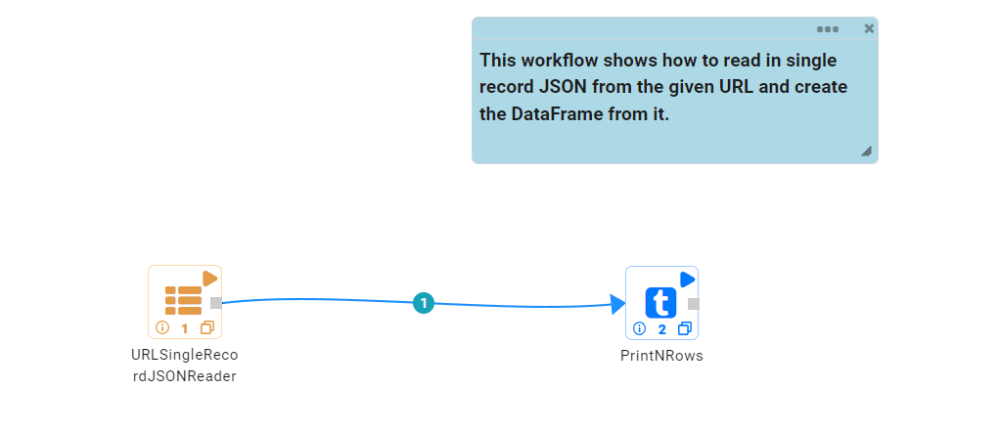
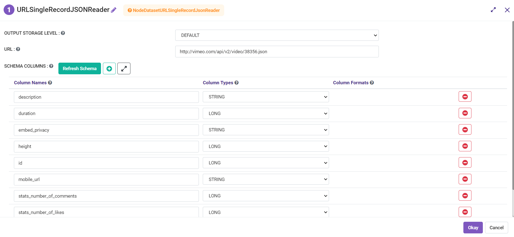
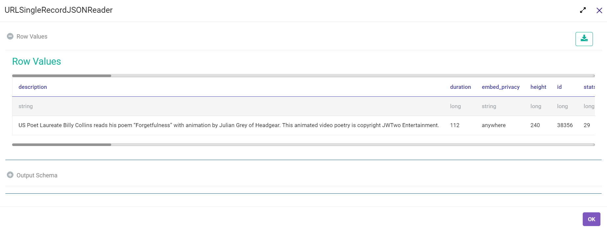

REST API Read and Parse JSON
=============

This workflow reads in a single record JSON from the given URL. It then parses the dataset and prints the result.

Workflow
-------

Below is the workflow that shows:

* How to read in single record JSON from the given URL and create the DataFrame from it.
* Prints the result.

   
Reading from URL And Parsing
---------------------

**URLSingleRecordJSONReader** Processor uses the passed URL to download single record JSON, Parse the dataset and create the DataFrame.

Processor Configuration
^^^^^^^^^^^^^^^^^^

  
Processor Output
^^^^^^

   
   
Prints the Result
------------------

It prints the result onto the screen.
