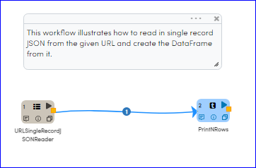
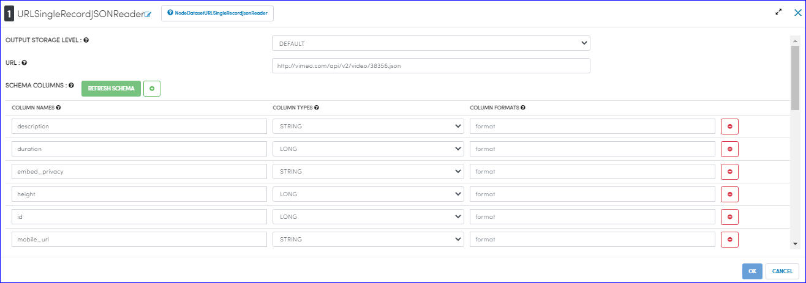
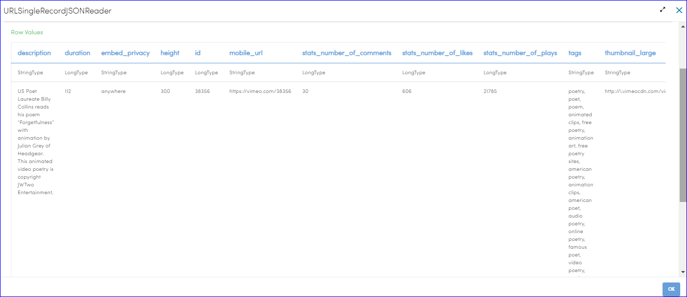

REST Read And Parse JSON
=============

This workflow reads in single record JSON from the given URL. It then parses the dataset and prints the results.

Workflow
-------

Below is the workflow that shows:
* How to read in single record JSON from the given URL and create the DataFrame from it
* Prints the result

   
Reading from URL And Parsing
---------------------

``DatasetURLSingleRecordJSONReader`` processor uses the passed URL to download single record JSON, parse the dataset and create the DataFrame.

Processor Configuration
^^^^^^^^^^^^^^^^^^

  
Processor Output
^^^^^^

   
   
Prints the Results
------------------

It prints the result onto the screen.
