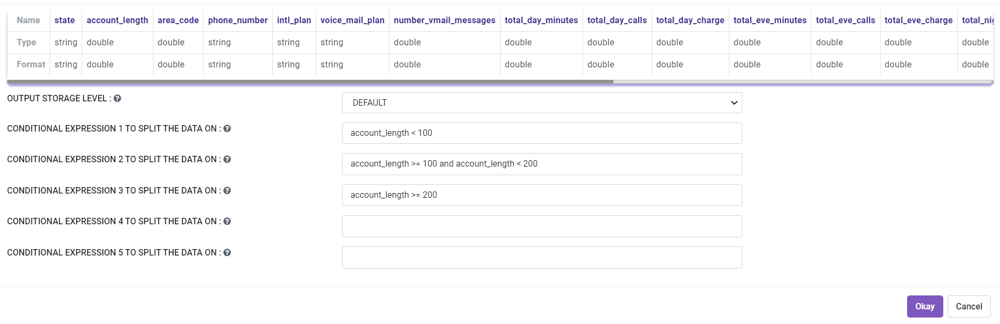
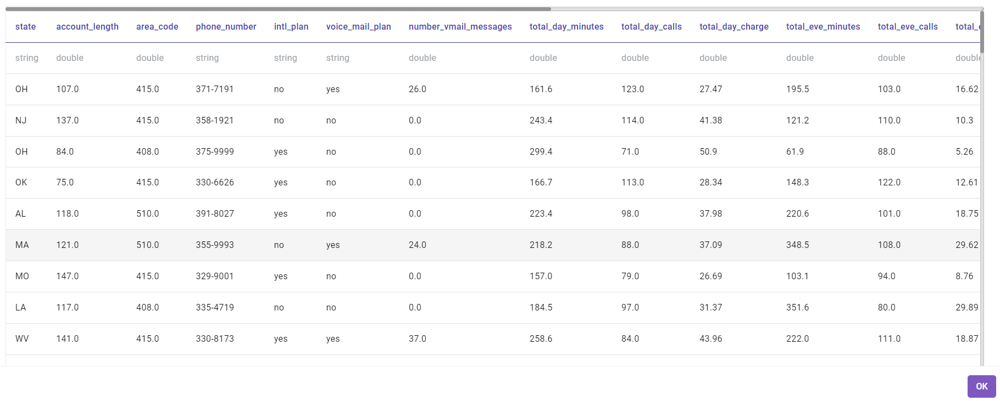
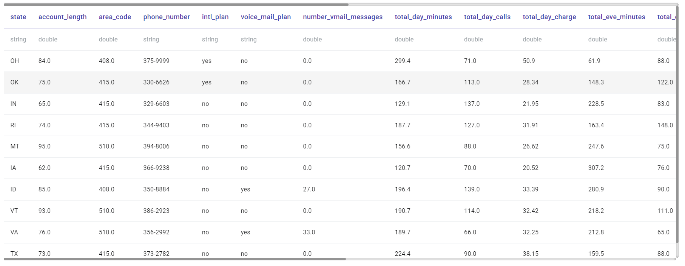
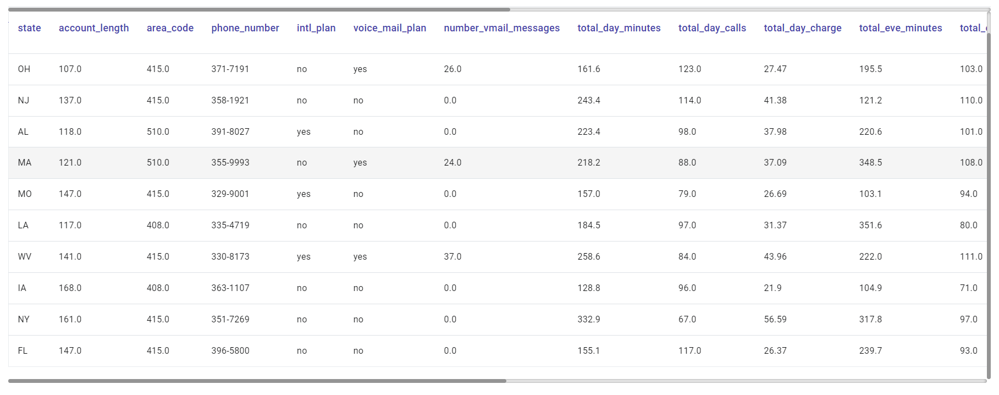
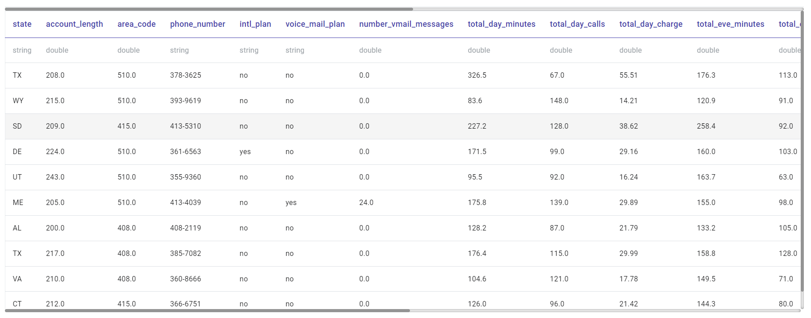

Split Dataset By Expression
===========================

Fire Insights allows you to split incoming DataFrames. Based on your needs, use the processors described below: 

**SplitByExpression:** This processor splits the incoming dataset based on an expression. Rows satisfying the expression go into one DataFrame and the rest go into another DataFrame.

**SplitByMultipleExpressions:** This processor splits the incoming dataset into multiple DataFrames based on up to five conditional expressions.The output of each expression is routed to a separate output path.

**Split:** This processor splits the incoming DataFrame into two based on the percentage specified for the split. Split processor is especially useful in machine learning workflows.

Workflow
--------

.. figure:: ../../_assets/tutorials/data-preparation/Split-Dataset-By-Expression/split-by-exp-wf.png
   :alt: Dataset
   :width: 60%
   
   
In the sample workflow above, ``Split By Multiple Expressions`` processor splits the incoming DataFrame into three output DataFrames. The three conditions are on column ``c1 - c1<3`` , ``c1>=3 and c1<5``, and ``c1>=5``. As mentioned earlier, ``SplitByMultipleExpressions`` can split incoming DataFrame in up to five DataFrames. 

Output
------

For the sample workflow, the three output DataFrames as per condition passed on ``Split By Multiple Expressions`` processor are shown below:

Output DataFrame 1:

Output DataFrame 2:

Output DataFrame 3:

