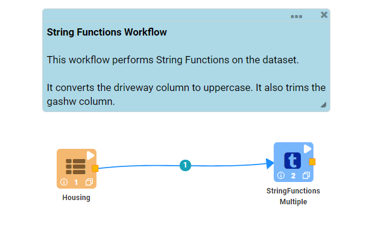
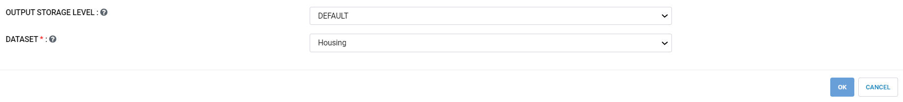
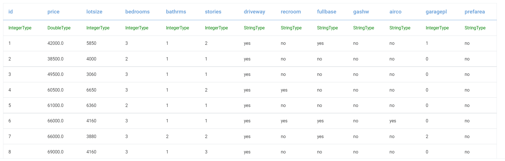
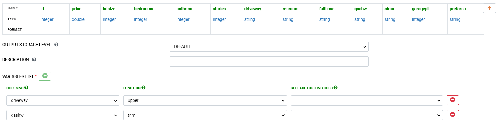
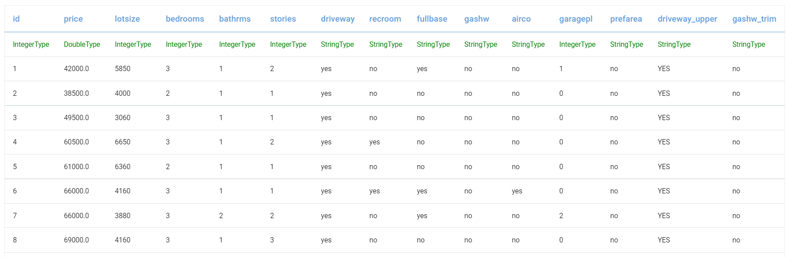

String Functions
================

String functions are useful to tranform strings in your dataframe. The ``StringFunction`` processors allows you to apply common string operations such as ``trim``, ``upper``, ``lower``, ``lefttrim``, ``righttrim``, etc. to strings.

In the example  given below different string functions are applied to input dataset.

Workflow
--------

The  below sample workflow reads data from HDFS/Hive and applies different string functions on different columns of the dataset.

   
Read data from HDFS
-------------------

The above ``Housing`` processor reads an existing dataset on HDFS.

Processor Configuration
^^^^^^^^^^^^^^^^^^^^^^^

Processor Output
^^^^^^^^^^^^^^^^

Apply string Functions
----------------------

The ``StringFunctionMultiple`` processor below converts contents of **Driveway column** to upper case and trims contents of **Gashw column**.

Processor Configuration
^^^^^^^^^^^^^^^^^^^^^^^

   
Processor Output
^^^^^^^^^^^^^^^^

   
   
   
   
