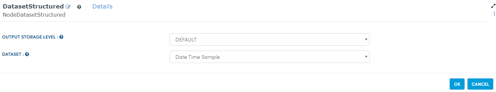
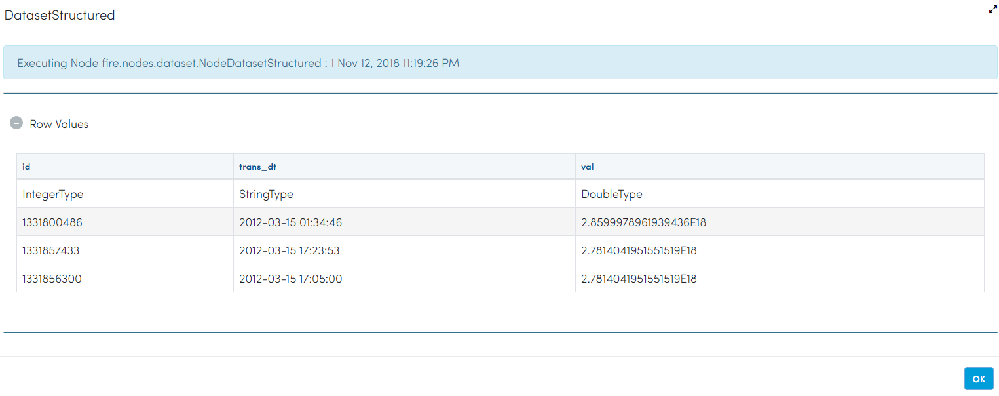
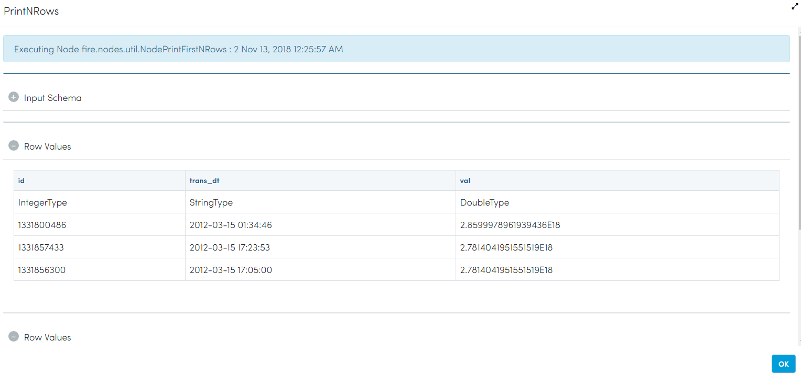
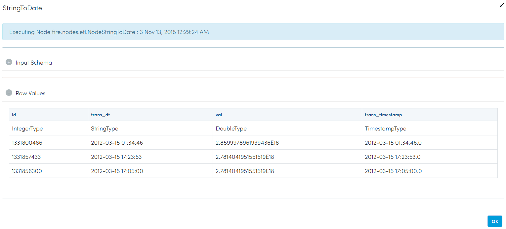
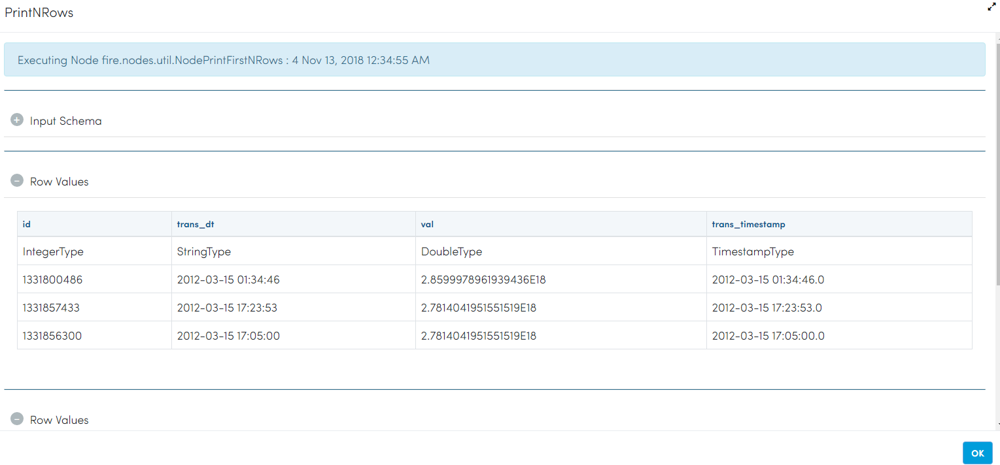

Time Functions
=============

There are many instances when you want to do time-series analysis. Fire Insights provides Date-Time features with TimeFunctions operator.

Creating additional features from the Timestamp Column helps you to know more about the data and run modeling algorithms on them. Fire Insights has NodeTimeFunctions for creating these time series features.

  
Workflow for applying TimeFunctions
-----------------------------------

In the example workflow below, additional Date Time features are being created from the date column.

.. figure:: ../../_assets/tutorials/data-cleaning/convert-to-timestamps/1.png
   :alt: Convert To Timestamps
   :width: 100%
   
In the above workflow: 

- The 'CSV' processor reads in the CSV data from HDFS.
- The 'StringToDate' Processor converts the column Date, which is in string format to 'Timestamp'. 
- The 'TimeFunctions' Processor takes in the Timestamp Column and then applies various "TimeFunctions" to it to generate additional output columns.

Reading from Dataset
---------------------

It reads sample Dataset File.

Processor Configuration
^^^^^^^^^^^^^^^^^^^^^^^

   
Processor Output
^^^^^^^^^^^^^^^^

   
Prints the sample Dataset Result
---------------------------------

It prints the result of the sample dataset available.

Processor Configuration
^^^^^^^^^^^^^^^^^^

.. figure:: ../../_assets/tutorials/data-cleaning/convert-to-timestamps/3.png
   :alt: Convert To Timestamps
   :width: 100%

Processor Output
^^^^^^

   
Convert To Timestamps
---------------------

It converts To Timestamps using StringToDate Node.

Processor Configuration
^^^^^^^^^^^^^^^^^^

.. figure:: ../../_assets/tutorials/data-cleaning/convert-to-timestamps/4.png
   :alt: Convert To Timestamps
   :width: 100% 

Processor Output
^^^^^^

   
Prints the Result
------------------

It prints the result after converting to Timestamps.

Processor Configuration
^^^^^^^^^^^^^^^^^^

.. figure:: ../../_assets/tutorials/data-cleaning/convert-to-timestamps/5.png
   :alt: Convert To Timestamps
   :width: 100%

Processor Output
^^^^^^

