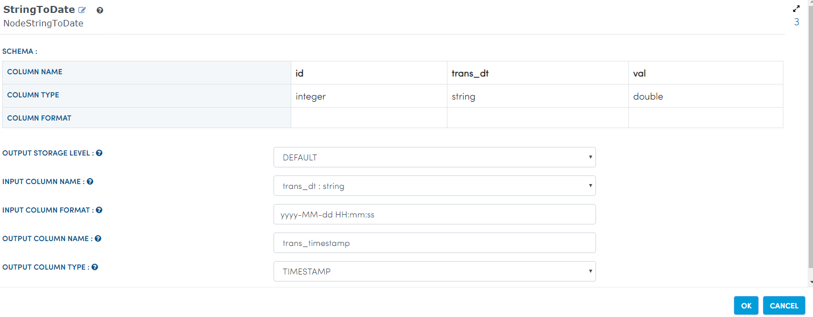
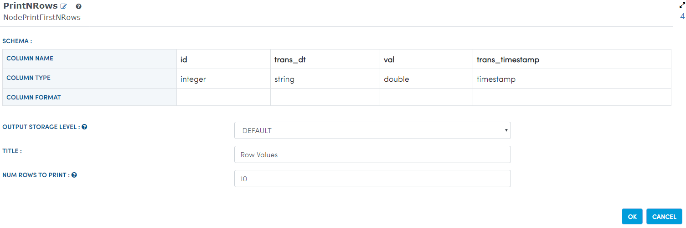

Time Function
=============

There are many instances when you want to do time-series analysis. Fire Insights provides Date-Time features with TimeFunctions operator.

Creating additional features from the timestamp column helps you to know more about the data and run modeling algorithms on them. Fire Insights has NodeTimeFunctions for creating these time series features.

Dataset
--------

Let us take a Transaction Dataset which is in CSV format on HDFS. The dataset has a "DATE" column.

.. figure:: ../../_assets/tutorials/dataset/28.PNG
   :alt: Dataset
   :width: 60%
   
Workflow for applying TimeFunctions
-----------------------------------

In the example workflow below, additional date time features are being created from the date column.

.. figure:: ../../_assets/tutorials/data-cleaning/convert-to-timestamps/1.png
   :alt: Convert To Timestamps
   :width: 100%
   
In the above workflow: 

- The 'CSV' processor reads in the CSV data from HDFS.
- The 'StringToDate' processor converts the column Date, which is in string format to 'timestamp'. 
- The 'TimeFunctions' processor takes in the timestamp column and then applies various timefunctions to it to generate additional output columns.

The diagram below shows the dialog box for the TimeFunctions processor. Timestamp column was selected as input, and various time functions were applied to it.

.. figure:: ../../_assets/tutorials/dataset/30.PNG
   :alt: Dataset
   :width: 60%
   
   
Workflow Execution
------------------

When the example workflow is executed, additional columns are produced for the various time functions that were selected.

.. figure:: ../../_assets/tutorials/dataset/31.PNG
   :alt: Dataset
   :width: 60%Reading from Dataset
---------------------

It reads sample Dataset File.

Processor Configuration
^^^^^^^^^^^^^^^^^^^^^^^

.. figure:: ../../_assets/tutorials/data-cleaning/convert-to-timestamps/2.png
   :alt: Convert To Timestamps
   :width: 100%
   
Processor Output
^^^^^^^^^^^^^^^^

.. figure:: ../../_assets/tutorials/data-cleaning/convert-to-timestamps/2a.png
   :alt: Convert To Timestamps
   :width: 100%
   
Print the sample Dataset Results
---------------------------------

It prints the results of the sample dataset available.

Processor Configuration
^^^^^^^^^^^^^^^^^^

.. figure:: ../../_assets/tutorials/data-cleaning/convert-to-timestamps/3.png
   :alt: Convert To Timestamps
   :width: 100%

Processor Output
^^^^^^

.. figure:: ../../_assets/tutorials/data-cleaning/convert-to-timestamps/3a.png
   :alt: Convert To Timestamps
   :width: 100%
   
Convert To Timestamps
---------------------

It converts To Timestamps using stringtodate Node.

Processor Configuration
^^^^^^^^^^^^^^^^^^

Processor Output
^^^^^^

.. figure:: ../../_assets/tutorials/data-cleaning/convert-to-timestamps/4a.png
   :alt: Convert To Timestamps
   :width: 100%
   
Prints the Results
------------------

It prints the results after converting to Timestamps.

Processor Configuration
^^^^^^^^^^^^^^^^^^

Processor Output
^^^^^^

.. figure:: ../../_assets/tutorials/data-cleaning/convert-to-timestamps/5a.png
   :alt: Convert To Timestamps
   :width: 100% 

