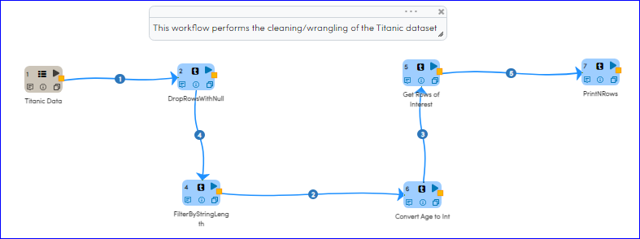
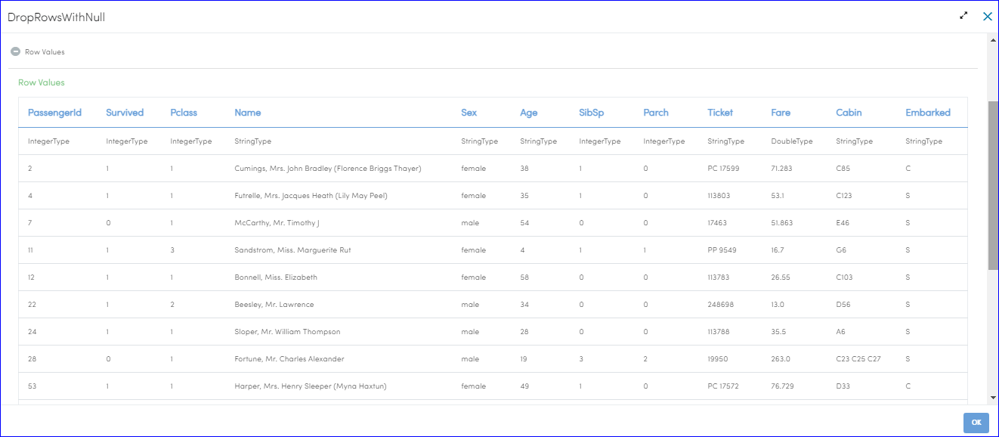
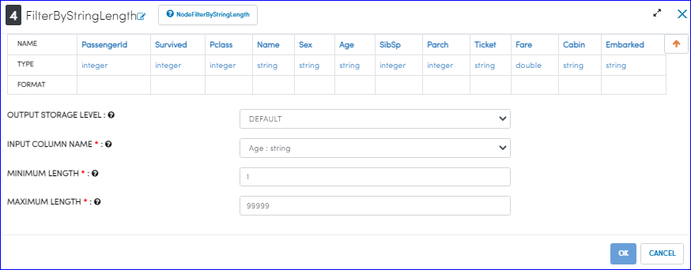
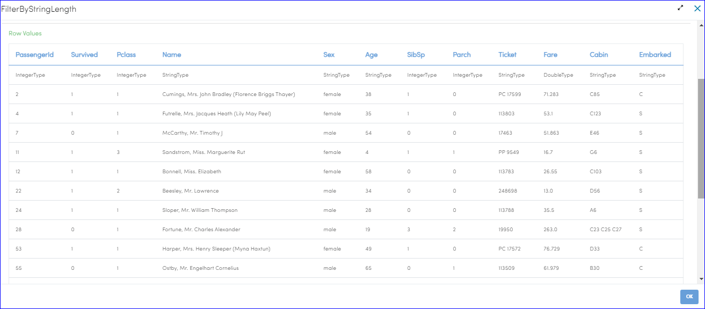
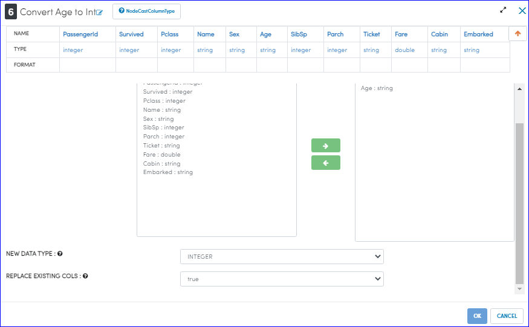
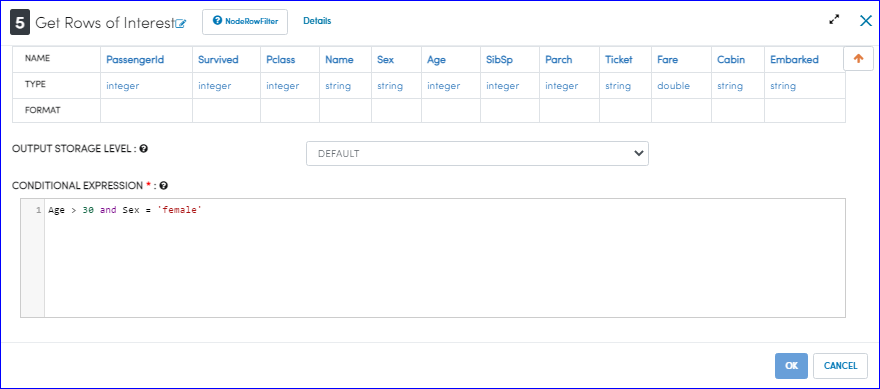

Titanic Data Cleaning/Wrangling
=========================

This workflow shows how to wrangle the Titanic Dataset with Sparkflows.

Workflow
--------
This workflow performs the following steps:

* Reads the Titanic dataset
* Drops Rows containing Null values
* Filters the Rows for whom Age has not been specified
* Changes the data type of the Age column to integer
* Filters rows for persons of age > 30 and who are female

   
Reading Titanic dataset
---------------------

Processor Output
^^^^^^^^^^^^^^^^^^

.. figure:: ../../_assets/tutorials/data-engineering/titanic-data-cleaning/Capture2.PNG
   :alt: titanic-data-cleaning
   :align: center
   :width: 60%
   

Dropping the rows with null values
--------------

Processor Configuration
^^^^^^

.. figure:: ../../_assets/tutorials/data-engineering/titanic-data-cleaning/Capture3.PNG
   :alt: titanic-data-cleaning
   :align: center
   :width: 60%

Processor Output
^^^^^^

Filter by string length
----------------
It filters the rows within the provided string length

Processor Configuration
^^^^^^^^^^^^^^^^^^

   
Processor Output
^^^^^^

   
Convert Age to Integer
---------------------

It performs conversion of Age to integer type

Processor Configuration
^^^^^^^^^^^^^^^^^^

   
Processor Output
^^^^^^

.. figure:: ../../_assets/tutorials/data-engineering/titanic-data-cleaning/Capture8.PNG
   :alt: titanic-data-cleaning
   :align: center
   :width: 60%   

Get Rows of Interest
---------------

Filters the data based on provided conditions

Processor Configuration
^^^^^^^^^^^^^^^^^^

   
Processor Output
^^^^^^

.. figure:: ../../_assets/tutorials/data-engineering/titanic-data-cleaning/Capture10.PNG
   :alt: titanic-data-cleaning
   :align: center
   :width: 60%   

Prints the results
-------------

It prints the first few records onto the screen.
