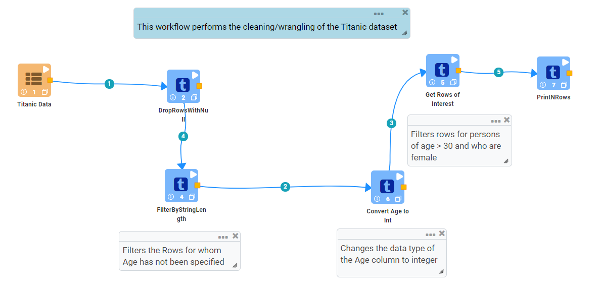
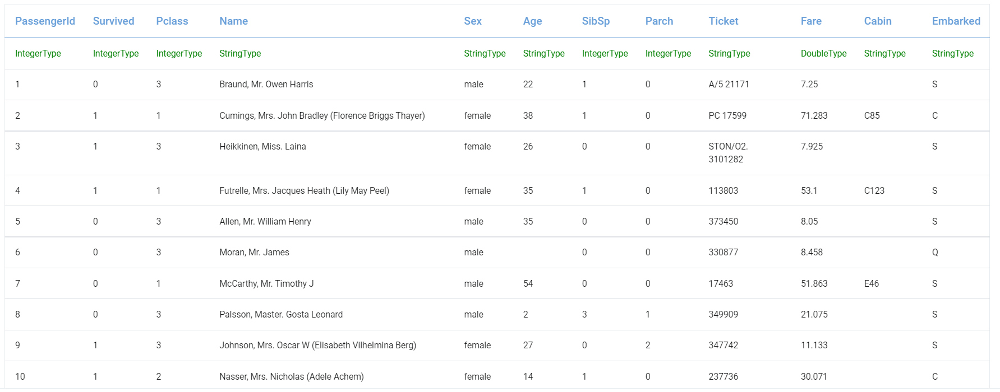
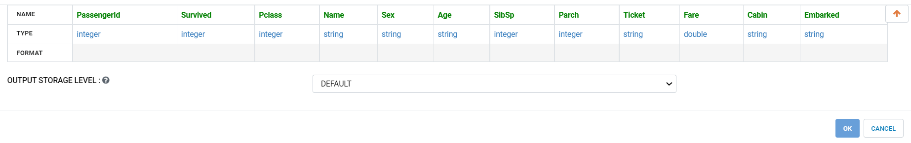
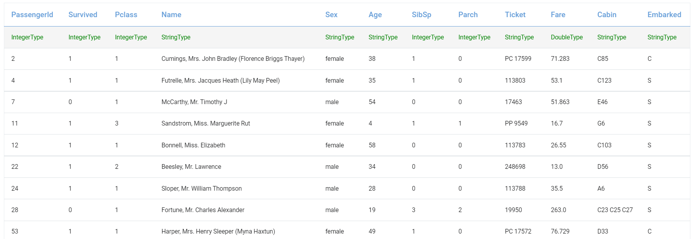
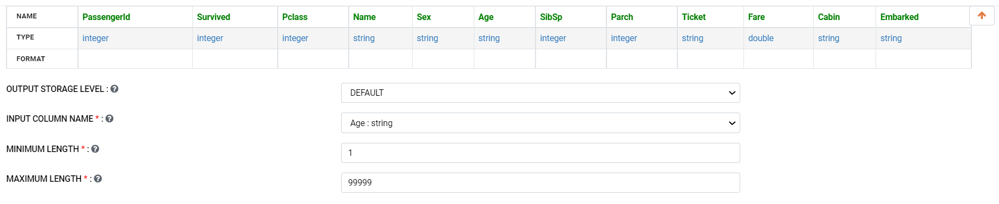
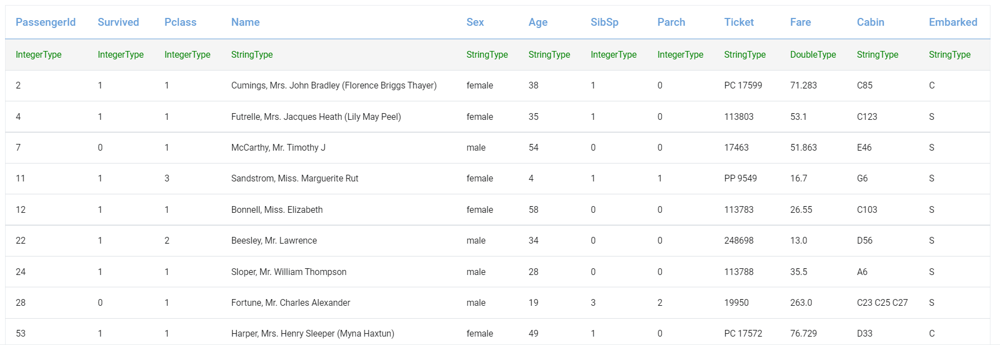
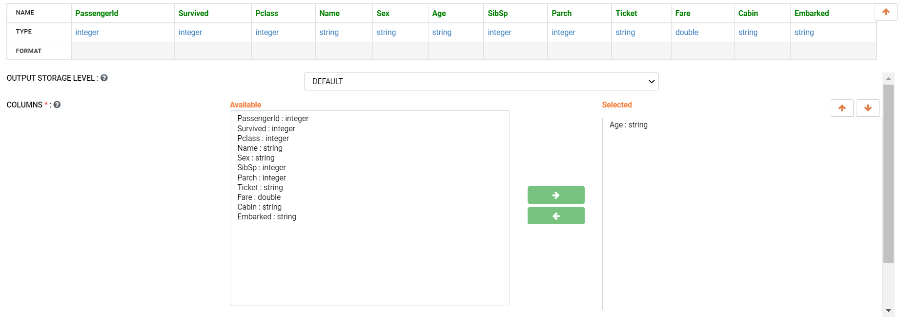
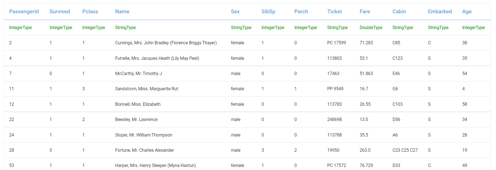
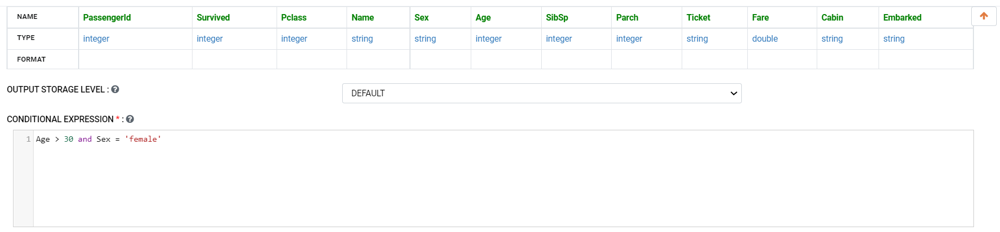
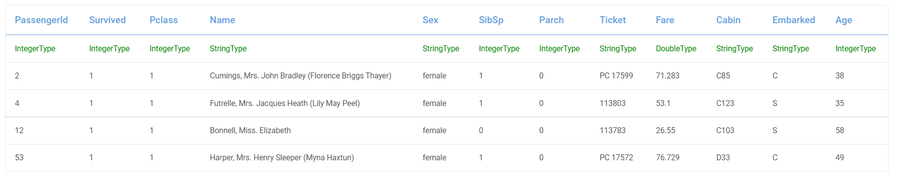

Titanic Data Cleaning and Wrangling
=========================

This workflow shows how to wrangle the Titanic Dataset with Sparkflows.

Workflow
--------
The below workflow: 

* Reads the Titanic dataset.
* Drops Rows containing Null values.
* Filters the Rows for which Age has not been specified.
* Changes the data type of the Age column to integer.
* Filters rows for persons of age > 30 and who are females.

   
Reading Titanic dataset
---------------------

``DatasetStructured`` Processor creates a DataFrame of your dataset named ``Titanic Data`` by reading data from HDFS, HIVE, etc. which have been defined earlier in Fire by using the Dataset feature.

Processor Output
^^^^^^

   

Dropping the rows with null values
--------------

``DropRowsWithNull`` Processor drops the rows with null values.

Processor Configuration
^^^^^^

Processor Output
^^^^^^

   
   
Filter by string length
----------------
``FilterByStringLength`` Processor filters the rows within the provided string length.

Processor Configuration
^^^^^^^^^^^^^^^^^^

   
Processor Output
^^^^^^

   
Convert Age to Integer
---------------------

``CastColumnType`` Processor performs conversion of Age to integer type.

Processor Configuration
^^^^^^^^^^^^^^^^^^

   
Processor Output
^^^^^^

Get Rows of Interest
---------------

``RowFilter`` Processor filters the data based on provided conditions as below.

Processor Configuration
^^^^^^^^^^^^^^^^^^

   
Processor Output
^^^^^^

Prints the result
-------------

It prints the first few records onto the screen.
