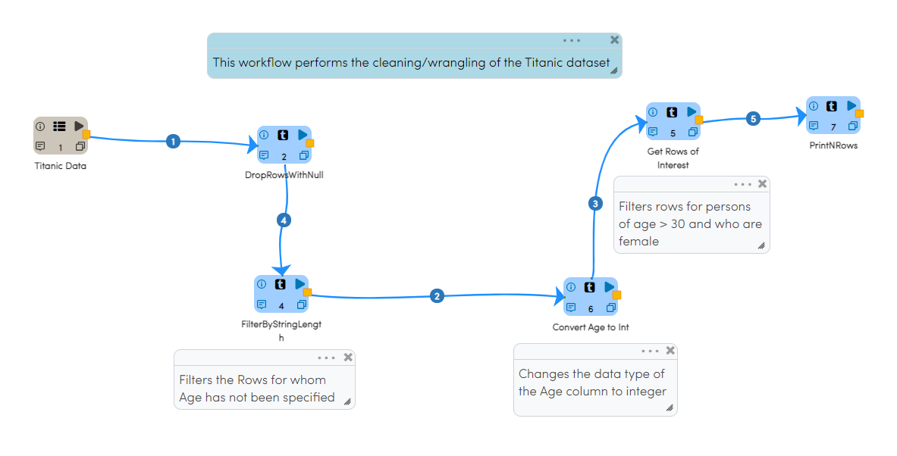
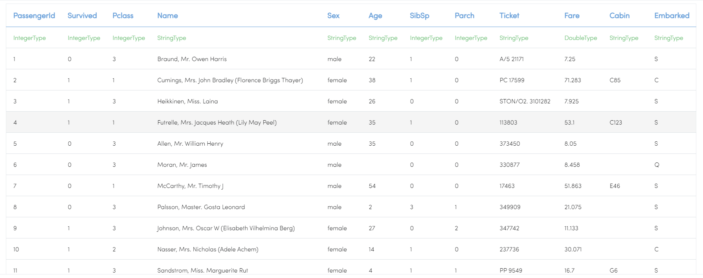
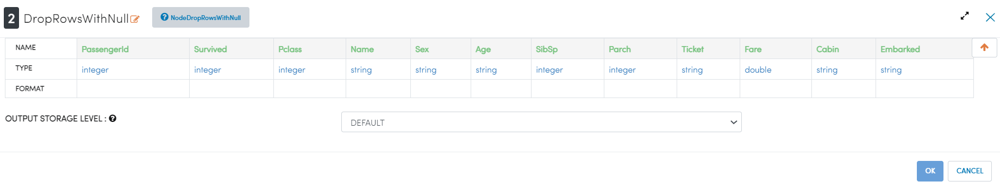
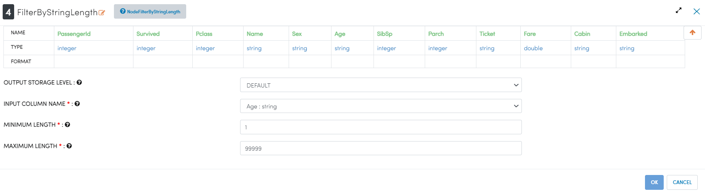
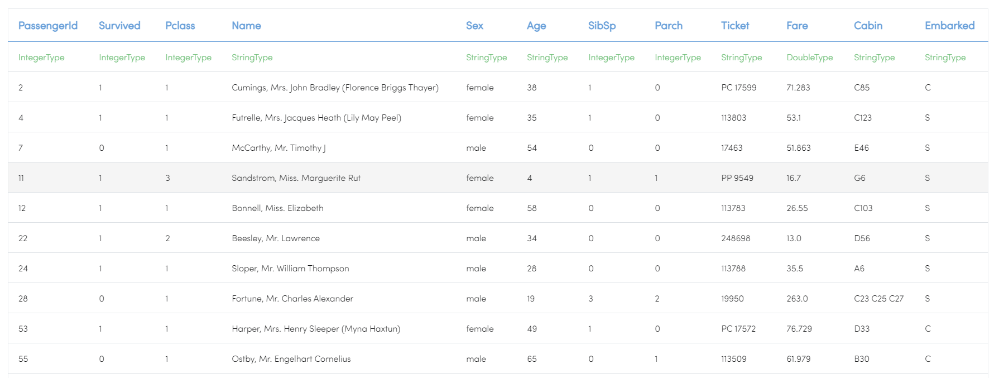

Titanic Data Cleaning/Wrangling
=========================

This workflow shows how to wrangle the Titanic Dataset with Sparkflows.

Workflow
--------
This workflow performs the following steps:

* Reads the Titanic dataset
* Drops Rows containing Null values
* Filters the Rows for whom Age has not been specified
* Changes the data type of the Age column to integer
* Filters rows for persons of age > 30 and who are female

   
Reading Titanic dataset
---------------------

``DatasetStructured`` processor creates a Dataframe of your dataset named ``Titanic Data`` by reading data from HDFS, HIVE etc. which had been defined earlier in Fire by using the Dataset feature.

Processor Output
^^^^^^^^^^^^^^^^^^

   

Dropping the rows with null values
--------------

``DropRowsWithNull`` processor drops the rows with null values.

Processor Configuration
^^^^^^

Filter by string length
----------------
``FilterByStringLength`` processor filters the rows within the provided string length

Processor Configuration
^^^^^^^^^^^^^^^^^^

   
Processor Output
^^^^^^

   
Convert Age to Integer
---------------------

``CastColumnType`` processor performs conversion of Age to integer type.

Processor Configuration
^^^^^^^^^^^^^^^^^^

.. figure:: ../../_assets/tutorials/data-engineering/titanic-data-cleaning/6.PNG
   :alt: titanic-data-cleaning
   :width: 90%

   
Processor Output
^^^^^^

.. figure:: ../../_assets/tutorials/data-engineering/titanic-data-cleaning/7.PNG
   :alt: titanic-data-cleaning
   :width: 90%

Get Rows of Interest
---------------

``RowFilter`` processor filters the data based on provided conditions as shown below:

Processor Configuration
^^^^^^^^^^^^^^^^^^

.. figure:: ../../_assets/tutorials/data-engineering/titanic-data-cleaning/8.PNG
   :alt: titanic-data-cleaning
   :width: 90%

   
Processor Output
^^^^^^

.. figure:: ../../_assets/tutorials/data-engineering/titanic-data-cleaning/9.PNG
   :alt: titanic-data-cleaning
   :width: 90%

Prints the results
-------------

It prints the first few records onto the screen.
