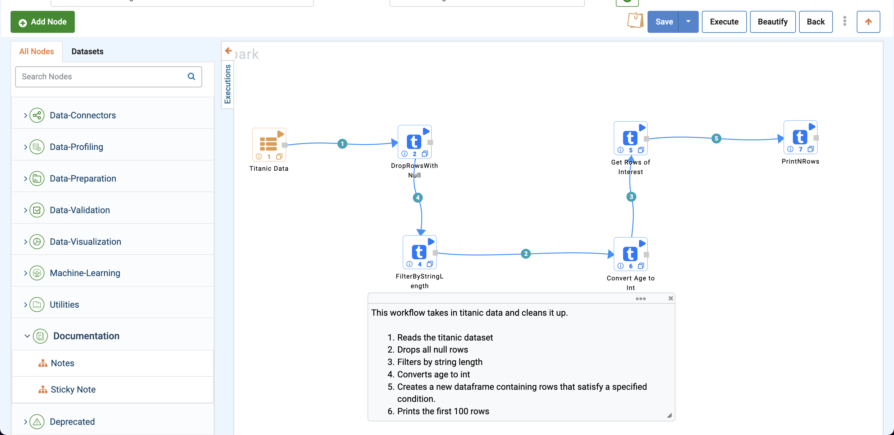
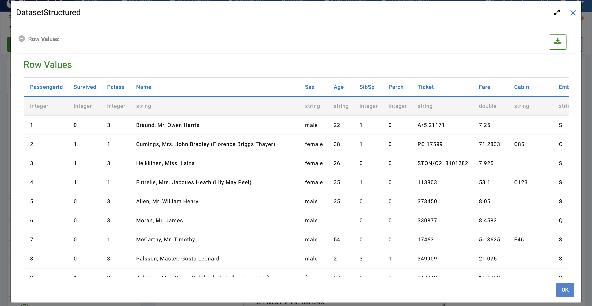
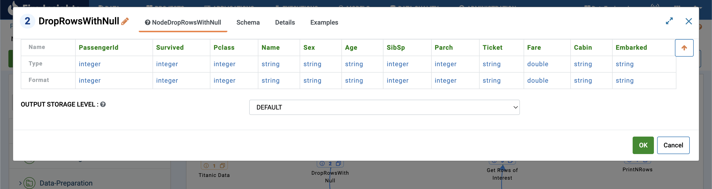
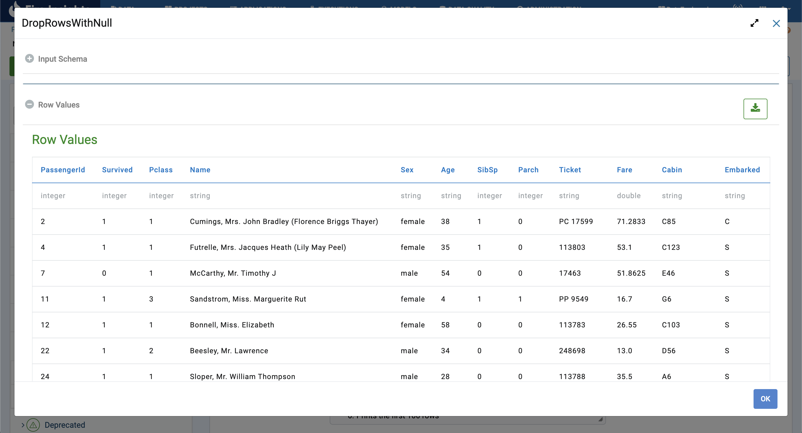
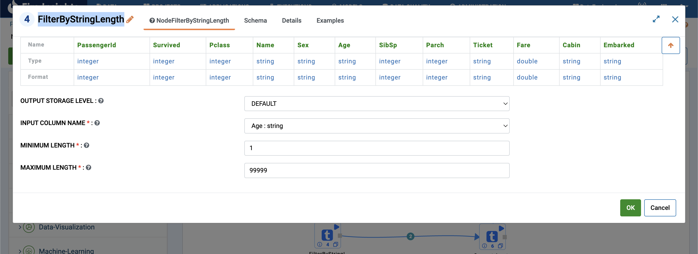
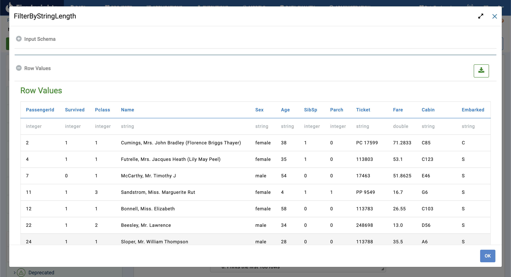
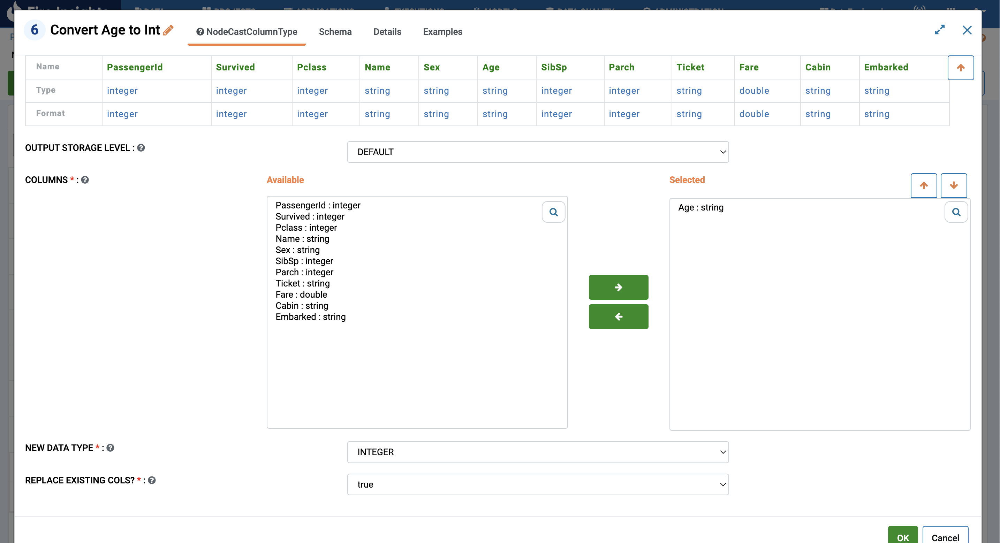
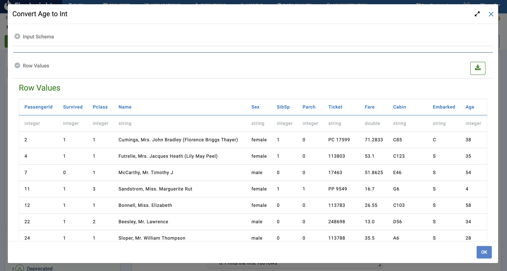
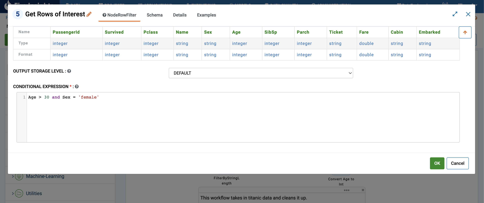
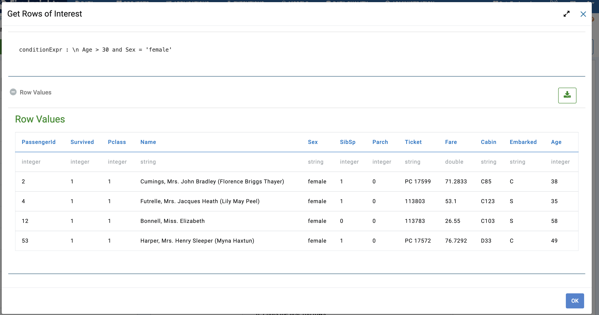

Data Preparation
=============

Data preparation is the process of cleaning and transforming raw data prior to processing and analysis. 
It is an important step prior to processing and often involves reformatting data, making corrections to data and the combining of data sets to enrich data.

Workflow
-------

Below is the workflow. It does the following:

* Reads data from the dataset.
* Converts a string column to date using the given date or time format.
* Sets values for the column ``State`` based on conditions.
* Creates a new DataFrame containing only rows satisfying given condition(s).
* Prints the results of few records.

   
Reading from Dataset
---------------------

It reads in the input Dataset file.

Processor Configuration
^^^^^^^^^^^^^^^^^^

.. figure:: ../../_assets/tutorials/data-engineering/data-preparation-1/Capture2.png
   :alt: DataPreparation
   :width: 75%
   
   
Processor Output
^^^^^^

   
   
Drop Rows with Null
------------

``DropRowsWithNull`` drops all null rows.

Processor Configuration
^^^^^^^^^^^^^^^^^^

Processor Output
^^^^^^

  

Filter by String Length
------------

``FilterByStringLength`` filters a specified string column between a maximum and minimum string length.

Processor Configuration
^^^^^^^^^^^^^^^^^^

Processor Output
^^^^^^

   
Convert `Age` to `Integer`
------------

``CastColumnType`` casts selected rows to a different data type.

Processor Configuration
^^^^^^^^^^^^^^^^^^

   
   
Processor Output
^^^^^^

   

Get Rows of Interest
------------

``RowFilter`` outputs a new dataset given a conditional statement.

Processor Configuration
^^^^^^^^^^^^^^^^^^

   
   
Processor Output
^^^^^^

The PrintNRows Node then prints the resulting DataFrame. 
