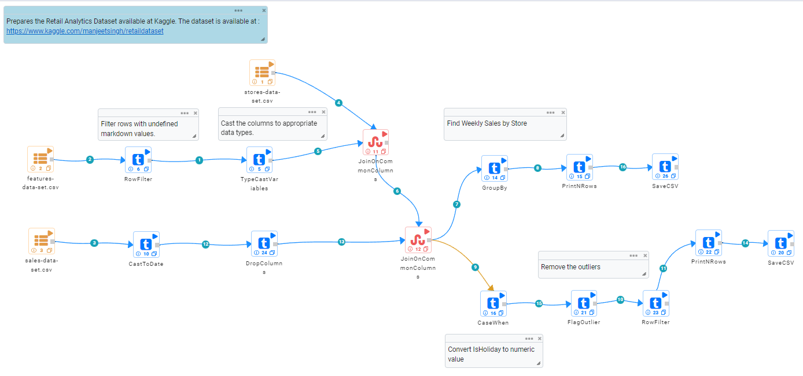
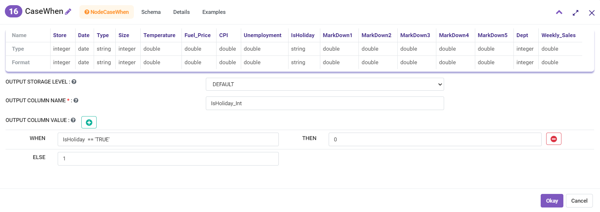
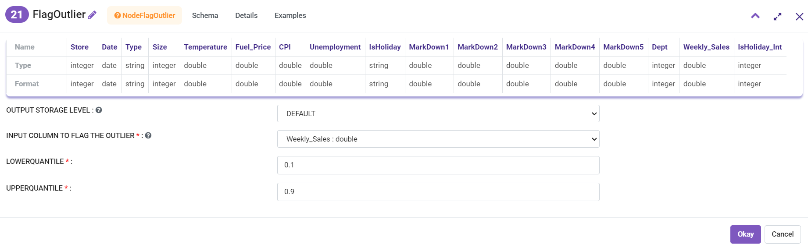

Retail Data Preparation
=========================

Fire Insights allows you to quickly do complex data preparation and ETL on Big Data.

Fire Insights has a number of features for enabling it including: 

- Reading data from multiple sources. 
- Cleaning data.
- Joins, GroupBy, Cube, SQL, etc. to transform data.
- CaseWhen and FlagOutlier.
- Writing results to various sinks.

Fire Insights also gives you detailed control over your Spark jobs with Repartition, Coalesce, Cache, etc.

Overview
---------

In this example, we start with 3 datasets, read them in & understand their schema in the process, perform data cleaning and then apply appropriate aggregations and joins.

The cleansed and tranformed datasets are written to HDFS as CSV files.

Datasets
--------

- stores-data-set.csv : Contains fixed length records of store data.
- features-data-set.csv : Contains features data.  
- sales-data-set.csv: Contains sales data.

Workflow
--------

The workflow achieves the following tasks: 

- Parses the facts data and performs various cleanup operations on it. 
- Performs groupby with aggregations operations and saves it to a file.  
- Joins the fact data with various dimensions to create a large table and saves it to a CSV file.

The workflow is shown below:

   
Data Parsing and Cleaning
--------------------------

While the various dimension data is available as CSV files, the fact data is in fixed field size format. 

Each record has a fixed number of characters. In each record each field consists of fixed number of characters. The steps for data parsing and cleaning are as follows: 

- Read in the fixed length record.
- Filter out invalid records.
- Cast some columns to numeric values. 

Group By and Aggregates
-----------------------

The data is then aggregated and counted and averages are calculated. It is then saved as CSV file.

Joins with various Dimension Data
---------------------------------

The fact data is then joined with various dimension data. These include: 

- Store  
- Product  
- Customer  
- Date 

CaseWhen Statement
------------------

Use the CaseWhen node for processing the IsHoliday column.

* WHENCONDITION IS : IsHoliday  == 'TRUE' Value is 0 ELSE Value is 1

   
FlagOutlier
-----------

* INPUT COLUMN TO FLAG THE OUTLIER : Select input column to flag outlier.
* LOWERQUANTILE : Select Lowerqantile value.
* UPPERQUANTILE : Select Upperquantile value.

The final dataset is saved as CSV file.
   
   

