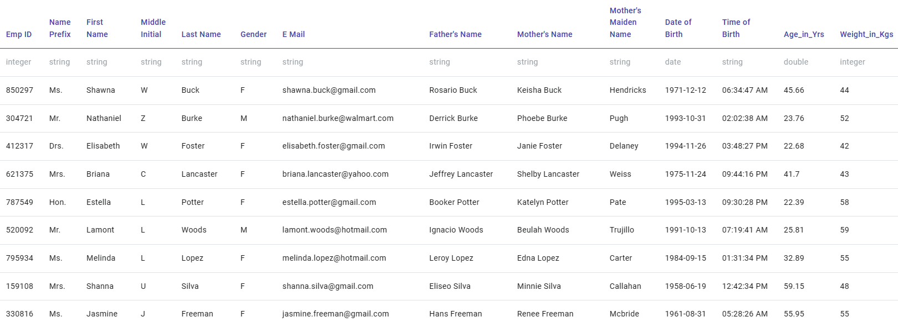
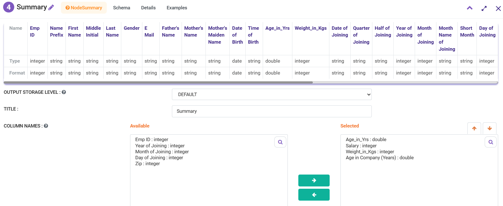
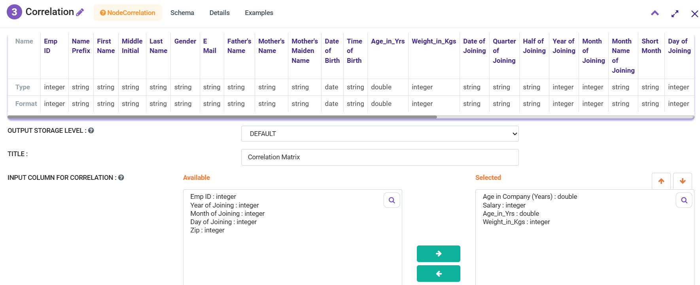
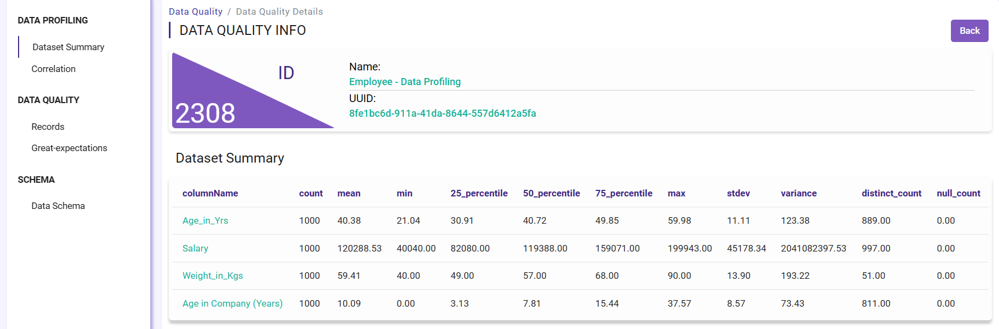
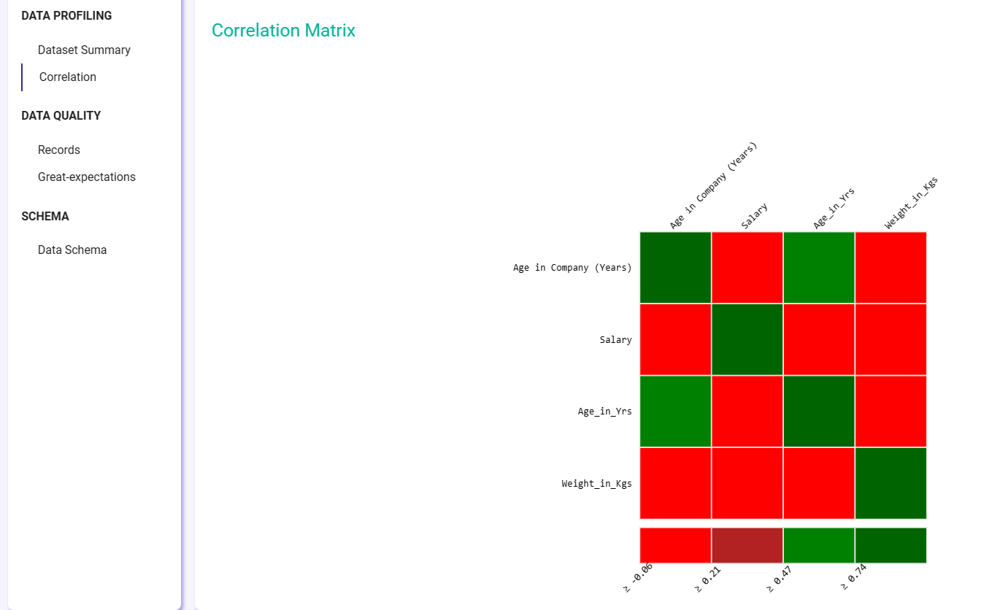

Data Profiling
=============

Fire Insights makes it easy to profile data. In Fire Insights, user can create the workflow using Summary, Correlation, etc. nodes to get more details about the dataset.

Sample Dataset: http://eforexcel.com/wp/downloads-16-sample-csv-files-data-sets-for-testing/

Below is a sample workflow.

Workflow
--------

Below is the workflow to do Data Profiling and it does the following:

* Reads data from a sample dataset.
* Summary of the numeric fields.
* Correlation of the fields in dataset.
* Verify the quality of data in sparkflows `Data Quality` tab.

.. figure:: ../../_assets/tutorials/data-quality/data-profiling-wf.png
   :alt: End
   :align: left
   :width: 60%
   
   
SampleData
----------
   

   
Summary
--------

Correlation
-----------

   
   
   
Data Quality Page
-----------------   
.. figure:: ../../_assets/tutorials/data-quality/data-quality-page.png
   :alt: End
   :align: left
   :width: 60%  
   
    
Summary Results 
----------------   

   
   
Correlation Results
------------------- 

   
